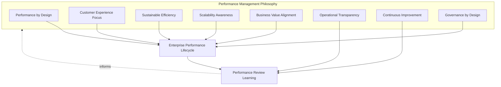
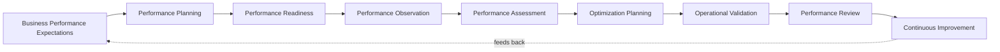
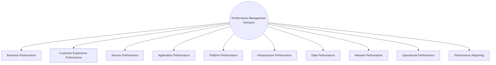
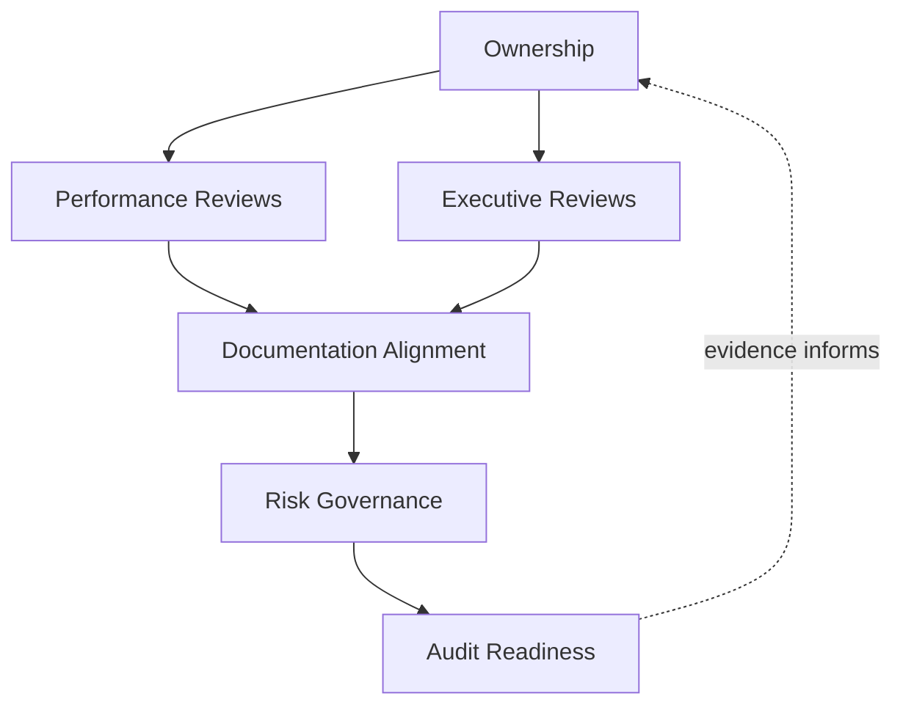
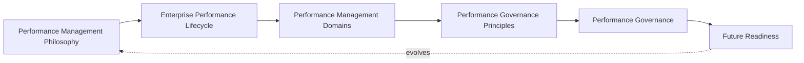
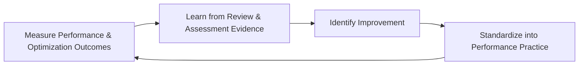
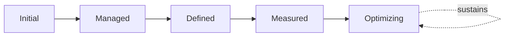

# Enterprise Performance Management & Performance Governance Strategy

## 1. Document Purpose

This document defines the official Enterprise Performance Management & Performance Governance Strategy for **StackLeo Tech Store**. It establishes how the organization observes, assesses, optimizes, and reviews performance as a continuous, live operational discipline — independent of any specific APM tool, performance testing tool, or monitoring platform.

This document governs performance once a capability is live: the ongoing discipline of observing real performance, assessing it against business expectation, and deliberately optimizing it over time. It is distinct from `08_Quality_Assurance/performance-testing.md`, which validates performance before release through Load, Stress, Spike, and related testing; and from `capacity-management.md`, which proactively plans the resources performance depends on. This document is the continuous, in-production management layer that sits after both — the ITIL-aligned discipline of sustaining and improving performance as the platform actually runs.

- **Purpose of Performance Management** — to ensure the platform's responsiveness is not only engineered and tested well but genuinely sustained and continuously improved in live operation, as customers actually experience it.
- **Relationship with Capacity Management** — `capacity-management.md` proactively plans the resources performance depends on; this document governs the ongoing observation and optimization of how that capacity actually translates into responsiveness once live.
- **Relationship with Availability Management** — performance and availability are related but distinct: a service can be available yet slow; this document coordinates with `availability-management.md` to ensure degraded performance is recognized as a genuine service concern even absent an outright outage.
- **Relationship with Service Level Management** — Performance Expectations in `service-level-management.md` (Section 4.5) are the business-facing commitments this document's ongoing management exists to fulfill and sustain over time, not merely satisfy at a single point of validation.
- **Relationship with Monitoring & Observability** — this document depends entirely on the telemetry foundation in `monitoring-observability.md`; Performance Observation (Section 3.4) is only as reliable as the data it draws on.
- **Relationship with Reliability Engineering** — this document operates on top of the performance efficiency engineered in `07_DevOps/sre-strategy.md` and `03_System_Design/quality-attributes.md` (Section 3), governing how that engineered potential is sustained and improved through real operational experience.
- **Relationship with Enterprise Governance** — performance directly affects conversion, customer trust, and cost; this document ensures performance-related investment and trade-off decisions are made deliberately, by accountable roles, against genuine evidence.

This document is implementation-independent and vendor-neutral. It defines performance management philosophy, lifecycle, domains, and governance conceptually — not specific APM tools, performance testing tools, monitoring platforms, cloud providers, performance benchmarks, latency thresholds, optimization techniques, testing methodologies, or infrastructure configuration.

## 2. Performance Management Philosophy

Performance management at StackLeo is governed by eight principles. Each exists to produce a specific business outcome — performance is managed continuously because of the conversion, trust, and cost it affects daily, not as a one-time engineering concern.

### 2.1 Performance by Design

Performance characteristics are considered from the moment a capability is designed, consistent with Performance by Design in `08_Quality_Assurance/performance-testing.md` (Section 2.1), and this document ensures that design intent is genuinely sustained once live.

- **Business Value** — protects the upfront engineering investment in performance from eroding silently over time in production.

### 2.2 Customer Experience Focus

Performance is ultimately judged by genuine customer experience, consistent with User Experience Monitoring in `monitoring-observability.md` (Section 4.5), not solely by internal technical measures.

- **Business Value** — ensures performance management effort protects what customers actually perceive, not only what is convenient to measure internally.

### 2.3 Sustainable Efficiency

Performance is pursued together with resource efficiency, consistent with Resource Optimization in `capacity-management.md` (Section 2.5), avoiding the assumption that performance problems can always be solved simply by adding more capacity.

- **Business Value** — balances responsiveness against cost, protecting the business from paying indefinitely to compensate for avoidable inefficiency.

### 2.4 Scalability Awareness

Performance management considers how responsiveness will hold as demand grows, consistent with `03_System_Design/scalability-strategy.md`, not only how it behaves under today's conditions.

- **Business Value** — protects performance from degrading precisely at the moments of growth that matter most to the business.

### 2.5 Business Value Alignment

Performance investment and optimization priority are determined by genuine business impact, consistent with Business Value Alignment in `service-level-management.md` (Section 2.2), not by which optimization is most technically interesting.

- **Business Value** — ensures finite optimization effort is directed toward the performance issues that matter most to customers and revenue.

### 2.6 Operational Transparency

Performance status and trends are visible to the stakeholders who depend on them, not held privately within any single engineering team.

- **Business Value** — builds cross-functional confidence and enables informed decisions by stakeholders who did not build a capability but must understand its performance implications.

### 2.7 Continuous Improvement

Performance management practice matures over time, informed by real operational experience and evolving business scale.

- **Business Value** — keeps performance capability aligned with StackLeo's growth in scale, architectural complexity, and business model.

### 2.8 Governance by Design

Performance governance structures are established deliberately as capability is built, not retrofitted once customers have already experienced degraded responsiveness.

- **Business Value** — prevents the costly, high-visibility discovery of performance governance gaps during a period of peak customer demand.

*Diagram 1: Performance Management Philosophy Overview — the eight principles shape the enterprise performance lifecycle, and performance review learning feeds back into the philosophy itself.*

## 3. Enterprise Performance Lifecycle

Performance management is governed across nine conceptual stages, spanning from initial business expectations through continuous improvement.

### 3.1 Business Performance Expectations

- **Purpose** — determine what level of responsiveness genuine customer and business need actually requires.
- **Business Value** — grounds subsequent management in real necessity rather than arbitrary technical aspiration.
- **Governance Objectives** — require expectations to trace to Performance Expectations in `service-level-management.md` (Section 4.5) and genuine business context.

### 3.2 Performance Planning

- **Purpose** — determine the approach that will sustain the required performance level in live operation.
- **Business Value** — converts a stated expectation into a concrete, actionable ongoing management approach.
- **Governance Objectives** — require plans to be coordinated with `capacity-management.md` and architectural strategy in `03_System_Design/quality-attributes.md` (Section 3).

### 3.3 Performance Readiness

- **Purpose** — confirm the organization is genuinely prepared to observe and sustain performance once a capability is live.
- **Business Value** — bridges the gap between a performance plan and the operational capability to actually sustain it.
- **Governance Objectives** — connect to Operational Readiness in `operations-overview.md` (Section 4.3), applying the same rigor to performance-specific preparation.

### 3.4 Performance Observation

- **Purpose** — continuously observe actual performance against expectations, drawing on `monitoring-observability.md`.
- **Business Value** — allows performance degradation to be noticed while still small, rather than discovered only through customer complaint.
- **Governance Objectives** — require observation coverage to be confirmed as part of Performance Readiness (Section 3.3).

### 3.5 Performance Assessment

- **Purpose** — evaluate observed performance data to determine whether it genuinely meets business expectations and to identify emerging trends.
- **Business Value** — converts raw observation into genuine understanding of whether performance is acceptable and where it is trending.
- **Governance Objectives** — require assessment to be conducted on a recurring basis, not only when a problem is already suspected.

### 3.6 Optimization Planning

- **Purpose** — determine specific, prioritized actions to improve performance where assessment reveals a genuine gap or opportunity.
- **Business Value** — ensures optimization effort is deliberately targeted at genuine business impact, consistent with Business Value Alignment (Section 2.5).
- **Governance Objectives** — require optimization plans to be prioritized against genuine assessment evidence, not speculative technical interest.

### 3.7 Operational Validation

- **Purpose** — confirm that implemented optimizations genuinely improve performance without introducing new risk.
- **Business Value** — prevents the costly failure mode of an optimization effort that does not deliver its intended benefit, or introduces a new problem.
- **Governance Objectives** — require validation to be performed independently of the optimization implementation effort itself.

### 3.8 Performance Review

- **Purpose** — periodically evaluate overall performance health and management effectiveness across the service portfolio.
- **Business Value** — gives leadership an honest, evidence-based view of whether performance management is genuinely working.
- **Governance Objectives** — require review to occur on a regular, predictable cadence, connected to Executive Reviews (Section 6.3).

### 3.9 Continuous Improvement

- **Purpose** — act on performance review findings to deliberately improve performance management practice itself.
- **Business Value** — ensures performance management effectiveness compounds over time rather than remaining static as the platform and business grow.
- **Governance Objectives** — require improvement actions arising from review to be documented and tracked to completion.

### Enterprise Performance Lifecycle Matrix

| Stage | Purpose | Business Value | Governance Objective |
|---|---|---|---|
| Business Performance Expectations | Determine what responsiveness level is genuinely needed | Grounds management in real necessity | Traces to service level performance expectations |
| Performance Planning | Determine approach to sustain required performance | Converts expectation into an actionable ongoing approach | Coordinated with capacity and architecture strategy |
| Performance Readiness | Confirm organization can observe and sustain performance | Bridges plan and genuine operational capability | Same rigor as general operational readiness |
| Performance Observation | Continuously observe actual performance vs. expectations | Allows degradation to be noticed while still small | Coverage confirmed as part of performance readiness |
| Performance Assessment | Evaluate data against expectations and identify trends | Converts observation into genuine understanding | Conducted recurringly, not only when a problem is suspected |
| Optimization Planning | Determine prioritized actions to improve performance | Effort deliberately targeted at genuine business impact | Prioritized against genuine evidence, not speculation |
| Operational Validation | Confirm optimizations genuinely improve performance | Prevents optimization effort that fails to deliver or adds risk | Performed independently of implementation effort |
| Performance Review | Periodically evaluate overall health and effectiveness | Honest, evidence-based view of management effectiveness | Regular cadence, connected to executive review |
| Continuous Improvement | Act on findings to improve management practice | Effectiveness compounds over time | Improvement actions tracked to completion |

*Diagram 2: Enterprise Performance Lifecycle — a continuous cycle in which performance review and improvement directly inform the next iteration of business performance expectations.*

## 4. Performance Management Domains

Performance management spans ten conceptual domains, each addressing a distinct dimension of responsiveness and efficiency.

### 4.1 Business Performance

- **Purpose** — represent the business-level view of how well the platform's performance serves overall business outcomes.
- **Scope** — informed by `01_Business/business-model.md` and aggregate conversion and revenue implications of responsiveness.
- **Governance Expectations** — reviewed jointly with Business and Product stakeholders, not treated as a purely technical concern.
- **Business Importance** — provides the business-level context every other performance domain ultimately serves.

### 4.2 Customer Experience Performance

- **Purpose** — represent how customers actually perceive the platform's responsiveness during their journeys.
- **Scope** — informed by User Experience Monitoring in `monitoring-observability.md` (Section 4.5) and `02_Product/user-journeys.md`.
- **Governance Expectations** — prioritized for the critical customer journey (browse, cart, checkout, payment, order).
- **Business Importance** — the closest available proxy for genuine customer-perceived quality, directly affecting conversion.

### 4.3 Service Performance

- **Purpose** — represent the performance of each individual service defined in `service-catalog.md`.
- **Scope** — service-level responsiveness, connected to Service Criticality (`service-catalog.md`, Section 4.8).
- **Governance Expectations** — management rigor is proportionate to each service's criticality classification.
- **Business Importance** — connects business-level performance concerns to the specific services responsible for them.

### 4.4 Application Performance

- **Purpose** — represent the processing efficiency of application-level logic and components.
- **Scope** — informed by Application Configuration Items in `configuration-management.md` (Section 4.3).
- **Governance Expectations** — assessed jointly with engineering teams owning the relevant application logic.
- **Business Importance** — application-level inefficiency can degrade responsiveness even when infrastructure is otherwise sufficient.

### 4.5 Platform Performance

- **Purpose** — represent the performance of shared platform capability that multiple services depend on.
- **Scope** — informed by Platform Configuration Items in `configuration-management.md` (Section 4.4).
- **Governance Expectations** — assessed with explicit awareness of every dependent service, given multiplied impact if degraded.
- **Business Importance** — a platform-level performance issue can simultaneously affect multiple services at once.

### 4.6 Infrastructure Performance

- **Purpose** — represent the performance of the underlying technical environment.
- **Scope** — coordinated with `capacity-management.md` (Infrastructure Capacity, Section 4.5) at a conceptual planning level.
- **Governance Expectations** — infrastructure performance is distinguished from application-level symptoms, so root cause is never confused with effect.
- **Business Importance** — provides the foundational performance every other technical domain in this section ultimately depends on.

### 4.7 Data Performance

- **Purpose** — represent the efficiency of data access and processing as data volume grows.
- **Scope** — coordinated with Volume Testing in `08_Quality_Assurance/performance-testing.md` (Section 4.7) and `04_Database/database-strategy.md`.
- **Governance Expectations** — assessed with explicit attention to catalog and order history growth over time, not only current volume.
- **Business Importance** — protects against degradation that emerges from data scale alone, distinct from concurrent user load.

### 4.8 Network Performance

- **Purpose** — represent the responsiveness of connectivity paths customers and internal systems depend on.
- **Scope** — coordinated with Network Capacity in `capacity-management.md` (Section 4.7).
- **Governance Expectations** — assessed with explicit attention to the variable network conditions common in StackLeo's primary market.
- **Business Importance** — protects customers on lower-bandwidth or less reliable connections from a degraded experience.

### 4.9 Operational Performance

- **Purpose** — represent the efficiency of the organization's own operational processes — incident response time, deployment speed.
- **Scope** — connects to Engineering Productivity Metrics in `08_Quality_Assurance/quality-metrics.md` (Section 4.8).
- **Governance Expectations** — always reviewed jointly with customer-facing performance, so internal efficiency is never optimized at the expense of customer experience.
- **Business Importance** — reflects the organization's capacity to sustain and improve performance efficiently, not merely the platform's technical responsiveness.

### 4.10 Performance Reporting

- **Purpose** — communicate performance status and trends to the stakeholders who depend on them for decisions.
- **Scope** — informed by Service Reporting in `service-management.md` (Section 4.9) and Performance Quality Metrics in `08_Quality_Assurance/quality-metrics.md` (Section 4.6).
- **Governance Expectations** — reporting reflects genuine underlying observation evidence and is produced on a predictable, regular cadence.
- **Business Importance** — gives leadership and business stakeholders an honest basis for decisions about performance investment.

### Performance Management Domain Matrix

| Domain | Purpose | Governance Expectations | Business Importance |
|---|---|---|---|
| Business Performance | Represent business-level view of performance outcomes | Reviewed jointly with Business and Product stakeholders | Provides business-level context for every other domain |
| Customer Experience Performance | Represent how customers perceive responsiveness | Prioritized for the critical customer journey | Closest proxy for customer-perceived quality, affects conversion |
| Service Performance | Represent each individual service's performance | Rigor proportionate to service criticality | Connects business concerns to specific responsible services |
| Application Performance | Represent application-level processing efficiency | Assessed jointly with owning engineering teams | Can degrade responsiveness independent of infrastructure |
| Platform Performance | Represent shared platform capability performance | Assessed with awareness of every dependent service | A degradation can simultaneously affect multiple services |
| Infrastructure Performance | Represent underlying technical environment performance | Distinguished from application-level symptoms | Foundational performance other technical domains depend on |
| Data Performance | Represent efficiency of data access as volume grows | Attention to historical growth, not just current volume | Protects against data-scale degradation distinct from user load |
| Network Performance | Represent responsiveness of connectivity paths | Attention to variable regional network conditions | Protects customers on lower-bandwidth connections |
| Operational Performance | Represent efficiency of organizational processes | Reviewed jointly with customer-facing performance | Reflects capacity to sustain and improve performance efficiently |
| Performance Reporting | Communicate status and trends to dependent stakeholders | Reflects genuine evidence, predictable cadence | Honest basis for performance investment decisions |

*Diagram 3 (Part A): Sustainable Performance Management Framework — ten domains spanning business, technical, and organizational performance, together forming the platform's complete responsiveness posture.*

## 5. Performance Governance Principles

- **Executive Ownership** — significant performance investment and trade-off decisions are reviewed at the executive level, given their direct cost and conversion implications.
- **Performance Visibility** — current performance status and trends are visible to the stakeholders who depend on them, consistent with Operational Transparency (Section 2.6).
- **Business Alignment** — performance priorities are set by genuine business impact, consistent with Business Value Alignment (Section 2.5), not technical convenience.
- **Performance Readiness** — the organization's capability to observe and sustain performance is confirmed explicitly, consistent with Section 3.3.
- **Continuous Measurement** — performance is measured continuously, consistent with Performance Observation (Section 3.4), not confirmed once and assumed to remain valid indefinitely.
- **Auditability** — performance plans, assessments, and review outcomes can be independently reviewed after the fact.
- **Risk Awareness** — performance governance decisions are made with explicit awareness of the business risk that degradation represents.
- **Continuous Improvement** — performance governance itself matures over time, informed by real operational experience.

### Performance Governance Principle Matrix

| Principle | Description | Business Value |
|---|---|---|
| Executive Ownership | Significant decisions reviewed at the executive level | Reflects genuine cost and conversion consequence |
| Performance Visibility | Status and trends visible to dependent stakeholders | Builds confidence and enables informed decisions |
| Business Alignment | Priorities set by genuine business impact | Directs effort toward what matters most to customers and revenue |
| Performance Readiness | Capability to observe and sustain confirmed explicitly | Ensures plans translate into genuine operational capability |
| Continuous Measurement | Measured continuously, not confirmed once | Keeps confidence current as conditions change |
| Auditability | Plans, assessments, and reviews independently reviewable | Supports accountability and confidence for partners and regulators |
| Risk Awareness | Decisions made with awareness of degradation business risk | Enables deliberate, informed risk-based prioritization |
| Continuous Improvement | Governance matures from real operational experience | Keeps performance capability aligned with organizational growth |

## 6. Performance Governance

### 6.1 Ownership

Every performance domain (Section 4) has a designated accountable owner; overall performance governance is owned jointly by Operations, SRE, and Engineering leadership, with significant investment decisions escalating to executive review.

### 6.2 Performance Reviews

Individual services are formally reviewed against Business Performance Expectations (Section 3.1) on a recurring basis, ensuring Performance Review (Section 3.8) is a deliberate governance act, not an informal assumption.

### 6.3 Executive Reviews

Overall performance health across the service portfolio is reviewed with executive stakeholders on a regular cadence, consistent with Executive Service Reviews in `service-level-management.md` (Section 6.3).

### 6.4 Documentation Alignment

Performance management documentation is kept consistent with `service-level-management.md`, `capacity-management.md`, and `08_Quality_Assurance/performance-testing.md`; a performance claim that contradicts current capacity or service level documentation is treated as a governance gap.

### 6.5 Risk Governance

Performance-related risk — unaddressed degradation trends, deferred optimization, unvalidated scalability assumptions — is tracked, prioritized, and escalated consistently, ensuring accepted risk is always a deliberate, accountable decision.

### 6.6 Audit Readiness

Performance plans, assessments, optimization records, and review outcomes are retained in a form that can be independently reviewed after the fact, supporting internal governance and partner or regulatory review where relevant.

### Performance Governance Matrix

| Governance Area | Objective |
|---|---|
| Ownership | Every performance domain has a designated accountable owner |
| Performance Reviews | Performance confirmation is a deliberate, recurring governance act |
| Executive Reviews | Overall performance health reviewed with executive stakeholders |
| Documentation Alignment | Performance documentation stays consistent with SLM and capacity practice |
| Risk Governance | Accepted performance risk is always a deliberate, accountable decision |
| Audit Readiness | Plans, assessments, and reviews retained for independent review |

*Diagram 2b: Performance Governance Framework — ownership anchors review activity, which feeds documentation alignment, risk governance, and ultimately auditable evidence.*

### Governance Responsibility Matrix

| Role | Responsibility |
|---|---|
| COO / Operations Lead | Owns coherence and enforcement of this performance management strategy, in partnership with SRE and Engineering leadership. |
| Service Owners | Own Service Performance (Section 4.3) observation and assessment for their respective services. |
| SRE Lead | Ensures Performance Planning (Section 3.2) aligns with `07_DevOps/sre-strategy.md` and architecture quality attributes. |
| Performance Engineering Lead | Owns Optimization Planning and Operational Validation (Sections 3.6–3.7) across domains. |
| Product Manager | Ensures Business Performance Expectations (Section 3.1) reflect genuine customer and business need. |
| Capacity Planning Lead | Coordinates Infrastructure and Network Performance (Sections 4.6, 4.8) with `capacity-management.md`. |
| Executive Leadership | Reviews significant performance investment and trade-off decisions. |
| Internal Audit / Review Function | Independently verifies that performance governance records reflect actual practice. |

*Diagram 3 (Part B): Enterprise Performance Operating Model — how philosophy, lifecycle, domains, principles, and governance operate together as a single, self-reinforcing system that continues to evolve as the platform grows.*

## 7. Future Readiness

This strategy is designed to remain valid as StackLeo evolves in scale and architectural complexity, without requiring redefinition of its underlying philosophy.

- **Cloud-Native Platforms** — performance domains (Section 4) are defined independently of any specific runtime or deployment model, so they apply unchanged as infrastructure evolves.
- **AI-Enabled Services** — as AI-assisted capability is introduced, Application and Platform Performance (Sections 4.4–4.5) extend to account for its distinct computational demand profile, without prescribing any specific AI infrastructure.
- **Marketplace Platform** — the multi-vendor marketplace model extends Business and Data Performance (Sections 4.1, 4.7) to cover seller-driven catalog and traffic growth.
- **Multi-Tenant Architecture** — where future architecture introduces tenant isolation, Service and Platform Performance (Sections 4.3, 4.5) extend to explicitly assess cross-tenant performance impact.
- **Multi-Region Operations** — as StackLeo expands from Bangladesh into South Asia and beyond, Network and Infrastructure Performance (Sections 4.8, 4.6) extend to cover region-specific conditions.
- **Global Business Expansion** — Performance Reporting (Section 4.10) extends to address distributed teams and region-specific performance context as the business grows beyond its current footprint.
- **Enterprise Scale** — the performance lifecycle, domains, and governance defined in Sections 3–6 are defined independently of organizational size or structure, so they remain coherent as the business grows substantially.
- **Evolving Workload Patterns** — Performance Assessment (Section 3.5) is structured to be revisited as new workload patterns emerge — new channels, new business models — ensuring the strategy adapts to genuinely new demand rather than only historical patterns.

## 8. Governance

- **Ownership** — the COO (or equivalent accountable executive function) owns this strategy and is accountable for its consistent application across the platform, in partnership with SRE and Engineering leadership.
- **Review Process** — this strategy is formally reviewed whenever a material change occurs in business model (`01_Business/business-model.md`), the service catalog (`service-catalog.md`), or architecture (`03_System_Design/quality-attributes.md`), and on a regular recurring cadence independent of specific change events.
- **Performance Management Policies** — subordinate, practice-specific performance documents (domain-specific optimization plans, review templates) must remain consistent with the philosophy, lifecycle, and domains defined here.
- **Audit Readiness** — this strategy and the evidence it requires (Section 6.6) are maintained in a state ready for internal or external audit at any time, without requiring advance preparation.
- **Continuous Improvement** — this strategy itself is subject to Continuous Improvement (Section 2.7, Section 3.9); its effectiveness is periodically assessed and revised based on genuine operational and organizational evidence.

*Diagram 4: Performance Review & Optimization Cycle — performance and optimization outcomes are measured, learned from, improved upon, and standardized back into practice, on a continuing basis.*

## 9. Performance Management Maturity Model

Performance management maturity is described across five conceptual levels, adapted from established process maturity thinking. Progression reflects increasing consistency, measurement, and deliberate improvement — not merely increasing optimization activity volume.

- **Initial** — performance management, where it exists, is informal and reactive; optimization occurs only after customers have already noticed degradation, and business context is rarely considered.
- **Managed** — basic performance observation exists for individual significant services, but consistency and assessment rigor across domains (Section 4) vary significantly.
- **Defined** — performance planning, observation, and governance are standardized, documented, and consistently applied across the organization, consistent with the lifecycle and domains defined throughout this document; ownership is clear organization-wide.
- **Measured** — performance is measured systematically against defined business expectations, and optimization decisions are grounded in genuine data rather than qualitative impression alone.
- **Optimizing** — performance management practice is continuously and deliberately improved based on quantitative evidence and organizational learning; improvement itself is a managed, ongoing discipline rather than an occasional initiative.

### Performance Management Maturity Model Matrix

| Level | Characteristics | Primary Focus |
|---|---|---|
| Initial | Informal, reactive management; optimization only after customer-noticed degradation | Ad hoc, reactive optimization |
| Managed | Basic observation exists per significant service; rigor varies | Service-level consistency |
| Defined | Standardized, documented planning and governance applied organization-wide | Organization-wide consistency and clear ownership |
| Measured | Performance measured systematically against defined business expectations | Evidence-based performance decisions |
| Optimizing | Practice continuously and deliberately improved from evidence | Sustained, deliberate improvement as a discipline |

*Diagram 6: Performance Management Maturity Progression Model — maturity advances from informal, reactive optimization toward standardized, measured, and continuously optimized performance management practice.*

## 10. Anti-Patterns

The following recurring failure patterns are explicitly recognized and avoided, as each one structurally undermines this strategy.

| Anti-Pattern | Why It's Avoided |
|---|---|
| Reactive Optimization | Contradicts Performance by Design (Section 2.1) and Continuous Measurement (Section 5.5); optimizing only after customers have already noticed degradation forfeits the far cheaper option of catching it early. |
| Performance Without Business Context | Contradicts Business Value Alignment (Section 2.5); optimization effort spent on technically interesting but low-impact issues wastes finite capacity. |
| Ignoring Customer Experience | Contradicts Customer Experience Focus (Section 2.2); relying solely on internal technical measures can miss what customers actually perceive. |
| Weak Performance Visibility | Contradicts Performance Visibility (Section 5.2); without genuine visibility, stakeholders cannot make informed decisions about performance investment. |
| Poor Documentation | Undermines Documentation Alignment (Section 6.4), leaving performance plans disconnected from current capacity and service level documentation. |
| Weak Governance | Undermines Section 6.1; without clear ownership and review, performance management drifts into inconsistency as the platform and organization grow. |
| Siloed Performance Decisions | Contradicts Operational Transparency (Section 2.6); performance decisions made without cross-functional visibility can optimize one team's view of performance at another's expense. |
| Missing Continuous Improvement | Contradicts Continuous Improvement (Section 2.7, Section 3.9); without deliberate improvement, performance management effectiveness stagnates as the business and platform grow in complexity. |

## 11. Document Information

| Property | Value |
|----------|-------|
| Document | performance-management.md |
| Version | 1.0.0 |
| Status | Active |
| Maintained By | StackLeo |
| Last Updated | 2026-07-24 |

---

© StackLeo. All Rights Reserved.
