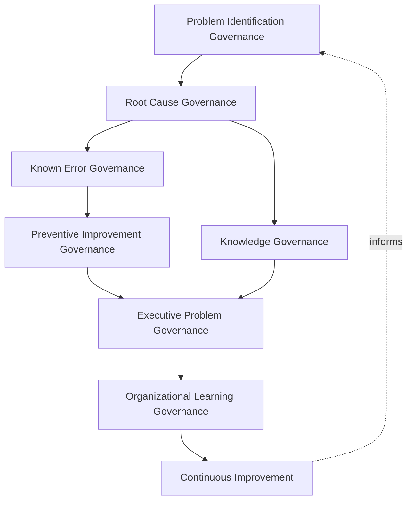
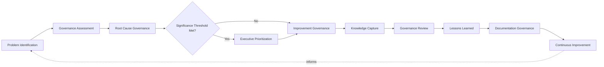
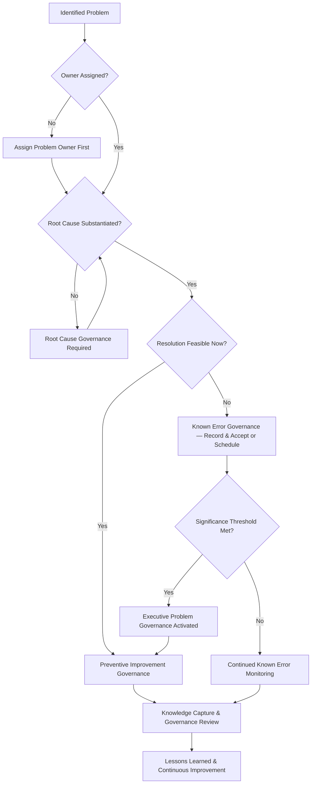
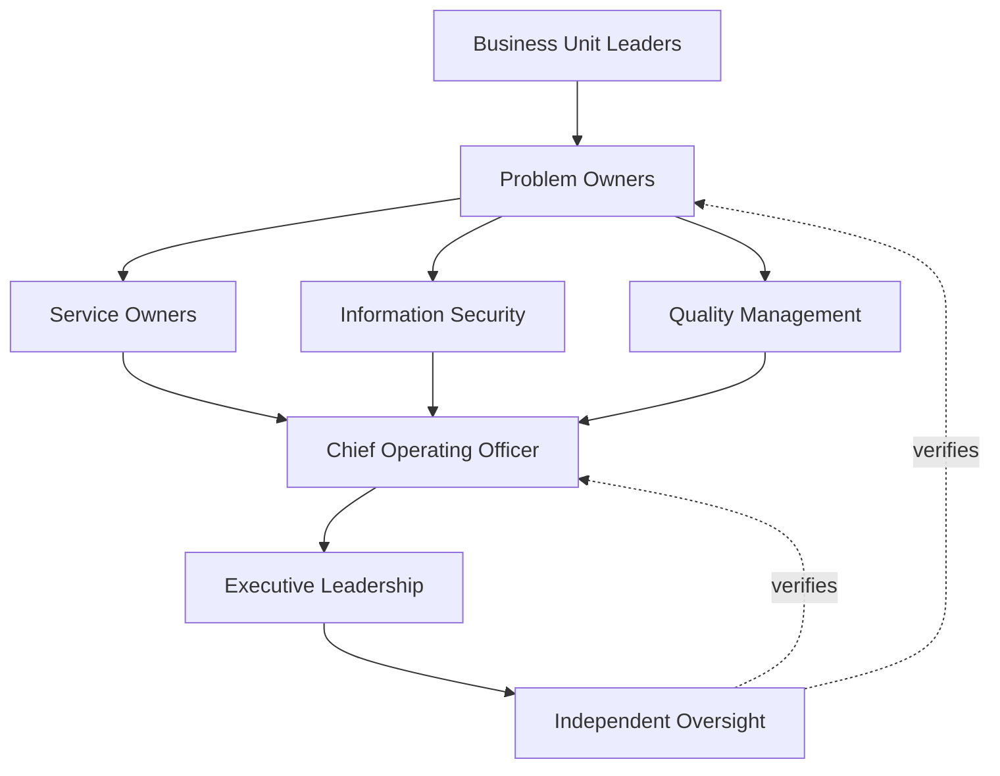
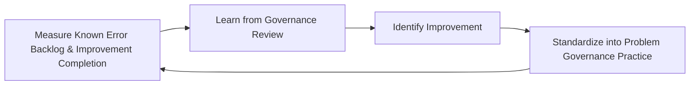
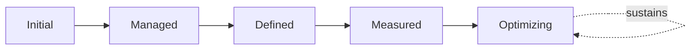

# Enterprise Problem Management Governance Strategy

## 1. Document Purpose

This document defines the official Enterprise Problem Management Governance Strategy for **StackLeo Tech Store** — the COO/CIO-owned executive charter under which problem management, root cause governance, known error governance, preventive governance, and organizational accountability for recurring disruption are governed as a deliberate, accountable discipline. It establishes governance for problem identification, root cause investigation oversight, known error governance, preventive improvement, knowledge governance, executive oversight, organizational accountability, and long-term problem management maturity across the StackLeo platform, consistent with ITIL 4, ISO/IEC 20000, ISO 9001, COBIT governance principles, and TOGAF enterprise architecture thinking.

`problem-management.md` remains the operational governance framework for problem management practice in this folder — the document that elaborates in full operational depth StackLeo's problem domains, root cause lifecycle, and known error practice. This document sits above it as the highest-level executive mandate, consistent with the executive-charter relationship `incident-management-governance.md` holds over `incident-management.md`: it does not restate operational investigation detail, it establishes the philosophy, organizational ownership, and executive expectations that give problem management practice its authority and coherence at the level of the Board and executive leadership.

- **Purpose of Problem Management Governance** — to ensure that the underlying causes of recurring disruption are genuinely identified, owned, and eliminated, rather than allowing the organization to resolve the same class of incident repeatedly without ever addressing what actually causes it.
- **Relationship with Incident Management** — `incident-management-governance.md` governs the organization's response to disruption once it occurs; this strategy governs the distinct, deliberate discipline of ensuring that disruption's underlying cause does not persist to cause it again, consistent with the distinction drawn in `problem-management.md` (Section 1).
- **Relationship with Service Management** — a problem left unaddressed is a direct, ongoing threat to the commitments defined in `service-catalog.md` and `service-level-management.md`; this strategy governs the accountability structure that protects those commitments over time, not merely incident by incident.
- **Relationship with Risk Management** — an unaddressed known error is itself a form of accepted operational risk; this strategy ensures that acceptance is a deliberate, governed decision, traceable to `06_Security/enterprise-risk-management-strategy.md` (Section 3.2, Operational Risk Governance), never a silent default.
- **Relationship with Operational Excellence** — this strategy is the specific governance mechanism through which `operations-governance-strategy.md` ensures StackLeo's daily operation genuinely improves over time, rather than merely being kept running.
- **Relationship with Knowledge Management** — the organizational memory this strategy governs the creation of — root causes, known errors, and lessons learned — is the foundation the whole organization draws on to avoid repeating past mistakes, consistent with Knowledge Management (`problem-management.md`, Section 4.9).
- **Relationship with Executive Decision-Making** — this strategy exists to give executive leadership genuine visibility into which underlying causes are driving recurring cost and risk, a visibility that directly informs decisions about investment, prioritization, and acceptable operational risk.

This document is implementation-independent and vendor-neutral. It defines problem management governance philosophy, model, domains, and lifecycle conceptually — not specific ITSM platforms, problem management software, knowledge management systems, monitoring tools, cloud providers, consulting firms, operational products, root cause analysis methodologies, troubleshooting workflows, known error database implementations, operational procedures, infrastructure configurations, deployment architectures, implementation roadmaps, or code.

## 2. Problem Management Philosophy

Problem management governance at StackLeo rests on eight principles. Each exists to produce a specific business outcome — problems are governed deliberately because the cumulative cost of unaddressed recurring causes compounds silently over time.

### 2.1 Prevention Over Repetition

Governance prioritizes eliminating the cause of recurring disruption over repeatedly resolving its symptoms.

- **Business Value** — the cost of genuinely preventing recurrence is typically far lower than the cumulative cost of the incidents an unaddressed cause would otherwise keep producing.

### 2.2 Governance Before Investigation

The accountability structure — who owns a problem, who decides its priority, who approves its resolution — is established before specific investigation activity is undertaken.

- **Business Value** — ensures problem investigation capability exists because a genuine, governed decision called for it, not as an ad hoc reaction to a frustrating incident.

### 2.3 Continuous Organizational Learning

Every problem, once understood, is treated as an opportunity to strengthen the organization's collective understanding, not merely to close an individual record.

- **Business Value** — converts the cost of past disruption into a durable, compounding improvement in organizational capability.

### 2.4 Accountability

Every problem traces to a specific, named, responsible owner from identification until it is formally resolved or deliberately accepted as a known error.

- **Business Value** — ensures no problem is left to drift without someone genuinely responsible for its resolution.

### 2.5 Transparency

Problem status, root cause understanding, and resolution progress are documented and visible to those who genuinely need them.

- **Business Value** — allows the true state of the platform's underlying reliability to be scrutinized and defended, rather than obscured.

### 2.6 Knowledge Sharing

What is learned from investigating one problem is made available to prevent or accelerate the resolution of others.

- **Business Value** — prevents the organization from re-investigating causes it has already understood elsewhere.

### 2.7 Business Alignment

Problem governance decisions are made in service of genuine business priority, focusing investigation where recurring disruption matters most.

- **Business Value** — ensures limited investigation capacity is directed toward what genuinely matters most to the business.

### 2.8 Continuous Improvement

Problem management governance practice matures over time, informed by real problems, trends, and the organization's growth in scale and complexity.

- **Business Value** — keeps problem governance aligned with StackLeo's growth in scale, market reach, and operational complexity.

## 3. Enterprise Problem Governance Model

Problem management governance operates across eight conceptual layers, each holding accountability for a distinct dimension of how StackLeo governs recurring disruption. Every layer here is elaborated in full operational depth in `problem-management.md`.

### 3.1 Problem Identification Governance

- **Purpose** — own the coherence of how the organization recognizes that a genuine underlying problem, rather than an isolated incident, exists.
- **Governance Scope** — oversight of the boundary between a single incident and a genuine recurring or systemic problem, coordinated with `monitoring-observability.md`.
- **Business Value** — ensures investigation effort is directed only at genuine recurring causes, not isolated, non-repeating events.
- **Executive Expectations** — leadership trusts that genuine problems are recognized from incident patterns, not left unnoticed until repetition becomes costly.

### 3.2 Root Cause Governance

- **Purpose** — own the coherence of how investigation is authorized, resourced, and held accountable for reaching a genuine underlying cause.
- **Governance Scope** — oversight of Root Cause Analysis (`problem-management.md`, Section 3.5) across every domain in Section 4.
- **Business Value** — ensures investigation genuinely reaches root cause rather than stopping at the first plausible explanation.
- **Executive Expectations** — leadership trusts root cause conclusions are genuinely substantiated, not asserted without evidence.

### 3.3 Known Error Governance

- **Purpose** — own the coherence of how a confirmed but not-yet-resolved cause is formally recorded, tracked, and deliberately accepted or scheduled for resolution.
- **Governance Scope** — oversight of Known Error Identification and Management (`problem-management.md`, Sections 3.6, 4.8).
- **Business Value** — ensures an unresolved cause remains visible and deliberately owned, never quietly forgotten.
- **Executive Expectations** — leadership expects every known error to carry an explicit, accountable decision — resolve, schedule, or knowingly accept.

### 3.4 Preventive Improvement Governance

- **Purpose** — own the coherence of how a confirmed root cause is translated into genuine, lasting corrective and preventive action.
- **Governance Scope** — oversight of Corrective Planning and Preventive Improvement (`problem-management.md`, Sections 3.7–3.8).
- **Business Value** — ensures understanding a cause actually leads to the organization no longer being exposed to it.
- **Executive Expectations** — leadership trusts preventive action is genuinely completed and verified, not merely proposed.

### 3.5 Knowledge Governance

- **Purpose** — own the coherence of how problem investigation findings are captured and made available across the organization.
- **Governance Scope** — oversight of Knowledge Capture and Knowledge Management (`problem-management.md`, Sections 3.10, 4.9).
- **Business Value** — ensures the organization's collective understanding compounds rather than resetting with each investigation.
- **Executive Expectations** — leadership expects prior findings to be genuinely discoverable, not siloed within the individuals who produced them.

### 3.6 Executive Problem Governance

- **Purpose** — own executive-level accountability for the problems carrying the greatest organizational consequence.
- **Governance Scope** — oversight spanning Sections 3.1–3.5 and 3.7 wherever a problem rises to genuine executive concern.
- **Business Value** — ensures the most consequential recurring causes are visible at the level accountable for the organization as a whole.
- **Executive Expectations** — leadership expects to be informed of, not surprised by, the organization's most significant unresolved causes.

### 3.7 Organizational Learning Governance

- **Purpose** — own the coherence of how the organization converts individual problem resolution into durable, shared organizational learning.
- **Governance Scope** — oversight of Governance Review and Lessons Learned (Sections 5.7–5.8) across every domain in Section 4.
- **Business Value** — ensures a resolved problem strengthens the organization's broader capability, not only the specific service it affected.
- **Executive Expectations** — leadership expects every significant problem to produce a documented, attributable organizational lesson.

### 3.8 Continuous Improvement

- **Purpose** — govern the mechanism by which every other layer in this model matures over time.
- **Governance Scope** — consolidates findings from problem trends, known error backlogs, and audits across every domain in Section 4.
- **Business Value** — prevents problem governance itself from becoming the next thing that quietly stagnates as the organization scales.
- **Executive Expectations** — leadership expects problem management maturity to be assessed periodically, not assumed static once established.

### Enterprise Problem Governance Matrix

| Layer | Purpose | Business Value | Executive Expectations |
|---|---|---|---|
| Problem Identification Governance | Own coherence of recognizing genuine underlying problems | Ensures effort is directed only at genuine recurring causes | Trusts problems are recognized from patterns, not left unnoticed |
| Root Cause Governance | Own coherence of authorizing and holding investigation accountable | Ensures investigation genuinely reaches root cause | Trusts conclusions are genuinely substantiated |
| Known Error Governance | Own coherence of recording and tracking confirmed causes | Ensures unresolved causes remain visible and owned | Expects every known error to carry an explicit decision |
| Preventive Improvement Governance | Own coherence of translating cause into corrective action | Ensures understanding a cause removes exposure to it | Trusts preventive action is completed and verified |
| Knowledge Governance | Own coherence of capturing and sharing findings | Ensures collective understanding compounds over time | Expects prior findings to be genuinely discoverable |
| Executive Problem Governance | Own executive accountability for highest-consequence problems | Ensures the most consequential causes are visible to leadership | Expects leadership informed of, not surprised by, top exposure |
| Organizational Learning Governance | Own coherence of converting resolution into shared learning | Ensures resolved problems strengthen broader capability | Expects every significant problem to produce a documented lesson |
| Continuous Improvement | Govern maturation of every other layer | Prevents governance itself from stagnating | Expects maturity to be assessed periodically |

*Diagram 1: Enterprise Problem Governance Framework — identification and root cause governance establish the foundation, branching into known error and knowledge governance ahead of preventive improvement, converging on executive oversight and organizational learning that feeds continuous improvement back into the model.*

## 4. Enterprise Problem Domains

Problem management is governed across ten conceptual domains, each requiring a distinct governance emphasis. Every domain here is elaborated in full operational depth in `problem-management.md`.

### 4.1 Customer Experience Problems

- **Purpose** — govern the underlying causes behind recurring friction or failure in a customer's experience of the platform.
- **Governance Considerations** — governed under Problem Identification Governance (Section 3.1), given its direct effect on customer trust.
- **Business Importance** — protects the trust relationship every recurring customer-visible failure erodes.
- **Executive Expectations** — leadership expects customer experience problems to be prioritized in proportion to genuine, cumulative customer impact.

### 4.2 Marketplace Problems

- **Purpose** — govern the underlying causes behind recurring disruption to listing, browsing, or transaction capability, including future multi-vendor marketplace activity.
- **Governance Considerations** — governed under Root Cause Governance (Section 3.2), structured ahead of the marketplace model's launch.
- **Business Importance** — protects the durability of the platform's core revenue-generating function.
- **Executive Expectations** — leadership expects marketplace problems to receive the highest business-criticality governance priority.

### 4.3 Payment Service Problems

- **Purpose** — govern the underlying causes behind recurring payment processing, reconciliation, or checkout failure.
- **Governance Considerations** — governed under Known Error Governance (Section 3.3), given its financial and regulatory sensitivity.
- **Business Importance** — protects revenue integrity and the business's standing with payment partners and regulators over time.
- **Executive Expectations** — leadership expects payment-related known errors to be resolved or explicitly, deliberately accepted, never left indefinitely open.

### 4.4 Technology Problems

- **Purpose** — govern the underlying causes behind recurring technical infrastructure or platform failure.
- **Governance Considerations** — governed under Preventive Improvement Governance (Section 3.4), coordinated with `07_DevOps/sre-strategy.md`.
- **Business Importance** — protects the technical foundation every other problem domain ultimately depends on.
- **Executive Expectations** — leadership expects technology problems to be governed with the same rigor regardless of which layer of the stack is affected.

### 4.5 Information Security Problems

- **Purpose** — govern the underlying causes behind recurring security-relevant weaknesses or incidents.
- **Governance Considerations** — governed jointly with, and never superseding, `06_Security/vulnerability-management.md` and `06_Security/incident-response.md`, which remain authoritative for security-specific obligations.
- **Business Importance** — protects customer data, platform integrity, and regulatory standing over time, not only at the moment of a single incident.
- **Executive Expectations** — leadership expects security-relevant known errors to be escalated with the same urgency defined in `06_Security/security-governance.md`.

### 4.6 Third-Party Service Problems

- **Purpose** — govern the underlying causes behind recurring disruption originating in a vendor, integration partner, or other external dependency.
- **Governance Considerations** — governed under Problem Identification Governance (Section 3.1), coordinated with `06_Security/third-party-risk-governance.md`.
- **Business Importance** — protects the business from recurring exposure to a dependency it does not directly control.
- **Executive Expectations** — leadership expects a recurring third-party cause to be escalated to the relationship level, not tolerated as routine.

### 4.7 Supply Chain Problems

- **Purpose** — govern the underlying causes behind recurring disruption in the sourcing relationships that supply the products StackLeo sells.
- **Governance Considerations** — governed under Preventive Improvement Governance (Section 3.4), anticipating growth in wholesale sourcing.
- **Business Importance** — protects the business's ability to reliably source the products it depends on to operate.
- **Executive Expectations** — leadership expects supply chain problem trends to be reviewed as sourcing relationships evolve.

### 4.8 Business Process Problems

- **Purpose** — govern the underlying causes behind recurring failure or friction in internal business processes.
- **Governance Considerations** — governed under Problem Identification Governance (Section 3.1), coordinated with Business Unit Leaders (Section 7.5).
- **Business Importance** — protects the organization's own operating capability, which customer-facing service ultimately depends on.
- **Executive Expectations** — leadership expects internal process problems to be governed with the same discipline as customer-facing ones.

### 4.9 Compliance Problems

- **Purpose** — govern the underlying causes behind recurring regulatory, contractual, or compliance-relevant failure.
- **Governance Considerations** — governed under Executive Problem Governance (Section 3.6), coordinated with `06_Security/compliance-governance.md`.
- **Business Importance** — protects the business's standing with regulators and its contractual counterparties over time.
- **Executive Expectations** — leadership expects compliance-related known errors to be escalated immediately, without exception, regardless of apparent technical severity.

### 4.10 Strategic Business Problems

- **Purpose** — govern the underlying causes behind recurring issues whose consequence extends to the organization's reputation, strategy, or competitive standing.
- **Governance Considerations** — governed exclusively under Executive Problem Governance (Section 3.6).
- **Business Importance** — protects the organization's most consequential asset — its standing with customers, partners, and the market.
- **Executive Expectations** — leadership expects direct, immediate engagement for any problem genuinely rising to this category.

### Enterprise Problem Domain Matrix

| Domain | Purpose | Business Importance | Executive Expectations |
|---|---|---|---|
| Customer Experience Problems | Govern causes behind recurring customer-facing friction or failure | Protects the trust relationship recurring failure erodes | Prioritized in proportion to genuine, cumulative customer impact |
| Marketplace Problems | Govern causes behind recurring listing, browsing, transaction disruption | Protects the durability of the core revenue-generating function | Receives the highest business-criticality priority |
| Payment Service Problems | Govern causes behind recurring payment or checkout failure | Protects revenue integrity and partner/regulator standing | Resolved or deliberately accepted, never left indefinitely open |
| Technology Problems | Govern causes behind recurring technical infrastructure failure | Protects the technical foundation every domain depends on | Governed with consistent rigor across the stack |
| Information Security Problems | Govern causes behind recurring security-relevant weakness | Protects data, integrity, and regulatory standing over time | Escalated with urgency per `security-governance.md` |
| Third-Party Service Problems | Govern causes behind recurring external dependency disruption | Protects against recurring exposure not directly controlled | Escalated to the relationship level, not tolerated as routine |
| Supply Chain Problems | Govern causes behind recurring sourcing disruption | Protects the ability to reliably source dependent products | Reviewed as sourcing relationships evolve |
| Business Process Problems | Govern causes behind recurring internal process failure | Protects operating capability customer service depends on | Governed with the same discipline as customer-facing problems |
| Compliance Problems | Govern causes behind recurring regulatory or contractual failure | Protects standing with regulators and counterparties over time | Escalated immediately, without exception |
| Strategic Business Problems | Govern causes affecting reputation or competitive standing | Protects the organization's standing with market and partners | Receives direct, immediate executive engagement |

## 5. Enterprise Problem Lifecycle

Problem management governance operates across ten conceptual lifecycle stages, applicable across every domain in Section 4.

### 5.1 Problem Identification

- **Purpose** — govern how the organization recognizes that a genuine underlying problem exists.
- **Governance Objectives** — require identification to draw on genuine incident pattern evidence, coordinated with `incident-management-governance.md`.
- **Business Value** — enables governance to begin as early as possible, before a recurring cause compounds in cost.

### 5.2 Governance Assessment

- **Purpose** — govern how a recognized problem is assessed for genuine scope, impact, and priority before investigation is authorized.
- **Governance Objectives** — apply Problem Identification Governance (Section 3.1) consistently before resourcing investigation.
- **Business Value** — ensures investigation effort is authorized deliberately, not opened reflexively for every reported concern.

### 5.3 Root Cause Governance

- **Purpose** — govern how investigation is held accountable for reaching a genuinely substantiated underlying cause.
- **Governance Objectives** — apply Root Cause Governance (Section 3.2) consistent with Prevention Over Repetition (Section 2.1).
- **Business Value** — ensures the cause finally addressed is the genuine one, not the most convenient explanation.

### 5.4 Executive Prioritization

- **Purpose** — govern the point at which a problem's scope or consequence requires executive-level prioritization decisions.
- **Governance Objectives** — apply Executive Problem Governance (Section 3.6) against clearly understood significance thresholds.
- **Business Value** — ensures leadership is engaged exactly when genuinely warranted, directing resolution investment deliberately.

### 5.5 Improvement Governance

- **Purpose** — govern how a confirmed root cause is translated into genuine corrective and preventive action.
- **Governance Objectives** — apply Preventive Improvement Governance (Section 3.4) through to verified completion.
- **Business Value** — ensures the organization is genuinely no longer exposed to a cause once it is understood.

### 5.6 Knowledge Capture

- **Purpose** — govern how problem investigation findings are formally recorded and made available for future use.
- **Governance Objectives** — apply Knowledge Governance (Section 3.5) consistent with Knowledge Sharing (Section 2.6).
- **Business Value** — ensures findings remain a durable organizational asset rather than knowledge held only by the investigator.

### 5.7 Governance Review

- **Purpose** — formally reassess whether a resolved or accepted problem's governance was handled appropriately.
- **Governance Objectives** — apply Organizational Learning Governance (Section 3.7) to every problem meeting a defined significance threshold.
- **Business Value** — ensures problem governance itself is genuinely scrutinized, not assumed correct by default.

### 5.8 Lessons Learned

- **Purpose** — formally capture what a review reveals about problem management governance itself.
- **Governance Objectives** — require lessons to be documented and attributed to specific governance implications, consistent with Continuous Organizational Learning (Section 2.3).
- **Business Value** — ensures the organization genuinely learns from experience rather than repeating the same gaps.

### 5.9 Documentation Governance

- **Purpose** — govern the completeness and integrity of the problem and known error record itself.
- **Governance Objectives** — require documentation to remain consistent with `problem-management.md` and `incident-management-governance.md` as those documents evolve.
- **Business Value** — ensures the organization retains a genuine, trustworthy record of what was found and why.

### 5.10 Continuous Improvement

- **Purpose** — apply accumulated lessons to strengthen future problem management governance.
- **Governance Objectives** — require findings to be genuinely analyzed for recurring patterns, consistent with Section 3.8.
- **Business Value** — turns each problem into an input that makes future problem governance genuinely stronger.

### Enterprise Problem Lifecycle Matrix

| Stage | Purpose | Governance Objective | Business Value |
|---|---|---|---|
| Problem Identification | Recognize that a genuine underlying problem exists | Draws on genuine incident pattern evidence | Enables governance to begin before cost compounds |
| Governance Assessment | Assess scope, impact, and priority before investigation | Authorizes investigation deliberately | Prevents reflexive opening of every reported concern |
| Root Cause Governance | Hold investigation accountable for a substantiated cause | Applies root cause governance consistently | Ensures the genuine cause is addressed, not the convenient one |
| Executive Prioritization | Elevate problems requiring executive-level decisions | Applies executive governance against clear thresholds | Directs resolution investment deliberately |
| Improvement Governance | Translate confirmed cause into corrective action | Carried through to verified completion | Ensures genuine removal of exposure to the cause |
| Knowledge Capture | Formally record findings for future use | Applies knowledge governance consistently | Makes findings a durable organizational asset |
| Governance Review | Reassess whether governance was handled appropriately | Applied to every problem meeting a significance threshold | Ensures governance itself is genuinely scrutinized |
| Lessons Learned | Capture governance implications from review | Documented and attributed to specific implications | Ensures genuine learning rather than repeated gaps |
| Documentation Governance | Maintain completeness and integrity of the record | Kept consistent with subordinate documentation | Retains a genuine, trustworthy record |
| Continuous Improvement | Apply lessons to strengthen future governance | Findings genuinely analyzed for recurring patterns | Makes future problem governance genuinely stronger |

*Diagram 2: Enterprise Problem Lifecycle — identification and governance assessment inform root cause governance, escalating to executive prioritization only where thresholds are met before improvement governance, with knowledge capture, governance review, lessons learned, and documentation governance feeding continuous improvement back into the cycle.*

## 6. Problem Management Principles

- **Accountability** — every problem traces to a specific, named, responsible owner, consistent with Section 2.4.
- **Transparency** — problem status, root cause understanding, and resolution are documented and visible to those who need them, consistent with Section 2.5.
- **Prevention** — governance prioritizes eliminating the cause of recurring disruption over repeatedly resolving symptoms, consistent with Section 2.1.
- **Organizational Learning** — every problem, once understood, strengthens the organization's collective understanding, consistent with Section 2.3.
- **Knowledge Sharing** — findings from one problem are made available to prevent or accelerate the resolution of others, consistent with Section 2.6.
- **Business Alignment** — problem governance decisions are made in service of genuine business priority.
- **Risk Awareness** — an unaddressed known error is treated as a deliberate, governed risk acceptance, not a silent default.
- **Continuous Improvement** — governance practice matures over time, informed by real problems and trends.

### Problem Management Principles Matrix

| Principle | Description | Business Value |
|---|---|---|
| Accountability | Every problem traces to a specific, named, responsible owner | Ensures no problem drifts without genuine ownership |
| Transparency | Status, root cause understanding, and resolution documented and visible | Allows the platform's true reliability state to be scrutinized |
| Prevention | Prioritizes eliminating cause over repeatedly resolving symptoms | Reduces the cumulative cost of recurring disruption |
| Organizational Learning | Each problem strengthens collective organizational understanding | Converts disruption cost into durable, compounding capability |
| Knowledge Sharing | Findings made available to prevent or accelerate other resolutions | Prevents re-investigating causes already understood elsewhere |
| Business Alignment | Decisions made in service of genuine business priority | Directs limited investigation capacity toward what matters most |
| Risk Awareness | Unaddressed known errors treated as deliberate risk acceptance | Ensures acceptance is a governed decision, never a silent default |
| Continuous Improvement | Practice matures from real problems and trends | Keeps governance aligned with organizational growth |

*Diagram 4: Enterprise Problem Governance Decision Flow — an identified problem is checked for assigned ownership and substantiated root cause, branching into known error governance or preventive improvement, with executive governance activated upon meeting significance thresholds, resolving into knowledge capture and continuous improvement.*

## 7. Ownership & Accountability

Governance authority for problem management is distributed deliberately across eight accountable functions, defined here at the governance-objective level, without prescribing specific operational problem investigation activities.

### 7.1 Executive Leadership

- **Governance Objective** — the Board and executive leadership hold ultimate accountability for how the organization governs its elimination of recurring underlying causes.
- **Business Value** — provides a single point of ultimate accountability for whether problem management governance is genuinely functioning as intended.

### 7.2 Chief Operating Officer

- **Governance Objective** — the Chief Operating Officer owns the coherence and enforcement of this strategy across every domain, layer, and stage it defines.
- **Business Value** — provides a single point of specialist accountability for whether problem management governance is genuinely functioning as intended.

### 7.3 Problem Owners

- **Governance Objective** — each individual problem has a specific, named owner accountable for its investigation, root cause substantiation, and resolution or deliberate acceptance, consistent with Accountability (Section 2.4).
- **Business Value** — ensures every open problem has a clear, singular point of accountability throughout its lifecycle.

### 7.4 Service Owners

- **Governance Objective** — each service defined in `service-catalog.md` has a specific, named owner accountable for that service's problem exposure and known error backlog.
- **Business Value** — ensures no service persists without someone genuinely responsible for its underlying reliability.

### 7.5 Business Unit Leaders

- **Governance Objective** — business unit leaders own problem governance readiness within their own function, consistent with Business Process Problems (Section 4.8).
- **Business Value** — ensures problem governance is genuinely embedded within the functions closest to recurring operational friction.

### 7.6 Information Security

- **Governance Objective** — information security owns Information Security Problems (Section 4.5) jointly with `06_Security/vulnerability-management.md` and `06_Security/incident-response.md`, which remain authoritative for security-specific obligations.
- **Business Value** — ensures security-relevant recurring causes remain integrated with, not separate from, broader problem governance.

### 7.7 Quality Management

- **Governance Objective** — quality management owns the alignment of problem governance with ISO 9001 continual improvement obligations, consistent with `08_Quality_Assurance` practice.
- **Business Value** — ensures problem management genuinely functions as a continual improvement discipline, not an isolated operational activity.

### 7.8 Independent Oversight

- **Governance Objective** — an independent function, separate from those who design and operate problem governance, periodically verifies its overall effectiveness.
- **Business Value** — prevents governance from being assumed effective on the word of the same function responsible for running it.

### Ownership & Accountability Matrix

| Role | Governance Objective | Business Value |
|---|---|---|
| Executive Leadership | Hold ultimate accountability for eliminating recurring causes | Provides a single point of ultimate accountability |
| Chief Operating Officer | Own coherence and enforcement of this strategy | Provides a single point of specialist accountability |
| Problem Owners | Own investigation, substantiation, and resolution of a specific problem | Ensures every open problem has clear, singular accountability |
| Service Owners | Own problem exposure and known error backlog for a specific service | Ensures no service persists without genuine reliability accountability |
| Business Unit Leaders | Own problem governance readiness within their own function | Embeds governance closest to recurring operational friction |
| Information Security | Own security problems jointly with vulnerability and incident response practice | Keeps security causes integrated with broader governance |
| Quality Management | Own alignment with ISO 9001 continual improvement obligations | Ensures problem management functions as genuine continual improvement |
| Independent Oversight | Independently verify overall governance effectiveness | Prevents self-assessed assumption of effectiveness |

*Diagram 3: Problem Ownership & Accountability Model — accountability flows from business unit and problem ownership through service ownership, security, and quality management into the Chief Operating Officer, converging on executive leadership verified by independent oversight.*

## 8. Executive Oversight

- **Executive Problem Reviews** — the overall coherence of problem management governance is formally reviewed on a regular cadence, consistent with `operations-governance-strategy.md` (Section 8).
- **Organizational Learning Reporting** — aggregated problem health — open problems, known error backlog, root cause trends — is reported to executive leadership and the Board.
- **Governance Reviews** — the governance model, domains, and lifecycle defined in this strategy (Sections 3–7) are periodically reassessed for continued fitness.
- **Improvement Oversight** — the organization's completion rate and quality of Preventive Improvement Governance (Section 3.4) is reviewed directly with executive leadership.
- **Documentation Governance** — this strategy's relationship to `problem-management.md`, `incident-management-governance.md`, and `06_Security/enterprise-risk-management-strategy.md` is kept current as those documents evolve.
- **Operational Readiness** — problem decisions, evidence, and outcomes are maintained in a state ready for internal or external audit at any time, coordinated with `06_Security/audit-governance.md`.

### Executive Oversight Matrix

| Oversight Mechanism | Purpose | Governance Role |
|---|---|---|
| Executive Problem Reviews | Confirm overall problem governance coherence | Regular, predictable cadence for the strategy as a whole |
| Organizational Learning Reporting | Provide leadership a single, coherent problem picture | Reports open problems, known error backlog, root cause trends |
| Governance Reviews | Reassess the governance model itself for continued fitness | Applies to Sections 3–7 of this strategy |
| Improvement Oversight | Review completion rate and quality of preventive improvement | Direct executive-level review of improvement follow-through |
| Documentation Governance | Keep this strategy's subordinate relationships current | Updated as related documents evolve |
| Operational Readiness | Maintain decisions and evidence ready for independent review | Continuous state, coordinated with audit governance |

### Governance Responsibility Matrix

| Role | Responsibility |
|---|---|
| Executive Leadership | Owns ultimate accountability for eliminating recurring underlying causes. |
| Chief Operating Officer | Owns coherence and enforcement of this strategy, in partnership with executive leadership. |
| Problem Management Governance Lead | Owns the operational problem model within `problem-management.md`. |
| Service Owners | Own problem exposure and known error backlog within their assigned service. |
| Problem Owners | Own investigation, substantiation, and resolution of their assigned problem. |
| Information Security | Owns Information Security Problems jointly with vulnerability and incident response practice. |
| Quality Management | Ensures problem governance meets ISO 9001 continual improvement obligations. |
| Independent Oversight | Independently verifies the overall effectiveness of problem management governance. |

## 9. Future Readiness

This strategy is designed to remain valid as StackLeo evolves in scale, geography, and organizational complexity, without requiring redefinition of its underlying philosophy.

- **AI-Assisted Problem Management** — as problem identification and root cause investigation increasingly incorporate AI-assisted analysis, they remain governed under Problem Identification and Root Cause Governance (Sections 3.1–3.2) at the same rigor as any other method.
- **Predictive Problem Intelligence** — where the organization develops the capability to anticipate a problem before repeated incidents confirm it, that capability is governed as an extension of Problem Identification (Section 5.1), not a separate discipline.
- **Enterprise Scale** — the governance model, domains, and lifecycle defined throughout this strategy are defined independently of organizational size, so they remain coherent as StackLeo's operational complexity grows substantially.
- **Global Expansion** — Governance Assessment and Executive Prioritization (Sections 5.2, 5.4) are structured to be re-applied as StackLeo expands from Bangladesh into South Asia and global markets, each with genuinely distinct problem considerations.
- **Multi-Region Operations** — Technology and Supply Chain Problems (Sections 4.4, 4.7) are structured to absorb genuinely multi-region operational complexity as it emerges.
- **Digital Operations** — this strategy's governance discipline is treated as a direct contributor to the digital trust customers, partners, and regulators extend to StackLeo, not merely an internal control exercise.
- **Knowledge-Centric Organizations** — Knowledge Governance (Section 3.5) is structured to scale toward an organization where accumulated problem knowledge is a genuinely first-class asset, not a byproduct of investigation.
- **Future Operational Ecosystems** — Continuous Improvement (Section 3.8) is structured to absorb genuinely new operational models — additional sales channels, multi-vendor operations, corporate and wholesale sales — without requiring this strategy to be rewritten.

## 10. Problem Management Maturity Model

Problem management governance maturity is described across five conceptual levels, consistent with ITIL 4 and established process maturity thinking.

- **Initial** — problem governance, where it exists, is informal and inconsistent; problems are identified reactively, and ownership is unclear.
- **Managed** — basic problem governance exists for individual domains, but consistency across the ten domains in Section 4 varies significantly.
- **Defined** — the governance model, domains, and lifecycle are standardized, documented, and consistently applied across the organization, consistent with the model defined throughout this strategy.
- **Measured** — problem volume, known error backlog, and preventive improvement completion are measured systematically, and decisions are grounded in genuine evidence rather than qualitative impression alone.
- **Optimizing** — problem management governance is continuously and deliberately improved based on quantitative evidence and organizational learning; improvement itself is a managed, ongoing discipline rather than an occasional initiative.

### Problem Management Maturity Model Matrix

| Level | Characteristics | Primary Focus |
|---|---|---|
| Initial | Informal, inconsistent governance; problems identified reactively | Ad hoc, individually-dependent problem practice |
| Managed | Basic governance exists per domain; consistency varies | Domain-level consistency |
| Defined | Standardized governance model, domains, and lifecycle | Organization-wide consistency and clear ownership |
| Measured | Volume, backlog, and improvement completion measured systematically | Evidence-based problem governance decisions |
| Optimizing | Practice continuously and deliberately improved from evidence | Sustained, deliberate improvement as a discipline |

*Diagram 5: Continuous Problem Improvement Cycle — problem outcomes are measured, learned from, improved upon, and standardized back into governed practice, on a continuing basis.*

*Diagram 6: Problem Management Maturity Progression Model — maturity advances from informal, reactively-identified problem practice toward standardized, measured, and continuously optimized problem management governance.*

## 11. Anti-Patterns

The following recurring failure patterns are explicitly recognized and avoided, as each one structurally undermines this strategy.

### Anti-Pattern Summary

| Anti-Pattern | Why It's Avoided |
|---|---|
| Repeating Incidents Without Problem Governance | Contradicts Prevention Over Repetition (Section 2.1); resolving the same class of incident repeatedly without governed investigation leaves the true cause in place indefinitely. |
| Unknown Problem Ownership | Contradicts Problem Owners (Section 7.3); a problem with no accountable owner has no one genuinely responsible for its resolution. |
| Weak Executive Visibility | Contradicts Organizational Learning Reporting (Section 8); leadership cannot govern recurring risk it is never shown. |
| Poor Documentation | Undermines Documentation Governance (Sections 5.9, 8) and Transparency (Section 2.5), leaving problem decisions unclear or unverifiable after the fact. |
| Knowledge Silos | Contradicts Knowledge Sharing (Section 2.6) and Knowledge Governance (Section 3.5); findings held only by the individuals who produced them cannot prevent others from repeating the same investigation. |
| Reactive Problem Management | Contradicts Governance Before Investigation (Section 2.2); treating governance as something invented in the moment leaves investigation improvised and inconsistently prioritized. |
| Short-Term Fixes Without Prevention | Contradicts Preventive Improvement Governance (Section 3.4); resolving a symptom without eliminating its cause guarantees the same class of disruption recurs. |
| Missing Continuous Improvement | Contradicts Continuous Improvement (Sections 2.8, 3.8); without deliberate improvement, problem governance stagnates as the organization and its risk landscape grow. |

## 12. Document Information

| Property | Value |
|----------|-------|
| Document | problem-management-governance.md |
| Version | 1.0.0 |
| Status | Active |
| Maintained By | StackLeo |
| Last Updated | 2026-07-24 |

---

© StackLeo. All Rights Reserved.
