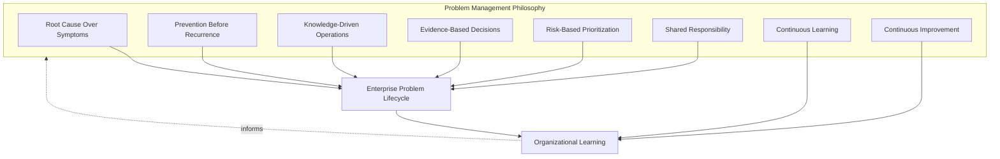
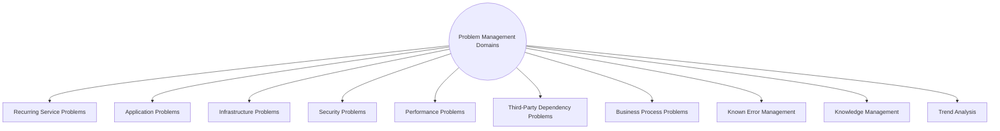
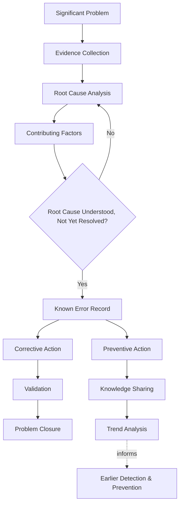
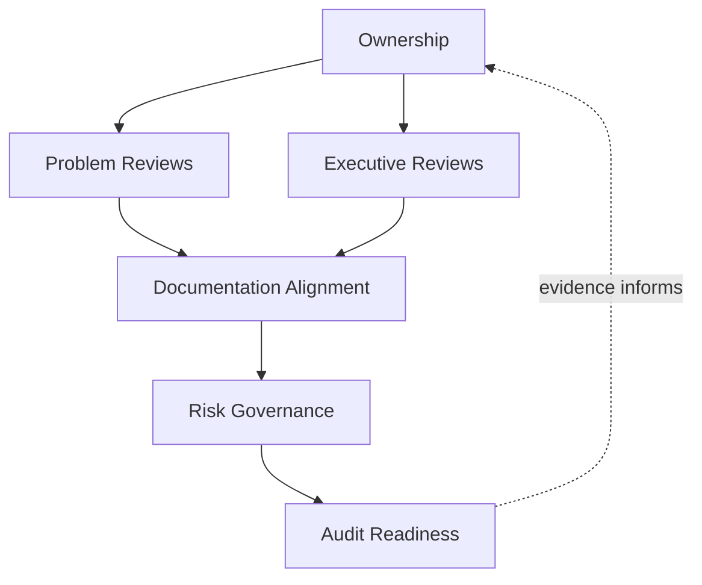
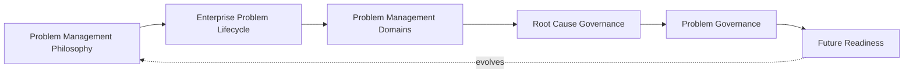
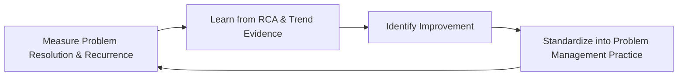
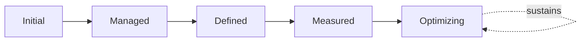

# Enterprise Problem Management & Root Cause Governance Strategy

## 1. Document Purpose

This document defines the official Enterprise Problem Management & Root Cause Governance Strategy for **StackLeo Tech Store**. It establishes how the organization identifies, investigates, and eliminates the underlying causes behind incidents and recurring operational issues — independent of any specific ITSM platform, problem management tool, ticketing system, or knowledge base software.

- **Purpose of Problem Management** — problem management exists to ensure that disruption is not merely resolved repeatedly but genuinely prevented from recurring, converting Post-Incident Learning (`incident-management.md`, Section 4.10) into durable, systemic improvement rather than a cycle of repeated firefighting.
- **Relationship with Incident Management** — incident management and problem management are related but distinct disciplines: `incident-management.md` restores service quickly when disruption occurs; this document investigates and eliminates the recurring causes behind multiple incidents, consistent with the distinction drawn in `operations-overview.md` (Section 5.4).
- **Relationship with Monitoring & Observability** — problem investigation depends on the diagnostic evidence and trend visibility established in `monitoring-observability.md`; Trend Analysis (Section 4.10) in this document is only as reliable as the telemetry it draws on.
- **Relationship with Reliability Engineering** — this strategy operationalizes accountability for eliminating the systemic causes of reliability erosion, complementing the engineered reliability objectives of `07_DevOps/sre-strategy.md` with a dedicated discipline focused on recurring, cross-cutting causes.
- **Relationship with Service Management** — problems that remain unresolved directly threaten the commitments defined in `service-level-management.md`; problem management is the mechanism that protects those commitments over time, not merely incident by incident.
- **Relationship with Continuous Improvement** — problem management is, at its core, a continuous improvement discipline; it treats every resolved problem as evidence that should make the platform and the organization structurally better, not merely quieter for a while.

This document is implementation-independent and vendor-neutral. It defines problem management philosophy, lifecycle, domains, and governance conceptually — not specific ITSM platforms, problem management tools, ticketing systems, knowledge base software, RCA techniques, severity thresholds, workflow implementations, or infrastructure configuration.

## 2. Problem Management Philosophy

Problem management at StackLeo is governed by eight principles. Each exists to produce a specific business outcome — problems are investigated deliberately because of the recurring cost and risk they represent, not as an academic exercise in curiosity.

### 2.1 Root Cause Over Symptoms

Investigation traces a problem back to its true underlying cause, rather than stopping at its first, most visible explanation.

- **Business Value** — a symptom-only fix leaves the true cause in place, allowing disruption to resurface in a different form; addressing the root cause prevents an entire class of future incidents.

### 2.2 Prevention Before Recurrence

Problem management acts to prevent a known cause from producing further incidents, rather than waiting for repetition to confirm a pattern is worth addressing.

- **Business Value** — the cost of preventing a second or third occurrence of a known issue is typically far lower than the cumulative cost of the incidents it would otherwise cause.

### 2.3 Knowledge-Driven Operations

Decisions about what to investigate and how to resolve it are informed by accumulated organizational knowledge, consistent with Knowledge Management in `service-management.md` (Section 4.8).

- **Business Value** — prevents the same investigative effort from being repeated whenever a similar issue resurfaces, whether or not the original investigator is still available.

### 2.4 Evidence-Based Decisions

Problem investigation and resolution decisions are grounded in observed telemetry and incident history, consistent with Evidence-Based Operations in `operations-overview.md` (Section 6).

- **Business Value** — replaces guesswork with genuine evidence, making problem resolution defensible and repeatable rather than dependent on individual intuition.

### 2.5 Risk-Based Prioritization

Problem investigation effort is proportionate to the genuine business, customer, and financial risk a recurring issue represents, consistent with risk-based prioritization used throughout this repository.

- **Business Value** — directs finite investigative capacity toward the problems whose resolution would prevent the greatest future harm.

### 2.6 Shared Responsibility

Problem management is owned jointly by Engineering, SRE, Operations, and Security; no single function alone determines whether a recurring cause is genuinely eliminated.

- **Business Value** — prevents the anti-pattern in Section 10.6, where problem resolution stalls because ownership of the underlying cause spans multiple teams and none takes it on.

### 2.7 Continuous Learning

Every investigated problem, regardless of its eventual resolution, is treated as an opportunity for organizational learning about how the platform and its operation can improve.

- **Business Value** — converts the cost already incurred by recurring disruption into a durable asset — improved future resilience — rather than a pure, repeated loss.

### 2.8 Continuous Improvement

Problem management practice itself matures over time, informed by real problem resolution outcomes and the effectiveness of past preventive action.

- **Business Value** — ensures problem management becomes more effective over time rather than repeating the same investigative gaps indefinitely as the platform grows.

*Diagram 1: Problem Management Philosophy Overview — the eight principles shape the enterprise problem lifecycle, and organizational learning feeds back into the philosophy itself.*

## 3. Enterprise Problem Lifecycle

Problem management is governed across twelve conceptual stages, spanning from initial identification through governance review and continuous improvement.

### 3.1 Problem Identification

- **Purpose** — recognize that a recurring or significant underlying cause exists behind one or more incidents, consistent with Post-Incident Learning (`incident-management.md`, Section 4.10).
- **Business Value** — is the necessary first step; a problem never identified can never be genuinely eliminated.
- **Governance Objectives** — ensure identification can originate from incident trends, monitoring evidence, or direct observation, without artificial barriers.

### 3.2 Problem Logging

- **Purpose** — capture the identified problem in a consistent, complete, and traceable record.
- **Business Value** — preserves the evidence and context necessary for effective investigation, especially when addressed later or by someone other than the identifier.
- **Governance Objectives** — require a consistent minimum set of information for every logged problem, including its linked incidents.

### 3.3 Initial Assessment

- **Purpose** — perform a first-pass evaluation of the problem's likely scope, severity, and business impact.
- **Business Value** — orients subsequent investigation quickly, before deeper effort is committed.
- **Governance Objectives** — require every logged problem to receive an initial assessment within a defined, consistent expectation.

### 3.4 Investigation

- **Purpose** — examine the problem in sufficient depth to understand its behavior and candidate causes.
- **Business Value** — builds the foundation of understanding that genuine Root Cause Analysis (Section 3.5) depends on.
- **Governance Objectives** — ensure investigation depth is proportionate to the problem's assessed severity and recurrence risk, per Risk-Based Prioritization (Section 2.5).

### 3.5 Root Cause Analysis

- **Purpose** — trace the problem to its true underlying cause, consistent with Root Cause Over Symptoms (Section 2.1).
- **Business Value** — is the point at which genuine prevention becomes possible, distinct from merely managing recurring symptoms.
- **Governance Objectives** — require RCA findings to explicitly consider contributing factors beyond the single most obvious technical cause (Section 5.3).

### 3.6 Known Error Identification

- **Purpose** — formally recognize a problem whose root cause is understood but not yet resolved as a Known Error, consistent with ITIL practice.
- **Business Value** — allows the organization to manage a problem's impact deliberately (through workarounds) while permanent resolution is planned, rather than treating it as an unknown recurring surprise each time.
- **Governance Objectives** — require Known Errors to be documented and made visible to incident response and support functions.

### 3.7 Corrective Planning

- **Purpose** — plan the specific action required to resolve the identified root cause.
- **Business Value** — converts understanding into a concrete, actionable plan rather than leaving a known cause unaddressed indefinitely.
- **Governance Objectives** — require corrective plans to be prioritized consistent with Risk-Based Prioritization (Section 2.5) and tracked to completion.

### 3.8 Preventive Improvement

- **Purpose** — implement broader improvements that prevent an entire class of similar problems, not only the specific instance investigated.
- **Business Value** — offers the highest-leverage outcome of the entire lifecycle, reducing future incident volume beyond the single resolved problem.
- **Governance Objectives** — require preventive improvements to be tracked separately from, and in addition to, corrective actions for the specific problem.

### 3.9 Validation

- **Purpose** — confirm that implemented corrective and preventive actions genuinely eliminate or sufficiently mitigate the root cause.
- **Business Value** — prevents the costly failure mode of declaring a problem resolved while its underlying cause remains active.
- **Governance Objectives** — require validation to be performed independently of the investigation and resolution effort itself.

### 3.10 Knowledge Capture

- **Purpose** — document the problem, its root cause, and its resolution for future reference, consistent with Knowledge-Driven Operations (Section 2.3).
- **Business Value** — prevents institutional knowledge about how a problem was understood and resolved from being lost over time.
- **Governance Objectives** — require knowledge capture to be connected to Knowledge Management in `service-management.md` (Section 4.8).

### 3.11 Governance Review

- **Purpose** — periodically evaluate the overall health of problem management practice, not only individual problem outcomes.
- **Business Value** — gives leadership an honest, evidence-based view of whether recurring causes are genuinely being eliminated at scale.
- **Governance Objectives** — ensure review is conducted on a regular, predictable cadence and reported to accountable ownership (Section 6.1).

### 3.12 Continuous Improvement

- **Purpose** — act on governance review findings and trend analysis to deliberately improve problem management practice itself.
- **Business Value** — ensures problem management effectiveness compounds over time rather than remaining static as the platform and business grow.
- **Governance Objectives** — require improvement actions arising from governance review to be documented and tracked to completion.

### Enterprise Problem Lifecycle Matrix

| Stage | Purpose | Business Value | Governance Objective |
|---|---|---|---|
| Problem Identification | Recognize a recurring or significant underlying cause | Necessary first step for every subsequent stage | Identification open to incidents, monitoring, or direct observation |
| Problem Logging | Capture the problem consistently and completely | Preserves evidence and context for investigation | Consistent minimum information, including linked incidents |
| Initial Assessment | First-pass evaluation of scope, severity, impact | Orients subsequent investigation quickly | Every problem assessed within a defined expectation |
| Investigation | Examine the problem to understand candidate causes | Builds the foundation genuine RCA depends on | Depth proportionate to assessed severity and recurrence risk |
| Root Cause Analysis | Trace the problem to its true underlying cause | Enables genuine prevention, not symptom management | Findings consider contributing factors beyond the obvious cause |
| Known Error Identification | Formally recognize an understood, unresolved cause | Allows deliberate impact management pending resolution | Known Errors documented and visible to incident response |
| Corrective Planning | Plan the action required to resolve the root cause | Converts understanding into a concrete, actionable plan | Plans prioritized by risk and tracked to completion |
| Preventive Improvement | Implement improvements preventing an entire problem class | Highest-leverage outcome of the whole lifecycle | Tracked separately from and in addition to corrective actions |
| Validation | Confirm actions genuinely eliminate or mitigate the cause | Prevents declaring resolution while the cause remains active | Performed independently of investigation and resolution effort |
| Knowledge Capture | Document the problem, cause, and resolution | Prevents institutional knowledge loss over time | Connected to knowledge management practice |
| Governance Review | Periodically evaluate overall problem management health | Honest, evidence-based view of systemic elimination | Regular cadence, reported to accountable ownership |
| Continuous Improvement | Act on review and trend findings to improve practice | Effectiveness compounds over time | Improvement actions tracked to completion |

```mermaid
flowchart LR
    A[Problem Identification] --> B[Problem Logging]
    B --> C[Initial Assessment]
    C --> D[Investigation]
    D --> E[Root Cause Analysis]
    E --> F[Known Error Identification]
    F --> G[Corrective Planning]
    G --> H[Preventive Improvement]
    H --> I[Validation]
    I --> J[Knowledge Capture]
    J --> K[Governance Review]
    K --> L[Continuous Improvement]
    L -.feeds back.-> A
```

*Diagram 2: Enterprise Problem Lifecycle — a continuous cycle in which governance review and improvement directly inform the next iteration of problem identification.*

## 4. Problem Management Domains

Problem management spans ten conceptual domains, each corresponding to a distinct source of recurring operational risk.

### 4.1 Recurring Service Problems

- **Purpose** — capture patterns of repeated disruption to a specific service defined in `service-catalog.md`.
- **Scope** — incident history aggregated at the service level, consistent with Service Health Monitoring in `monitoring-observability.md` (Section 4.1).
- **Governance Expectations** — investigation priority reflects the affected service's criticality classification.
- **Business Importance** — protects the service level commitments defined in `service-level-management.md` from erosion by repeated, unaddressed disruption.

### 4.2 Application Problems

- **Purpose** — capture recurring causes rooted in application-level logic or behavior.
- **Scope** — informed by Application Monitoring in `monitoring-observability.md` (Section 4.3) and Application Incidents in `incident-management.md` (Section 4.2).
- **Governance Expectations** — engineering teams owning the affected logic are engaged directly in root cause investigation.
- **Business Importance** — often reveals design or construction weaknesses that, once corrected, prevent an entire family of future defects.

### 4.3 Infrastructure Problems

- **Purpose** — capture recurring causes rooted in the underlying technical environment.
- **Scope** — informed by Infrastructure Health Awareness in `monitoring-observability.md` (Section 4.2).
- **Governance Expectations** — infrastructure-level root causes are distinguished from application-level symptoms that merely manifest through them.
- **Business Importance** — can simultaneously affect multiple services, making systemic resolution especially high-leverage.

### 4.4 Security Problems

- **Purpose** — capture recurring causes behind security-relevant incidents.
- **Scope** — governed jointly with, and never superseding, `06_Security/vulnerability-management.md`, which remains authoritative for security-specific remediation obligations.
- **Governance Expectations** — security problems are investigated with the confidentiality and urgency established in `06_Security`, alongside this document's broader problem governance.
- **Business Importance** — protects StackLeo's core trust differentiator by preventing recurring security weaknesses rather than repeatedly remediating individual incidents.

### 4.5 Performance Problems

- **Purpose** — capture recurring causes behind performance degradation or capacity strain.
- **Scope** — informed by `08_Quality_Assurance/performance-testing.md` and Capacity Management in `operations-overview.md` (Section 5.8).
- **Governance Expectations** — investigation considers both workload growth and structural performance constraints as candidate causes.
- **Business Importance** — protects conversion and customer trust by preventing recurring responsiveness degradation as the platform scales.

### 4.6 Third-Party Dependency Problems

- **Purpose** — capture recurring causes behind disruption originating from external dependencies — payment providers, couriers, and future marketplace partners.
- **Scope** — patterns across Third-Party Service Incidents (`incident-management.md`, Section 4.5).
- **Governance Expectations** — investigation includes explicit engagement with the affected partner where the root cause lies outside StackLeo's direct control.
- **Business Importance** — protects customers from recurring disruption StackLeo does not directly cause but remains responsible for managing.

### 4.7 Business Process Problems

- **Purpose** — capture recurring causes behind disruption to a business process rather than a purely technical failure.
- **Scope** — informed by Business Process Monitoring in `monitoring-observability.md` (Section 4.4) and Business Process Incidents (`incident-management.md`, Section 4.6).
- **Governance Expectations** — investigation engages Business and Product stakeholders directly, not only Engineering and Operations.
- **Business Importance** — reveals process-level weaknesses that purely technical investigation would miss.

### 4.8 Known Error Management

- **Purpose** — maintain visibility and deliberate management of problems whose root cause is understood but not yet permanently resolved.
- **Scope** — the accumulated set of Known Errors identified across Section 3.6, spanning every other domain in this section.
- **Governance Expectations** — Known Errors are visible to incident response and support functions so they can be managed consistently, not rediscovered each time.
- **Business Importance** — converts an otherwise unpredictable recurring surprise into a deliberately managed, understood risk.

### 4.9 Knowledge Management

- **Purpose** — capture, organize, and make accessible the knowledge produced by problem investigation and resolution.
- **Scope** — connects to Knowledge Management in `service-management.md` (Section 4.8), extended here to problem-specific investigative knowledge.
- **Governance Expectations** — knowledge is actively maintained and accessible, not scattered across individual memory or informal channels.
- **Business Importance** — reduces the cost of investigating similar future problems and supports faster incident diagnosis through Known Error visibility.

### 4.10 Trend Analysis

- **Purpose** — analyze patterns across the accumulated history of incidents and problems to identify systemic risk not visible in any single occurrence.
- **Scope** — connects to Trend Analysis in `08_Quality_Assurance/quality-metrics.md` (Section 3.4), extended here to operational incident and problem data.
- **Governance Expectations** — trend analysis is conducted on a recurring basis, not only in response to an already-visible crisis.
- **Business Importance** — offers the earliest possible warning of an emerging systemic weakness, before it produces a significant incident.

### Problem Management Domain Matrix

| Domain | Purpose | Governance Expectations | Business Importance |
|---|---|---|---|
| Recurring Service Problems | Capture patterns of repeated service disruption | Priority reflects the affected service's criticality | Protects service level commitments from repeated erosion |
| Application Problems | Capture recurring causes in application logic | Owning engineering teams engaged directly | Reveals design weaknesses preventing entire defect families |
| Infrastructure Problems | Capture recurring causes in the technical environment | Distinguished from application-level symptoms | Can affect multiple services; high-leverage resolution |
| Security Problems | Capture recurring causes behind security incidents | Governed jointly with, never superseding, vulnerability management | Prevents recurring security weaknesses, not repeated remediation |
| Performance Problems | Capture recurring performance/capacity causes | Considers both workload growth and structural constraints | Prevents recurring responsiveness degradation as platform scales |
| Third-Party Dependency Problems | Capture recurring causes from external dependencies | Includes explicit partner engagement | Protects customers from disruption outside direct control |
| Business Process Problems | Capture recurring business process disruption causes | Engages Business and Product stakeholders directly | Reveals process weaknesses purely technical review would miss |
| Known Error Management | Maintain visibility of understood, unresolved causes | Visible to incident response and support functions | Converts unpredictable recurrence into managed, understood risk |
| Knowledge Management | Capture and organize investigative knowledge | Actively maintained and accessible | Reduces cost of future investigation; supports faster diagnosis |
| Trend Analysis | Analyze patterns across accumulated history | Conducted on a recurring basis, not only reactively | Earliest possible warning of emerging systemic weakness |

*Diagram 3: Problem Management Domain Map — ten domains, each corresponding to a distinct source of recurring operational risk.*

## 5. Root Cause Governance

- **Root Cause Analysis Governance** — RCA is required for every problem meeting a defined significance threshold, and its findings are reviewed for genuine depth, not accepted at the first plausible explanation.
- **Evidence Collection** — RCA draws on preserved incident evidence, telemetry, and diagnostic data, consistent with Evidence Preservation (`incident-management.md`, Section 5).
- **Contributing Factors** — RCA explicitly considers the full set of conditions that allowed a problem to occur and recur — process, design, review, or environmental factors — not only the single proximate technical cause.
- **Corrective Actions** — actions that resolve the specific investigated problem, tracked to verified completion via Validation (Section 3.9).
- **Preventive Actions** — broader actions that prevent an entire class of similar problems, tracked separately from and in addition to corrective actions.
- **Knowledge Sharing** — RCA findings and resulting actions are shared across teams, not confined to the team that happened to encounter the problem, consistent with Knowledge-Driven Operations (Section 2.3).
- **Operational Learning** — RCA and resolution outcomes feed back into Section 3.1 and monitoring practice in `monitoring-observability.md`, closing the loop between what was learned and how future problems are prevented or detected earlier.
- **Continuous Improvement** — root cause governance itself matures over time, informed by the effectiveness of past RCA and preventive action.

### Root Cause Governance Matrix

| Element | Purpose | Governance Role |
|---|---|---|
| Root Cause Analysis Governance | Require and review genuine-depth RCA | Required for problems meeting a significance threshold |
| Evidence Collection | Draw on preserved incident evidence and telemetry | Grounds RCA in genuine, retained data |
| Contributing Factors | Consider the full set of enabling conditions | Prevents RCA from stopping at the first plausible explanation |
| Corrective Actions | Resolve the specific investigated problem | Tracked to verified completion via validation |
| Preventive Actions | Prevent an entire class of similar future problems | Tracked separately from and in addition to corrective actions |
| Knowledge Sharing | Distribute findings across teams | Findings documented and accessible beyond the originating team |
| Operational Learning | Feed outcomes back into identification and monitoring | Closes the loop between learning and future prevention/detection |
| Continuous Improvement | Mature root cause governance from real outcomes | Effectiveness of RCA and preventive action reviewed over time |

*Diagram: Known Error Management Flow — a significant problem is traced through evidence and root cause analysis to a Known Error record, from which both corrective and preventive action proceed toward validated closure and shared learning.*

## 6. Problem Governance

### 6.1 Ownership

Every problem management domain (Section 4) has a single accountable owner; overall problem governance is owned jointly by Operations and SRE leadership, consistent with Shared Responsibility (Section 2.6).

### 6.2 Problem Reviews

Open problems are formally reviewed on a recurring basis against prioritization criteria (Section 2.5), ensuring no problem stalls without visibility or accountable ownership.

### 6.3 Executive Reviews

Problem trends and systemic risk findings from Governance Review (Section 3.11) are reviewed with executive stakeholders on a regular cadence, consistent with Executive Service Reviews in `service-level-management.md` (Section 6.3).

### 6.4 Documentation Alignment

Problem management documentation is kept consistent with `incident-management.md`, `monitoring-observability.md`, and `08_Quality_Assurance/defect-management.md`; a problem record that contradicts current incident or defect documentation is treated as a governance gap.

### 6.5 Risk Governance

Problem-related risk — unresolved Known Errors, deferred preventive action, recurring patterns without RCA — is tracked, prioritized, and escalated consistently, ensuring accepted risk is always a deliberate, accountable decision.

### 6.6 Audit Readiness

Problem records, RCA findings, and preventive action outcomes are retained in a form that can be independently reviewed after the fact, supporting internal governance and partner or regulatory review where relevant.

### Problem Governance Matrix

| Governance Area | Objective |
|---|---|
| Ownership | Every problem domain has one accountable owner |
| Problem Reviews | Open problems reviewed recurringly against prioritization criteria |
| Executive Reviews | Systemic risk findings reviewed with executive stakeholders |
| Documentation Alignment | Problem records stay consistent with incident and defect documentation |
| Risk Governance | Accepted problem-related risk is always a deliberate, accountable decision |
| Audit Readiness | Records and RCA outcomes retained for independent review |

*Diagram 4 (Part A): Root Cause Governance Framework — ownership anchors review activity, which feeds documentation alignment, risk governance, and ultimately auditable evidence.*

*Diagram 4 (Part B): Problem Management Operating Model — how philosophy, lifecycle, domains, root cause governance, and governance operate together as a single, self-reinforcing system that continues to evolve as the platform grows.*

### Governance Responsibility Matrix

| Role | Responsibility |
|---|---|
| COO / Operations Lead | Owns coherence and enforcement of this problem management strategy, in partnership with SRE and Engineering leadership. |
| Problem Manager / Coordinator | Owns Problem Logging, Initial Assessment, and Prioritization (Sections 3.2–3.3) across domains. |
| Engineering Leads | Own Investigation and Root Cause Analysis (Sections 3.4–3.5) within their domain, and drive corrective/preventive action. |
| SRE Lead | Ensures Trend Analysis (Section 4.10) draws accurately on `monitoring-observability.md` telemetry. |
| Security Lead | Owns Security Problems (Section 4.4) jointly with `06_Security/vulnerability-management.md`. |
| Service Owners | Own Recurring Service Problems (Section 4.1) for their respective services. |
| Executive Leadership | Consumes Governance Review findings (Section 3.11) and authorizes systemic investment where warranted. |
| Internal Audit / Review Function | Independently verifies that problem governance records reflect actual practice. |

## 7. Future Readiness

This strategy is designed to remain valid as StackLeo evolves in scale and architectural complexity, without requiring redefinition of its underlying philosophy.

- **Cloud-Native Platforms** — problem domains (Section 4) are defined independently of any specific runtime or deployment model, so they apply unchanged as infrastructure evolves.
- **AI-Assisted Operations** — where AI-assisted techniques support problem investigation or trend analysis, they operate within the same Evidence-Based Decisions and Root Cause Over Symptoms principles (Section 2) as any other investigative practice, never adopted as an unreviewed shortcut around genuine RCA.
- **Marketplace Platform** — the multi-vendor marketplace model extends Recurring Service and Third-Party Dependency Problems (Sections 4.1, 4.6) to cover seller-facing services and seller-side dependencies.
- **Multi-Tenant Architecture** — where future architecture introduces tenant isolation, Infrastructure and Application Problems (Sections 4.3, 4.2) extend to explicitly assess cross-tenant recurrence patterns.
- **Microservices** — as the platform decomposes into further bounded services per `03_System_Design/service-architecture.md`, Application and Infrastructure Problems (Sections 4.2–4.3) grow in relative complexity, and problem ownership extends naturally to service-level teams.
- **Multi-Region Operations** — as StackLeo expands from Bangladesh into South Asia and beyond, Trend Analysis (Section 4.10) extends to identify region-specific patterns distinct from global ones.
- **Global Operations Teams** — the lifecycle, domains, and governance defined in Sections 3–6 are defined independently of team size, location, or organizational structure, so they remain coherent as problem management scales beyond a single, co-located team.
- **Enterprise Scale** — Known Error Management (Section 4.8) is structured to extend to a growing volume of tracked errors across an expanding portfolio without requiring the underlying lifecycle to be redesigned.

## 8. Governance

- **Ownership** — the Operations lead (or equivalent COO-accountable function) owns this strategy and is accountable for its consistent application across the platform, in partnership with SRE and Engineering leadership.
- **Review Process** — this strategy is formally reviewed whenever a material change occurs in architecture (`03_System_Design`), the service catalog (`service-catalog.md`), or incident management practice (`incident-management.md`), and on a regular recurring cadence independent of specific change events.
- **Problem Management Policies** — subordinate, practice-specific problem documents (RCA templates, Known Error records) must remain consistent with the philosophy, lifecycle, and domains defined here.
- **Operational Readiness** — problem investigation capability is maintained as a continuously sustained state, not assembled only after a recurring pattern has already become severe.
- **Audit Readiness** — this strategy and the evidence it requires (Section 6.6) are maintained in a state ready for internal or external audit at any time, without requiring advance preparation.
- **Continuous Improvement** — this strategy itself is subject to Continuous Improvement (Section 2.8, Section 3.12); its effectiveness is periodically assessed and revised based on genuine problem resolution outcomes and organizational evidence.

*Diagram 5: Continuous Problem Improvement Cycle — problem resolution outcomes are measured, learned from, improved upon, and standardized back into practice, on a continuing basis.*

## 9. Problem Management Maturity Model

Problem management maturity is described across five conceptual levels, adapted from established process maturity thinking. Progression reflects increasing consistency, measurement, and deliberate improvement — not merely increasing investigative activity volume.

- **Initial** — problem investigation, where it occurs at all, is informal and inconsistent; recurring issues are often treated as unrelated, unlucky repeats rather than evidence of a shared underlying cause.
- **Managed** — basic problem investigation exists and is followed for individual significant issues, but consistency across domains (Section 4) varies significantly.
- **Defined** — problem management processes are standardized, documented, and consistently applied across the organization, consistent with the lifecycle and domains defined throughout this document; roles and responsibilities are clear organization-wide.
- **Measured** — problem management effectiveness is measured systematically — recurrence rate, time to root cause — and decisions are grounded in genuine performance data rather than qualitative impression alone.
- **Optimizing** — problem management practice is continuously and deliberately improved based on quantitative evidence and organizational learning; improvement itself is a managed, ongoing discipline rather than an occasional initiative.

### Problem Management Maturity Model Matrix

| Level | Characteristics | Primary Focus |
|---|---|---|
| Initial | Informal investigation; recurring issues treated as unrelated repeats | Ad hoc investigation, unconnected incident history |
| Managed | Basic investigation exists per significant issue; consistency varies | Issue-level consistency |
| Defined | Standardized, documented processes applied across the organization | Organization-wide consistency and clear ownership |
| Measured | Effectiveness measured systematically against defined expectations | Evidence-based problem management decisions |
| Optimizing | Practice continuously and deliberately improved from evidence | Sustained, deliberate improvement as a discipline |

*Diagram 6: Problem Management Maturity Progression Model — maturity advances from informal, disconnected investigation toward standardized, measured, and continuously optimized problem management practice.*

## 10. Anti-Patterns

The following recurring failure patterns are explicitly recognized and avoided, as each one structurally undermines this strategy.

| Anti-Pattern | Why It's Avoided |
|---|---|
| Treating Symptoms as Root Causes | Contradicts Root Cause Over Symptoms (Section 2.1); a symptom-level fix leaves the true cause in place, allowing disruption to resurface in a different form. |
| Weak Root Cause Analysis | Undermines Root Cause Analysis Governance (Section 5); RCA that stops at the first plausible explanation misses contributing factors and forfeits the preventive value RCA exists to provide. |
| Ignoring Recurring Problems | Contradicts Prevention Before Recurrence (Section 2.2); treating repeated disruption as unrelated bad luck rather than evidence of a shared cause allows it to continue indefinitely. |
| Poor Knowledge Capture | Undermines Knowledge Management (Section 4.9); without actively maintained knowledge, future investigation repeats effort already spent on similar problems. |
| Reactive Problem Resolution | Contradicts Trend Analysis (Section 4.10); investigating only after a crisis has already emerged forfeits the far cheaper option of catching systemic risk early. |
| Weak Governance | Undermines Section 6.1; without clear ownership and review, problems drift into inconsistency and stalled investigation as the organization scales. |
| Poor Documentation | Undermines Documentation Alignment (Section 6.4) and Audit Readiness (Section 6.6), leaving problem records and RCA findings unclear or unverifiable after the fact. |
| Missing Continuous Improvement | Contradicts Continuous Improvement (Section 2.8, Section 3.12); without deliberate improvement, problem management effectiveness stagnates as the business and platform grow in complexity. |

## 11. Document Information

| Property | Value |
|----------|-------|
| Document | problem-management.md |
| Version | 1.0.0 |
| Status | Active |
| Maintained By | StackLeo |
| Last Updated | 2026-07-24 |

---

© StackLeo. All Rights Reserved.
