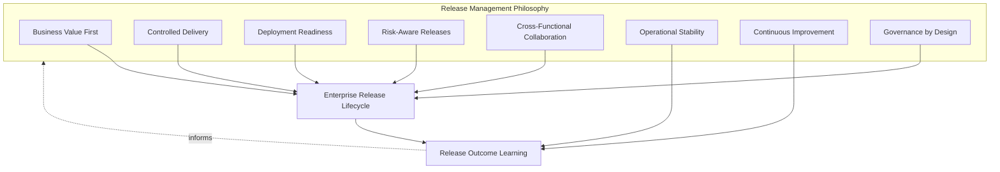
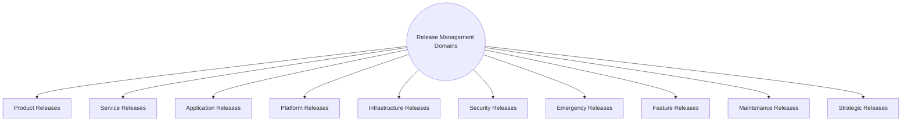
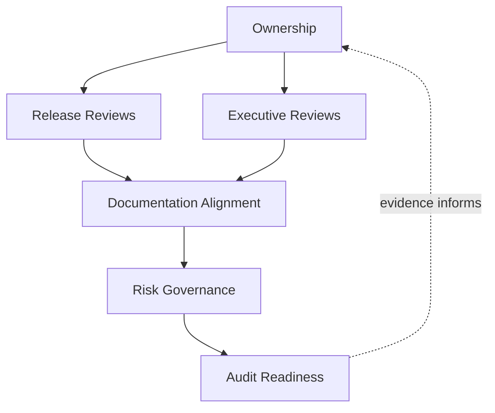
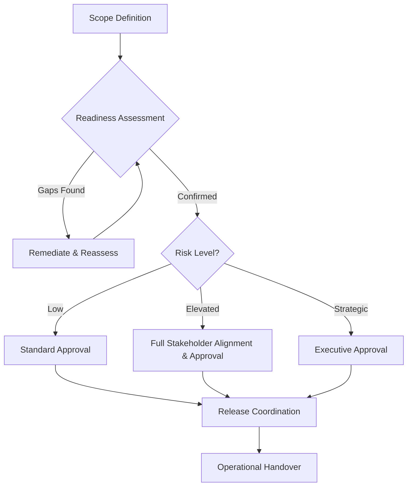
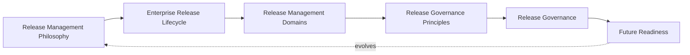
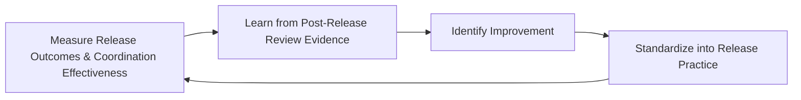
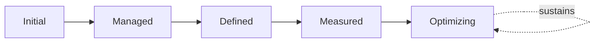

# Enterprise Release Management & Release Governance Strategy

## 1. Document Purpose

This document defines the official Enterprise Release Management & Release Governance Strategy for **StackLeo Tech Store**, from an IT Service Management (ITSM) perspective. It establishes how a release is coordinated across the whole organization, communicated to stakeholders, formally handed over to operations, and reviewed — independent of any specific CI/CD platform, deployment tool, or release orchestration software.

Two companion documents already govern closely related aspects of release: `07_DevOps/release-management.md` governs the business decision of when and how validated, deployment-ready change becomes an actual release, built on top of CI/CD-established technical readiness; and `08_Quality_Assurance/release-quality-gates.md` governs the quality evidence and go/no-go decision framework that readiness depends on. This document is the ITIL-aligned, ITSM coordination layer that sits across both: it governs how a release — once decided and quality-gated — is planned, categorized, communicated, coordinated cross-functionally, formally handed over to operational support, and reviewed as a service management event, consistent with `change-management.md`, `configuration-management.md`, and `service-management.md` in this folder.

- **Purpose of Release Management** — to ensure a release is coordinated as a deliberate service management event — planned, communicated, executed with cross-functional readiness, and formally handed over to the teams who will operate and support it — not merely a technical deployment that happens to reach customers.
- **Relationship with Change Management** — every release is composed of one or more changes governed by `change-management.md`; this document governs how those individual changes are packaged, sequenced, and coordinated together as a single release event.
- **Relationship with Configuration Management** — release planning depends on accurate knowledge of what a release affects; this document draws directly on Configuration Relationships in `configuration-management.md` (Section 4.9) to scope release impact.
- **Relationship with Service Management** — a release is ultimately a change to one or more services in `service-catalog.md`; this document ensures release coordination keeps the service catalog and service level commitments in `service-level-management.md` accurate and honored.
- **Relationship with Incident Management** — poorly coordinated releases are a common cause of incidents; Operational Handover (Section 3.9) exists specifically to ensure `incident-management.md` response teams are prepared before a release reaches customers.
- **Relationship with DevOps & SRE** — this document assumes and depends on the technical delivery and reliability practice in `07_DevOps/ci-cd-strategy.md` and `07_DevOps/sre-strategy.md`; it does not redefine how software is built and deployed, only how that capability is coordinated as an organizational event.
- **Relationship with Enterprise Governance** — a release is among the most consequential and frequent operational decisions the organization makes; this document ensures that decision carries governance proportionate to its risk and business impact.

This document is implementation-independent and vendor-neutral. It defines release management philosophy, lifecycle, domains, and governance conceptually — not specific CI/CD platforms, deployment tools, release orchestration software, deployment workflows, release frequencies, approval timelines, or infrastructure configuration.

## 2. Release Management Philosophy

Release management at StackLeo is governed by eight principles. Each exists to produce a specific business outcome — releases are coordinated deliberately because of the disruption risk and opportunity they carry, not as a routine technical formality.

### 2.1 Business Value First

Every release is evaluated by the value it delivers to customers and the business, consistent with Business Value First in `service-management.md` (Section 2.1), not scheduled merely because it is technically ready.

- **Business Value** — keeps release timing and scope focused on genuine business outcomes, not on engineering convenience alone.

### 2.2 Controlled Delivery

What is released, and when, is a deliberate decision, coordinated across the organization, consistent with Controlled Change in `change-management.md` (Section 2.2).

- **Business Value** — reduces the risk of uncoordinated releases interacting unpredictably or reaching customers before the organization is ready.

### 2.3 Deployment Readiness

A release proceeds only once every function affected by it — Engineering, Operations, Support, Security — confirms genuine readiness, not only once code is technically deployable.

- **Business Value** — prevents a technically successful deployment from becoming an operational crisis due to unprepared supporting functions.

### 2.4 Risk-Aware Releases

Release governance rigor is proportionate to the genuine risk a release carries, consistent with Risk Evaluation practice used throughout this repository.

- **Business Value** — directs governance attention toward the releases that matter most, while allowing low-risk releases to proceed efficiently.

### 2.5 Cross-Functional Collaboration

Release coordination engages every function affected by a release, consistent with Shared Accountability in `change-management.md` (Section 2.4), not only the team that built the change.

- **Business Value** — surfaces readiness gaps that any single function, viewing the release from only its own perspective, might otherwise miss.

### 2.6 Operational Stability

Release management exists to protect the stability of live services during and after a release, treating stability as equally important as the release's intended benefit.

- **Business Value** — prevents the pursuit of new value from silently eroding the reliability customers already depend on.

### 2.7 Continuous Improvement

Release management practice matures over time, informed by real release outcomes and post-release review findings.

- **Business Value** — keeps release coordination aligned with StackLeo's growth in delivery cadence, architectural complexity, and business scale.

### 2.8 Governance by Design

Release governance structures are established deliberately as delivery practice matures, consistent with Governance by Design in `service-management.md` (Section 2.7), not retrofitted once a poorly coordinated release has already caused harm.

- **Business Value** — prevents the costly rework of introducing release discipline only after disruption has already demonstrated its absence.

*Diagram 1: Release Management Philosophy Overview — the eight principles shape the enterprise release lifecycle, and release outcome learning feeds back into the philosophy itself.*

## 3. Enterprise Release Lifecycle

Release management is governed across twelve conceptual stages, spanning from initial planning through continuous improvement.

### 3.1 Release Planning

- **Purpose** — establish the intended scope, timing, and business context for an upcoming release, coordinated with `07_DevOps/release-management.md`.
- **Business Value** — ensures release coordination begins deliberately rather than reactively as deployment day approaches.
- **Governance Objectives** — require every planned release to have documented scope and business rationale before Scope Definition (Section 3.2).

### 3.2 Scope Definition

- **Purpose** — determine precisely which changes, per `change-management.md`, are included in a given release.
- **Business Value** — makes release boundaries explicit and reviewable, preventing ambiguity about what is actually being delivered.
- **Governance Objectives** — require scope to be documented and traceable to the individual changes it comprises.

### 3.3 Readiness Assessment

- **Purpose** — confirm that quality, operational, and business readiness for the release genuinely exist, drawing on `08_Quality_Assurance/release-quality-gates.md`.
- **Business Value** — ensures the release decision is grounded in accumulated evidence, not assumption.
- **Governance Objectives** — require readiness assessment to reference the specific quality gate outcomes it depends on.

### 3.4 Risk Evaluation

- **Purpose** — assess the risk the release carries as a whole, considering the combined effect of its constituent changes.
- **Business Value** — surfaces risk that may not be visible when changes are assessed only individually.
- **Governance Objectives** — require risk evaluation to directly inform Release Approval (Section 3.6).

### 3.5 Stakeholder Alignment

- **Purpose** — confirm that all affected stakeholders — Engineering, Operations, Support, Security, Business — understand and agree the release is ready to proceed.
- **Business Value** — prevents disputes and misaligned expectations from surfacing only after the release has already reached customers.
- **Governance Objectives** — require explicit confirmation from every function with a stake in the release's outcome.

### 3.6 Release Approval

- **Purpose** — render a deliberate, accountable decision on whether the release is authorized to proceed.
- **Business Value** — converts release authorization into a governed decision point rather than a default outcome of the calendar.
- **Governance Objectives** — require approval authority to be proportionate to the release's assessed risk (Section 3.4).

### 3.7 Release Coordination

- **Purpose** — organize the timing, sequencing, and cross-functional activity required to execute the release.
- **Business Value** — reduces the risk of a technically sound release being undermined by poor organizational coordination.
- **Governance Objectives** — require a designated release coordinator for releases above a defined significance threshold.

### 3.8 Release Validation

- **Purpose** — confirm the release, once live, behaves as intended and delivers its expected value.
- **Business Value** — closes the loop between pre-release confidence and genuine, observed outcome.
- **Governance Objectives** — require validation to be performed independently of the release execution effort itself.

### 3.9 Operational Handover

- **Purpose** — formally transfer ongoing operational responsibility for the released capability to Operations and Support.
- **Business Value** — ensures the teams who will sustain the release day to day are genuinely prepared before that responsibility shifts to them.
- **Governance Objectives** — require explicit, documented handover, connected to Operational Readiness in `operations-overview.md` (Section 4.3), never assumed automatically.

### 3.10 Post-Release Review

- **Purpose** — formally evaluate the release's outcome, including whether it delivered its intended value and whether any unintended impact occurred.
- **Business Value** — gives stakeholders an honest, evidence-based view of whether the release process itself is working well.
- **Governance Objectives** — require review for every release meeting a defined significance threshold, connected to Post-Change Review in `change-management.md` (Section 3.11).

### 3.11 Knowledge Capture

- **Purpose** — document what was learned about the release for future reference.
- **Business Value** — prevents institutional knowledge about how a release was planned and executed from being lost over time.
- **Governance Objectives** — connect captured knowledge to Knowledge Management in `service-management.md` (Section 4.8).

### 3.12 Continuous Improvement

- **Purpose** — act on post-release review and knowledge capture findings to deliberately improve release management practice.
- **Business Value** — ensures release management effectiveness compounds over time rather than remaining static as delivery cadence grows.
- **Governance Objectives** — require improvement actions arising from post-release review to be documented and tracked to completion.

### Enterprise Release Lifecycle Matrix

| Stage | Purpose | Business Value | Governance Objective |
|---|---|---|---|
| Release Planning | Establish intended scope, timing, and context | Coordination begins deliberately, not reactively | Documented scope and rationale before scope definition |
| Scope Definition | Determine precisely which changes are included | Makes release boundaries explicit and reviewable | Scope documented and traceable to constituent changes |
| Readiness Assessment | Confirm quality, operational, business readiness | Grounds the release decision in accumulated evidence | References specific quality gate outcomes |
| Risk Evaluation | Assess risk of the release as a combined whole | Surfaces risk invisible at the individual-change level | Directly informs release approval |
| Stakeholder Alignment | Confirm all affected functions agree readiness exists | Prevents disputes surfacing after customers are affected | Explicit confirmation from every stakeholder function |
| Release Approval | Render a deliberate, accountable decision | Converts authorization into a governed decision point | Authority proportionate to assessed risk |
| Release Coordination | Organize timing, sequencing, cross-functional activity | Prevents poor coordination undermining sound technical work | Designated coordinator for significant releases |
| Release Validation | Confirm the release behaves as intended once live | Closes the loop between confidence and observed outcome | Performed independently of execution effort |
| Operational Handover | Formally transfer ongoing responsibility to Operations | Ensures sustaining teams are genuinely prepared | Explicit, documented handover, never assumed |
| Post-Release Review | Evaluate outcome and unintended impact | Honest, evidence-based view of process effectiveness | Required for releases meeting a significance threshold |
| Knowledge Capture | Document learning for future reference | Prevents institutional knowledge loss over time | Connected to knowledge management practice |
| Continuous Improvement | Act on findings to improve practice | Effectiveness compounds over time | Improvement actions tracked to completion |

*Diagram 2: Enterprise Release Lifecycle — a continuous cycle in which post-release review and knowledge capture directly inform the next iteration of release planning.*

## 4. Release Management Domains

Release management spans ten conceptual domains, each carrying a different risk profile and requiring proportionate coordination.

### 4.1 Product Releases

- **Purpose** — capture releases delivering new or changed customer-facing product capability.
- **Scope** — informed by `02_Product/product-roadmap.md`, spanning features visible to end customers.
- **Governance Expectations** — coordinated with Product and Business stakeholders for Stakeholder Alignment (Section 3.5).
- **Business Importance** — the category most directly tied to competitive positioning and customer value delivery.

### 4.2 Service Releases

- **Purpose** — capture releases that change a service's defined scope or commitments in `service-catalog.md`.
- **Scope** — changes to what a service is or promises, coordinated with Service Changes in `change-management.md` (Section 4.7).
- **Governance Expectations** — reviewed jointly with Service Owners, given direct impact on service level commitments.
- **Business Importance** — directly affects customer and business expectations already established for the service.

### 4.3 Application Releases

- **Purpose** — capture releases of application-level logic and behavior.
- **Scope** — the most frequent release category, coordinated with `07_DevOps/ci-cd-strategy.md`.
- **Governance Expectations** — Readiness Assessment (Section 3.3) draws on the applicable testing evidence in `08_Quality_Assurance/testing-strategy.md`.
- **Business Importance** — represents the ongoing, continuous delivery of business logic that sustains and grows the platform.

### 4.4 Platform Releases

- **Purpose** — capture releases of shared platform capability that multiple services depend on.
- **Scope** — informed by Platform Configuration Items in `configuration-management.md` (Section 4.4).
- **Governance Expectations** — Stakeholder Alignment explicitly includes every dependent service owner, given multiplied impact.
- **Business Importance** — carries disproportionate risk relative to apparent scope, given multiplied dependency impact.

### 4.5 Infrastructure Releases

- **Purpose** — capture releases changing the underlying technical environment.
- **Scope** — coordinated with `07_DevOps/infrastructure-as-code.md` and Infrastructure Configuration Items in `configuration-management.md` (Section 4.5).
- **Governance Expectations** — sequenced explicitly relative to dependent application and platform releases.
- **Business Importance** — can affect multiple services simultaneously, making careful coordination especially important.

### 4.6 Security Releases

- **Purpose** — capture releases addressing security fixes or capability, jointly with `06_Security`.
- **Scope** — governed with the urgency and confidentiality appropriate to their content.
- **Governance Expectations** — reviewed with Security leadership involvement regardless of apparent release size, consistent with Security Changes in `change-management.md` (Section 4.5).
- **Business Importance** — protects StackLeo's core trust differentiator; timing and communication require particular care.

### 4.7 Emergency Releases

- **Purpose** — capture releases required urgently to resolve or prevent significant, active harm.
- **Scope** — coordinated with Emergency Changes in `change-management.md` (Section 4.8) and Major Incident Governance in `incident-management.md` (Section 4.8).
- **Governance Expectations** — still require accountable authorization and full Post-Release Review (Section 3.10), never exempted from governance entirely.
- **Business Importance** — allows the organization to respond quickly to genuine urgency without abandoning release discipline.

### 4.8 Feature Releases

- **Purpose** — capture releases delivering discrete, well-scoped new functionality.
- **Scope** — a subset of Product Releases (Section 4.1) at a more granular, frequent cadence.
- **Governance Expectations** — coordination proportionate to feature scope and risk, consistent with Risk-Aware Releases (Section 2.4).
- **Business Importance** — represents the steady, incremental value delivery that sustains competitive positioning over time.

### 4.9 Maintenance Releases

- **Purpose** — capture releases addressing technical debt, dependency updates, or non-customer-visible improvement.
- **Scope** — releases without direct customer-facing change, but still requiring coordination given technical risk.
- **Governance Expectations** — not assumed low-risk purely because they are not customer-visible; Risk Evaluation (Section 3.4) applies regardless.
- **Business Importance** — protects long-term platform health, consistent with Maintainability in `03_System_Design/quality-attributes.md` (Section 8).

### 4.10 Strategic Releases

- **Purpose** — capture large-scale releases tied directly to significant business strategy shifts, such as the introduction of the multi-vendor marketplace or corporate sales capability.
- **Scope** — releases of a scale and consequence extending well beyond routine delivery.
- **Governance Expectations** — reviewed with executive-level involvement, consistent with Executive Reviews (Section 6.3).
- **Business Importance** — represents the release category with the greatest potential business consequence, warranting the highest level of deliberate governance.

### Release Management Domain Matrix

| Domain | Purpose | Governance Expectations | Business Importance |
|---|---|---|---|
| Product Releases | New or changed customer-facing product capability | Coordinated with Product and Business stakeholders | Most directly tied to competitive positioning |
| Service Releases | Changes to a service's defined scope or commitments | Reviewed jointly with Service Owners | Directly affects established customer/business expectations |
| Application Releases | Application-level logic and behavior changes | Assessment draws on applicable testing evidence | Ongoing, continuous delivery of sustaining business logic |
| Platform Releases | Shared platform capability changes | Alignment includes every dependent service owner | Disproportionate risk relative to apparent scope |
| Infrastructure Releases | Underlying technical environment changes | Sequenced relative to dependent releases | Can affect multiple services simultaneously |
| Security Releases | Security fixes or capability changes | Security leadership involvement regardless of size | Protects the core trust differentiator |
| Emergency Releases | Urgent releases resolving active harm | Still requires authorization and full post-release review | Allows rapid response without abandoning discipline |
| Feature Releases | Discrete, well-scoped new functionality | Coordination proportionate to feature scope and risk | Steady, incremental value delivery over time |
| Maintenance Releases | Technical debt, dependency, non-customer-visible improvement | Never assumed low-risk absent customer visibility | Protects long-term platform health |
| Strategic Releases | Large-scale, business-strategy-tied releases | Reviewed with executive-level involvement | Greatest potential business consequence |

*Diagram 4 (Part A): Enterprise Release Operating Model — ten domains, each carrying a distinct risk profile requiring proportionate coordination.*

## 5. Release Governance Principles

- **Ownership** — every release has a single, named accountable owner responsible for seeing it through the lifecycle (Section 3).
- **Readiness Validation** — a release is not authorized to proceed until Readiness Assessment (Section 3.3) genuinely confirms preparedness, not merely that code is deployable.
- **Risk Awareness** — every release decision is made with explicit awareness of the risk it carries, consistent with Risk Evaluation (Section 3.4).
- **Stakeholder Communication** — affected stakeholders are informed of a release proportionate to its impact, consistent with Communication Management in `incident-management.md` (Section 4.9).
- **Operational Preparedness** — a release is not considered complete until Operational Handover (Section 3.9) genuinely confirms Operations and Support are prepared to sustain it.
- **Auditability** — release proposals, approvals, and outcomes are retained in a form that can be independently reviewed after the fact.
- **Documentation Integrity** — release records remain consistent with `service-catalog.md`, `configuration-management.md`, and other affected documentation, never left to silently diverge.
- **Continuous Improvement** — release governance itself matures over time, informed by real release outcomes.

### Release Governance Principle Matrix

| Principle | Description | Business Value |
|---|---|---|
| Ownership | Every release has a single, named accountable owner | Ensures a release is genuinely seen through, not abandoned mid-lifecycle |
| Readiness Validation | Release proceeds only once genuine preparedness is confirmed | Prevents a technically deployable release from proceeding unprepared |
| Risk Awareness | Decisions made with explicit awareness of carried risk | Enables deliberate, informed risk-taking rather than blind exposure |
| Stakeholder Communication | Affected stakeholders informed proportionate to impact | Prevents surprise disruption to teams and customers |
| Operational Preparedness | Release not complete until sustaining teams are prepared | Prevents a successful release becoming an operational crisis |
| Auditability | Proposals, approvals, and outcomes retained for review | Supports accountability and confidence for partners and regulators |
| Documentation Integrity | Records stay consistent with catalog and configuration data | Prevents governance decisions being made against stale information |
| Continuous Improvement | Governance matures from real release outcomes | Keeps governance aligned with organizational and platform growth |

## 6. Release Governance

### 6.1 Ownership

Every release management domain (Section 4) has a designated accountable review authority; overall release governance is owned jointly by Operations and Engineering leadership, consistent with Cross-Functional Collaboration (Section 2.5).

### 6.2 Release Reviews

Proposed releases are formally reviewed against Readiness Assessment and Risk Evaluation (Sections 3.3–3.4) before Release Approval (Section 3.6) is exercised, ensuring approval is grounded in genuine assessment.

### 6.3 Executive Reviews

Strategic Releases (Section 4.10) and any release assessed as carrying significant risk are reviewed with executive stakeholders, consistent with Executive Reviews in `change-management.md` (Section 6.3).

### 6.4 Documentation Alignment

Release management documentation is kept consistent with `service-catalog.md`, `configuration-management.md`, and `07_DevOps/release-management.md`; a release record that contradicts current service or configuration documentation is treated as a governance gap.

### 6.5 Risk Governance

Release-related risk — unassessed cross-domain impact, inadequate operational handover, deferred post-release review — is tracked, prioritized, and escalated consistently, ensuring accepted risk is always a deliberate, accountable decision.

### 6.6 Audit Readiness

Release proposals, readiness assessments, approvals, and post-release review outcomes are retained in a form that can be independently reviewed after the fact, supporting internal governance and partner or regulatory review where relevant.

### Release Governance Matrix

| Governance Area | Objective |
|---|---|
| Ownership | Every release domain has a designated accountable review authority |
| Release Reviews | Approval is grounded in genuine readiness and risk assessment |
| Executive Reviews | Strategic and significant-risk releases receive executive-level review |
| Documentation Alignment | Release records stay consistent with catalog and configuration documentation |
| Risk Governance | Accepted release-related risk is always a deliberate, accountable decision |
| Audit Readiness | Proposals, approvals, and outcomes retained for independent review |

*Diagram 2b: Release Governance Framework — ownership anchors review activity, which feeds documentation alignment, risk governance, and ultimately auditable evidence.*

*Diagram 3: Release Readiness & Approval Model — approval rigor scales with assessed risk level, converging into common coordination and operational handover regardless of the path taken.*

### Governance Responsibility Matrix

| Role | Responsibility |
|---|---|
| COO / Operations Lead | Owns coherence and enforcement of this release management strategy, in partnership with Engineering leadership. |
| Release Coordinator | Owns Release Coordination (Section 3.7) for individual releases above a defined significance threshold. |
| Service Owners | Provide Stakeholder Alignment input (Section 3.5) for releases affecting their services. |
| QA Leadership | Ensures Readiness Assessment (Section 3.3) genuinely reflects `08_Quality_Assurance/release-quality-gates.md` outcomes. |
| Security Lead | Owns approval authority for Security Releases (Section 4.6) regardless of apparent size. |
| Operations / Support Lead | Owns Operational Handover (Section 3.9) confirmation before a release is considered complete. |
| Executive Leadership | Reviews and approves Strategic Releases (Section 4.10) and significant-risk releases. |
| Internal Audit / Review Function | Independently verifies that release governance records reflect actual practice. |

*Diagram 4 (Part B): Enterprise Release Operating Model — how philosophy, lifecycle, domains, principles, and governance operate together as a single, self-reinforcing system that continues to evolve as the platform grows.*

## 7. Future Readiness

This strategy is designed to remain valid as StackLeo evolves in scale and architectural complexity, without requiring redefinition of its underlying philosophy.

- **Cloud-Native Platforms** — release domains (Section 4) are defined independently of any specific runtime or deployment model, so they apply unchanged as infrastructure evolves.
- **AI-Assisted Operations** — where AI-assisted techniques support release risk assessment or coordination, they operate within the same Risk Awareness and Stakeholder Communication principles (Section 5) as any other release practice, never bypassing accountable human approval for significant releases.
- **Marketplace Platform** — the multi-vendor marketplace model extends Service and Product Releases (Sections 4.2, 4.1) to cover seller-facing service and feature releases.
- **Multi-Tenant Architecture** — where future architecture introduces tenant isolation, Stakeholder Alignment (Section 3.5) extends to explicitly evaluate cross-tenant release consequences.
- **Continuous Delivery** — as delivery cadence accelerates per `07_DevOps/ci-cd-strategy.md`, the proportion of releases classified as Feature or Maintenance (Sections 4.8–4.9) is expected to grow, with lightweight governance applied consistently rather than discipline being abandoned for speed.
- **Multi-Region Operations** — as StackLeo expands from Bangladesh into South Asia and beyond, Stakeholder Alignment and Communication (Section 3.5) extend to consider region-specific stakeholders and regulatory notification expectations.
- **Global Engineering Organizations** — the release lifecycle, domains, and governance defined in Sections 3–6 are defined independently of team size, location, or organizational structure, so they remain coherent as engineering scales across geographies.
- **Enterprise Scale** — the release governance model is structured to extend to a growing release volume and organizational complexity without requiring the underlying lifecycle to be redesigned.

## 8. Governance

- **Ownership** — the COO (or equivalent accountable executive function) owns this strategy and is accountable for its consistent application across the platform, in partnership with Engineering leadership.
- **Review Process** — this strategy is formally reviewed whenever a material change occurs in business model (`01_Business/business-model.md`), the service catalog (`service-catalog.md`), or delivery practice (`07_DevOps/ci-cd-strategy.md`), and on a regular recurring cadence independent of specific change events.
- **Release Management Policies** — subordinate, practice-specific release documents (domain-specific coordination checklists, handover templates) must remain consistent with the philosophy, lifecycle, and domains defined here.
- **Audit Readiness** — this strategy and the evidence it requires (Section 6.6) are maintained in a state ready for internal or external audit at any time, without requiring advance preparation.
- **Continuous Improvement** — this strategy itself is subject to Continuous Improvement (Section 2.7, Section 3.12); its effectiveness is periodically assessed and revised based on genuine release outcomes and organizational evidence.

*Diagram 5: Continuous Release Improvement Cycle — release outcomes are measured, learned from, improved upon, and standardized back into practice, on a continuing basis.*

## 9. Release Management Maturity Model

Release management maturity is described across five conceptual levels, adapted from established process maturity thinking. Progression reflects increasing consistency, measurement, and deliberate improvement — not merely increasing release frequency.

- **Initial** — release coordination, where it exists, is informal and inconsistent; readiness and handover depend heavily on individual initiative, and impact is often discovered only after a release has already reached customers.
- **Managed** — basic release coordination exists and is followed for individual significant releases, but consistency across domains (Section 4) varies significantly.
- **Defined** — release management processes are standardized, documented, and consistently applied across the organization, consistent with the lifecycle and domains defined throughout this document; ownership is clear organization-wide.
- **Measured** — release outcomes are measured systematically — release-related incident rate, handover completeness — and decisions are grounded in genuine performance data rather than qualitative impression alone.
- **Optimizing** — release management practice is continuously and deliberately improved based on quantitative evidence and organizational learning; improvement itself is a managed, ongoing discipline rather than an occasional initiative.

### Release Management Maturity Model Matrix

| Level | Characteristics | Primary Focus |
|---|---|---|
| Initial | Informal coordination dependent on individual initiative | Ad hoc, individually-dependent release coordination |
| Managed | Basic coordination exists per significant release; consistency varies | Release-level consistency |
| Defined | Standardized, documented processes applied across the organization | Organization-wide consistency and clear ownership |
| Measured | Outcomes measured systematically against defined expectations | Evidence-based release management decisions |
| Optimizing | Practice continuously and deliberately improved from evidence | Sustained, deliberate improvement as a discipline |

*Diagram 6: Release Management Maturity Progression Model — maturity advances from informal, individually-dependent coordination toward standardized, measured, and continuously optimized release management practice.*

## 10. Anti-Patterns

The following recurring failure patterns are explicitly recognized and avoided, as each one structurally undermines this strategy.

| Anti-Pattern | Why It's Avoided |
|---|---|
| Uncontrolled Releases | Contradicts Controlled Delivery (Section 2.2); a release proceeding without deliberate coordination risks unpredictable interaction with other live change and services. |
| Weak Readiness Validation | Contradicts Deployment Readiness (Section 2.3); a release authorized without genuine cross-functional confirmation risks proceeding while some affected function remains unprepared. |
| Poor Stakeholder Communication | Undermines Stakeholder Communication (Section 5.4); affected teams and customers surprised by a release lose trust independent of the release's technical success. |
| Missing Operational Handover | Contradicts Operational Handover (Section 3.9); a release whose ongoing operational responsibility was never formally transferred leaves sustaining teams unprepared to support it. |
| Weak Documentation | Undermines Documentation Integrity (Section 5.7), leaving release records inconsistent with catalog and configuration data. |
| Inadequate Post-Release Reviews | Contradicts Post-Release Review (Section 3.10); without reviewing outcomes, release management cannot improve its own judgment over time. |
| Weak Governance | Undermines Section 6.1; without clear ownership and review, release discipline drifts into inconsistency as delivery cadence and organizational scale grow. |
| Missing Continuous Improvement | Contradicts Continuous Improvement (Section 2.7, Section 3.12); without deliberate improvement, release management effectiveness stagnates as the business and platform grow in complexity. |

## 11. Document Information

| Property | Value |
|----------|-------|
| Document | release-management.md |
| Version | 1.0.0 |
| Status | Active |
| Maintained By | StackLeo |
| Last Updated | 2026-07-24 |

---

© StackLeo. All Rights Reserved.
