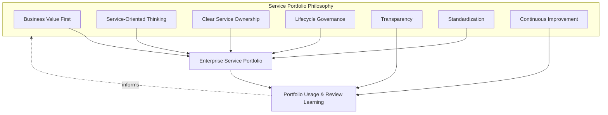
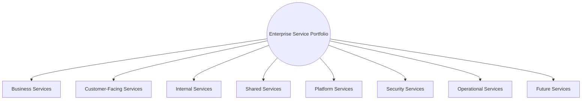
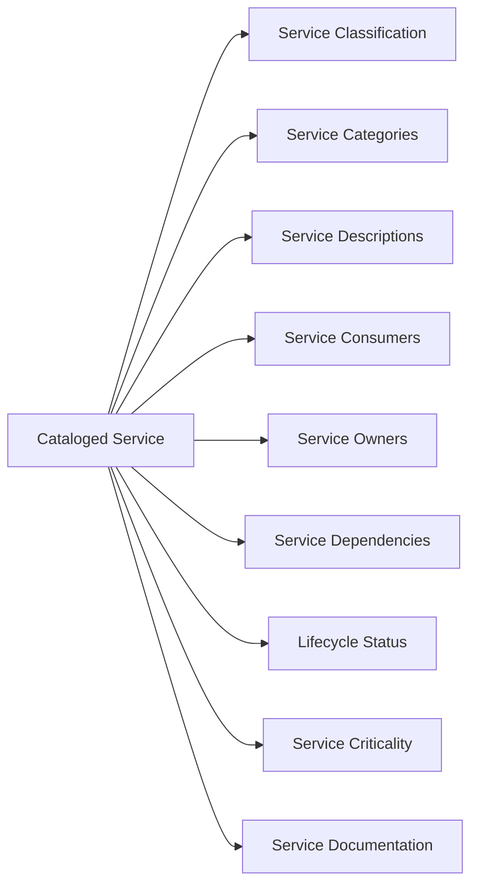
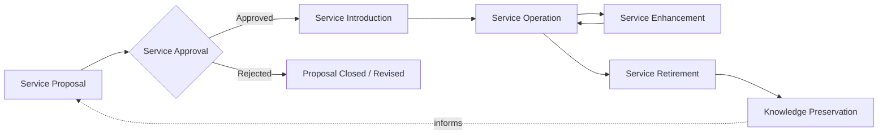
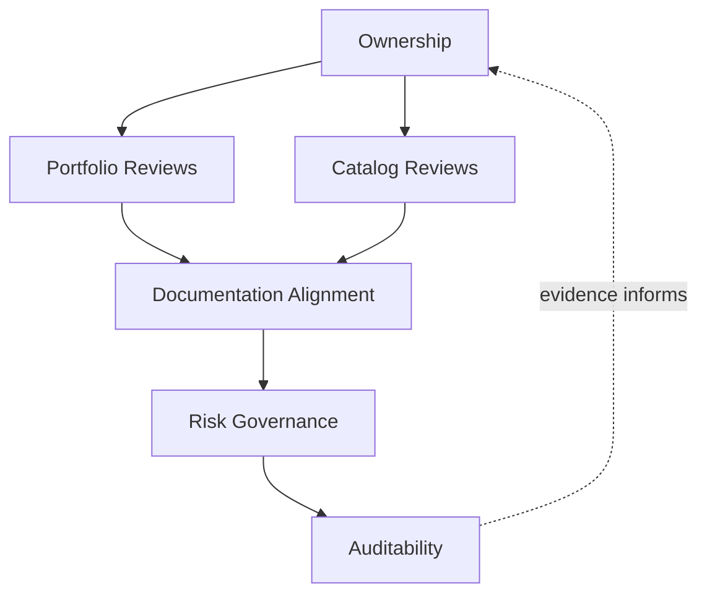
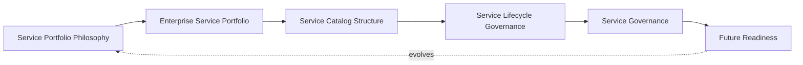
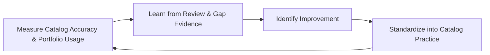

# Enterprise Service Catalog & Service Portfolio Governance

## 1. Document Purpose

This document defines the official Enterprise Service Catalog & Service Portfolio Governance strategy for **StackLeo Tech Store**. It establishes how the platform's services are classified, cataloged, owned, and governed across their lifecycle — independent of any specific ITSM tool, CMDB platform, or catalog software.

- **Purpose of the Service Catalog** — the catalog exists to give operations, support, product, and business stakeholders a single, accurate, shared understanding of what services StackLeo actually provides, to whom, and at what expected quality, elaborating Service Catalog Management as introduced in `service-management.md` (Section 4.2).
- **Relationship with Service Management** — this document is the catalog- and portfolio-specific elaboration of `service-management.md`; where that document defines the full service lifecycle and ten management domains, this document defines specifically how the service portfolio is structured, classified, and governed as a coherent whole.
- **Relationship with Service Portfolio** — this document distinguishes the full Service Portfolio (Section 3, every service across its lifecycle) from the live Service Catalog (Section 4, currently available services), consistent with the distinction established in `service-management.md` (Sections 4.1–4.2).
- **Relationship with Business Operations** — the services cataloged here are the concrete mechanism by which `01_Business/business-model.md` is delivered daily; portfolio governance ensures service investment remains a deliberate reflection of business priority, not an accumulation of historical decisions.
- **Relationship with Customer Experience** — every customer-facing service in this catalog exists because a customer depends on it; catalog accuracy directly determines whether support, operations, and product teams can serve that dependency reliably.
- **Relationship with Enterprise Architecture** — service classification and dependency mapping (Section 4) are informed by, and kept consistent with, the bounded contexts and component architecture defined in `03_System_Design/component-architecture.md`, ensuring the business-facing service view and the technical architecture view remain coherent with one another.

This document is implementation-independent and vendor-neutral. It defines service portfolio philosophy, structure, lifecycle governance, and catalog governance — not specific ITSM tools, CMDB platforms, catalog software, or infrastructure configuration.

## 2. Service Portfolio Philosophy

Service portfolio and catalog governance at StackLeo is built on seven principles. Each exists to produce a specific business outcome — the portfolio is governed deliberately because of the clarity and accountability it creates, not as administrative record-keeping.

### 2.1 Business Value First

Every service in the portfolio exists because it delivers identifiable value to a customer or the business, consistent with Service Value First in `service-management.md` (Section 2.1).

- **Business Value** — keeps the portfolio a deliberate reflection of business priority rather than an accumulation of whatever has historically been built.

### 2.2 Service-Oriented Thinking

The platform is understood and organized as a set of defined services, not as an undifferentiated collection of technical components.

- **Business Value** — keeps operational, support, and governance attention aligned with what customers and the business actually depend on.

### 2.3 Clear Service Ownership

Every service in the catalog has a single, named accountable owner, consistent with Service Ownership in `service-management.md` (Section 5.1).

- **Business Value** — prevents the anti-pattern in Section 9.2, where a service's quality and evolution become nobody's specific priority.

### 2.4 Lifecycle Governance

Every service is governed consistently across its full lifecycle — from proposal through retirement — not only while it is newly built or highly visible.

- **Business Value** — ensures services are not left to degrade quietly or persist indefinitely by default, once initial attention has moved elsewhere.

### 2.5 Transparency

The catalog and portfolio are visible to the stakeholders who depend on them, not held privately within any single team.

- **Business Value** — enables informed decisions by operations, support, and business stakeholders who did not build a service but must understand, use, or govern it.

### 2.6 Standardization

Services are classified, described, and documented using a consistent structure, regardless of which team owns them.

- **Business Value** — makes the catalog genuinely usable as a single reference, rather than a collection of inconsistent, team-specific records.

### 2.7 Continuous Improvement

Portfolio and catalog governance practice matures over time, informed by real usage, gaps discovered, and evolving business scale.

- **Business Value** — keeps the catalog a living, accurate asset rather than a static record that quietly diverges from reality.

*Diagram 1: Service Portfolio Philosophy Overview — the seven principles shape the enterprise service portfolio, and usage and review learning feed back into the philosophy itself.*

## 3. Enterprise Service Portfolio

The full service portfolio — every service StackLeo offers or plans to offer, regardless of lifecycle stage — spans eight conceptual categories.

### 3.1 Business Services

- **Purpose** — represent the highest-level services that directly deliver business outcomes, such as retail commerce and, in time, corporate sales and wholesale distribution.
- **Business Value** — provides the top-level view executives use to understand what the business actually does, expressed in business rather than technical terms.
- **Governance Objectives** — ensure every business service maps clearly to the business models defined in `01_Business/business-model.md`.

### 3.2 Customer-Facing Services

- **Purpose** — represent the services customers directly interact with — browsing, search, cart, checkout, order tracking, and support.
- **Business Value** — directly determines the customer experience the trust-centered brand in `01_Business/vision.md` depends on.
- **Governance Objectives** — ensure every customer-facing service has defined service levels, per `service-management.md` (Section 4.3).

### 3.3 Internal Services

- **Purpose** — represent services consumed by StackLeo's own employees and internal stakeholders, such as administrative and back-office capability.
- **Business Value** — ensures the tools internal teams depend on to run the business receive the same deliberate governance as customer-facing capability.
- **Governance Objectives** — ensure internal services are cataloged with the same rigor as customer-facing ones, not treated as informal or unmanaged by default.

### 3.4 Shared Services

- **Purpose** — represent capability consumed by multiple other services, such as identity, notification, and pricing capability.
- **Business Value** — avoids duplicated effort and inconsistent behavior across the services that depend on shared capability.
- **Governance Objectives** — ensure shared services are governed with explicit awareness of every dependent service, given their multiplied impact if degraded.

### 3.5 Platform Services

- **Purpose** — represent the underlying technical capability, consistent with `03_System_Design/component-architecture.md`, that other services are built on.
- **Business Value** — makes the technical foundation visible in business-facing portfolio terms, not only in architecture documentation.
- **Governance Objectives** — ensure platform services are mapped to the architecture they represent and kept synchronized with it.

### 3.6 Security Services

- **Purpose** — represent identity, access, and protection capability, consistent with `06_Security`, expressed as services the rest of the portfolio depends on.
- **Business Value** — protects StackLeo's core trust differentiator by making security capability a visible, governed part of the portfolio rather than an invisible assumption.
- **Governance Objectives** — ensure security services are reviewed jointly with Security leadership, per Security Operations in `operations-overview.md` (Section 3.4).

### 3.7 Operational Services

- **Purpose** — represent the monitoring, incident response, and support capability that sustains every other service, consistent with `operations-overview.md` (Section 5).
- **Business Value** — makes operational capability itself a first-class, governed part of the portfolio, not an implicit background activity.
- **Governance Objectives** — ensure operational services are cataloged with clear ownership, consistent with Governance Operations in `operations-overview.md` (Section 3.7).

### 3.8 Future Services

- **Purpose** — represent services planned but not yet live, such as the Mobile App, Physical Store, POS, and Marketplace capability defined in `02_Product/product-roadmap.md`.
- **Business Value** — gives portfolio governance visibility into what is coming, allowing catalog and operational readiness to be planned proactively rather than discovered at launch.
- **Governance Objectives** — ensure future services proceed through Service Proposal and Approval (Section 5) before being treated as committed portfolio additions.

### Enterprise Service Portfolio Matrix

| Category | Purpose | Business Value | Governance Objective |
|---|---|---|---|
| Business Services | Represent highest-level business outcome delivery | Top-level view of what the business actually does | Maps clearly to defined business models |
| Customer-Facing Services | Represent services customers directly interact with | Directly determines customer experience | Defined service levels for every service |
| Internal Services | Represent services consumed by internal stakeholders | Ensures internal tools receive deliberate governance | Cataloged with the same rigor as customer-facing services |
| Shared Services | Represent capability consumed by multiple services | Avoids duplicated effort and inconsistent behavior | Governed with explicit awareness of dependent services |
| Platform Services | Represent underlying technical capability | Makes technical foundation visible in business terms | Mapped to and synchronized with the architecture |
| Security Services | Represent identity, access, and protection capability | Protects the core trust differentiator | Reviewed jointly with Security leadership |
| Operational Services | Represent monitoring, incident, and support capability | Makes operational capability a first-class portfolio item | Cataloged with clear ownership |
| Future Services | Represent planned, not-yet-live services | Enables proactive readiness planning ahead of launch | Proceed through proposal and approval before commitment |

*Diagram 2: Enterprise Service Portfolio Framework — eight categories spanning the full portfolio, from business-level outcomes through platform, security, operational, and future capability.*

## 4. Service Catalog Structure

The live Service Catalog — the subset of the portfolio currently available — is structured using nine consistent elements, applied to every cataloged service regardless of category.

### 4.1 Service Classification

- **Purpose** — assign each service to its portfolio category (Section 3), establishing its type at a glance.
- **Governance Expectations** — classification is applied consistently using the same category definitions across the entire catalog.

### 4.2 Service Categories

- **Purpose** — group related services together within a classification, supporting navigation and review at a meaningful level of granularity.
- **Governance Expectations** — categories are reviewed periodically to confirm they remain meaningful as the portfolio grows.

### 4.3 Service Descriptions

- **Purpose** — describe, in business terms, what a service does and the value it provides.
- **Governance Expectations** — descriptions are written for a business audience, not only for the engineers who built the service.

### 4.4 Service Consumers

- **Purpose** — identify who or what depends on a service — customers, internal stakeholders, or other services.
- **Governance Expectations** — consumer information is kept current, since it directly determines the impact of any change or disruption to the service.

### 4.5 Service Owners

- **Purpose** — identify the single, named accountable owner responsible for a service's quality and evolution.
- **Governance Expectations** — every cataloged service has exactly one accountable owner, consistent with Clear Service Ownership (Section 2.3).

### 4.6 Service Dependencies

- **Purpose** — document what a service depends on, and what depends on it, consistent with Configuration Management in `operations-overview.md` (Section 5.6).
- **Governance Expectations** — dependency information is kept current and is a required input to Change and Incident Management.

### 4.7 Service Lifecycle Status

- **Purpose** — record where a service currently sits in its lifecycle (Section 5) — proposed, live, being enhanced, or being retired.
- **Governance Expectations** — status is updated at each lifecycle transition, not left to default to whatever was last recorded.

### 4.8 Service Criticality

- **Purpose** — classify how significant a service's failure would be to customers and the business, informing prioritization of operational attention.
- **Governance Expectations** — criticality is assigned deliberately and reviewed periodically, consistent with risk-based prioritization used throughout `08_Quality_Assurance` and `operations-overview.md`.

### 4.9 Service Documentation

- **Purpose** — link each catalog entry to the fuller documentation (architecture, runbooks, service level definitions) that supports operating and supporting the service.
- **Governance Expectations** — documentation links are verified current as part of Catalog Reviews (Section 6.3).

### Service Catalog Structure Matrix

| Element | Purpose | Governance Expectation |
|---|---|---|
| Service Classification | Assign each service to its portfolio category | Applied consistently using shared category definitions |
| Service Categories | Group related services at a meaningful granularity | Reviewed periodically as the portfolio grows |
| Service Descriptions | Describe what a service does in business terms | Written for a business audience, not only engineers |
| Service Consumers | Identify who or what depends on the service | Kept current given its impact on change/disruption assessment |
| Service Owners | Identify the single, named accountable owner | Exactly one owner per service, always |
| Service Dependencies | Document what the service depends on and what depends on it | Kept current; required input to change and incident management |
| Service Lifecycle Status | Record current lifecycle stage | Updated at each lifecycle transition |
| Service Criticality | Classify significance of failure to customers/business | Assigned deliberately, reviewed periodically |
| Service Documentation | Link to fuller supporting documentation | Verified current as part of catalog reviews |

*Diagram 3: Service Catalog Structure — nine consistent elements applied uniformly to every cataloged service, regardless of portfolio category.*

## 5. Service Lifecycle Governance

- **Service Proposal** — a new service is formally proposed, stating its intended customer, value, and business rationale, consistent with Service Strategy in `service-management.md` (Section 3.1).
- **Service Approval** — the proposal is reviewed and approved by accountable stakeholders before design and build effort proceeds, ensuring portfolio growth remains deliberate.
- **Service Introduction** — an approved, built, and transitioned service is formally added to the live Service Catalog, consistent with Service Transition in `service-management.md` (Section 3.3).
- **Service Operation** — the service is sustained in live use, with its catalog entry (Section 4) kept current throughout.
- **Service Enhancement** — the service is deliberately improved over time, consistent with Service Improvement in `service-management.md` (Section 3.5), with catalog entries updated to reflect material changes.
- **Service Retirement** — the service is deliberately and safely withdrawn once it no longer delivers sufficient value, consistent with Service Retirement in `service-management.md` (Section 3.6).
- **Knowledge Preservation** — what was learned about the service throughout its lifecycle is captured and retained, consistent with Knowledge Preservation in `service-management.md` (Section 3.7), even after the service itself is retired.

### Service Lifecycle Governance Matrix

| Stage | Purpose | Governance Objective |
|---|---|---|
| Service Proposal | Formally propose a new service with stated value and rationale | Every proposal states intended customer, value, and rationale |
| Service Approval | Review and approve before design and build proceed | Portfolio growth remains deliberate, never assumed |
| Service Introduction | Formally add an approved, transitioned service to the catalog | Catalog entry created only once genuinely ready |
| Service Operation | Sustain the service in live use | Catalog entry kept current throughout live operation |
| Service Enhancement | Deliberately improve the service over time | Catalog entries updated to reflect material changes |
| Service Retirement | Deliberately and safely withdraw a low-value service | Explicit decision and transition plan required, never silent |
| Knowledge Preservation | Capture and retain lifecycle learning | Learning captured even after retirement, not lost |

*Diagram 4: Service Lifecycle Governance Flow — a service proceeds from proposal through approval, introduction, operation, and enhancement, to eventual retirement and knowledge preservation, which in turn informs future proposals.*

## 6. Service Governance

### 6.1 Ownership

Every service in the portfolio (Section 3) has a single accountable owner; overall portfolio and catalog governance is owned jointly by Operations and Product leadership, consistent with `service-management.md` (Section 6.1).

### 6.2 Portfolio Reviews

The full service portfolio is formally reviewed periodically against current business strategy, consistent with Continuous Evolution in `service-management.md` (Section 3.8), ensuring the portfolio's overall shape remains a deliberate reflection of business priority.

### 6.3 Catalog Reviews

The live Service Catalog is formally reviewed for accuracy and currency on a recurring basis, ensuring catalog entries (Section 4) genuinely reflect live service reality, not a stale historical snapshot.

### 6.4 Documentation Alignment

Service catalog documentation is kept consistent with `service-management.md`, `operations-overview.md`, and `03_System_Design/component-architecture.md`; a catalog entry that contradicts current architecture or service management documentation is treated as a governance gap.

### 6.5 Risk Governance

Portfolio-related risk — unclear ownership, undocumented dependencies, stale catalog entries — is tracked, prioritized, and escalated consistently, ensuring accepted risk is always a deliberate, accountable decision.

### 6.6 Auditability

Service proposals, approvals, catalog entries, and lifecycle transitions are retained in a form that can be independently reviewed after the fact, supporting internal governance and partner or regulatory review where relevant.

### Service Governance Matrix

| Governance Area | Objective |
|---|---|
| Ownership | Every service has one accountable owner |
| Portfolio Reviews | Overall portfolio shape reviewed against business strategy |
| Catalog Reviews | Catalog entries reviewed for accuracy and currency |
| Documentation Alignment | Catalog documentation stays consistent with architecture and service management strategy |
| Risk Governance | Accepted portfolio risk is always a deliberate, accountable decision |
| Auditability | Proposals, approvals, and transitions retained for independent review |

*Diagram 5 (Part A): Service Governance Operating Model — ownership anchors review activity, which feeds documentation alignment, risk governance, and ultimately auditable evidence.*

*Diagram 5 (Part B): Service Governance Operating Model — how philosophy, portfolio, catalog structure, lifecycle governance, and governance operate together as a single, self-reinforcing system that continues to evolve as the platform grows.*

## 7. Future Readiness

This strategy is designed to remain valid as StackLeo evolves in scale and organizational complexity, without requiring redefinition of its underlying philosophy.

- **Cloud-Native Platforms** — portfolio categories and catalog structure (Sections 3–4) are defined independently of any specific runtime or deployment model, so they apply unchanged as infrastructure evolves.
- **AI-Driven Services** — as AI-assisted capability is introduced as a customer-facing or internal service, it is classified and cataloged under the same structure (Section 4) as any other service, with Service Criticality assessed on the same basis.
- **Marketplace Platform** — the multi-vendor marketplace model extends Customer-Facing and Shared Services (Sections 3.2, 3.4) to cover seller-facing capability, applying the same catalog rigor used for StackLeo's own services today.
- **Multi-Tenant Architecture** — where future architecture introduces tenant isolation, Service Dependencies (Section 4.6) extend to explicitly document per-tenant dependency implications.
- **Mobile Applications** — the future Mobile App channel is introduced to the catalog as a new set of Customer-Facing Services (Section 3.2), following the same proposal and approval process as any other service.
- **POS Services** — the future POS channel is similarly introduced as a distinct service category, extending the catalog without requiring its underlying structure to change.
- **Multi-Region Operations** — as StackLeo expands from Bangladesh into South Asia and beyond, Service Consumers and Service Criticality (Sections 4.4, 4.8) extend to reflect region-specific customer bases and impact.
- **Global Service Portfolio** — the portfolio categories, catalog structure, and lifecycle governance defined in Sections 3–5 are defined independently of team size or organizational structure, so they remain coherent as the portfolio scales across geographies.

## 8. Governance

- **Ownership** — the Operations lead (or equivalent COO-accountable function) owns this strategy and is accountable for its consistent application across the platform, in partnership with Product and Engineering leadership, consistent with `service-management.md` (Section 8).
- **Review Process** — this strategy is formally reviewed whenever a material change occurs in business model (`01_Business/business-model.md`), the service portfolio (Section 3), or architecture (`03_System_Design`), and on a regular recurring cadence independent of specific change events.
- **Service Catalog Policies** — subordinate, practice-specific catalog documents (individual service entries, classification standards, and further documents within `09_Operations`) must remain consistent with the philosophy, portfolio structure, and lifecycle governance defined here.
- **Audit Readiness** — this strategy and the evidence it requires (Section 6.6) are maintained in a state ready for internal or external audit at any time, without requiring advance preparation.
- **Continuous Improvement** — this strategy itself is subject to Continuous Improvement (Section 2.7); its effectiveness is periodically assessed and revised based on genuine portfolio usage and organizational evidence.

### Governance Responsibility Matrix

| Role | Responsibility |
|---|---|
| COO / Operations Lead | Owns coherence and enforcement of this service catalog strategy, in partnership with Product and Engineering leadership. |
| Service Owners | Own individual catalog entries (Section 4) and their accuracy and currency. |
| Product Manager | Owns Service Proposal input (Section 5) for new customer-facing or business services. |
| Solution Architect | Ensures Service Dependencies and Platform Services (Sections 4.6, 3.5) remain consistent with `03_System_Design`. |
| Security Lead | Reviews Security Services (Section 3.6) entries jointly with Operations. |
| Support Lead | Uses catalog entries to inform Service Support practice in `service-management.md` (Section 4.5). |
| Internal Audit / Review Function | Independently verifies that portfolio and catalog governance records reflect actual practice. |

*Diagram 6: Continuous Service Portfolio Improvement Cycle — catalog accuracy and portfolio usage are measured, learned from, improved upon, and standardized back into practice, on a continuing basis.*

## 9. Anti-Patterns

The following recurring failure patterns are explicitly recognized and avoided, as each one structurally undermines this strategy.

| Anti-Pattern | Why It's Avoided |
|---|---|
| Incomplete Service Catalog | Undermines Transparency (Section 2.5); a catalog missing live services leaves operations, support, and business stakeholders working from an inaccurate picture of what actually exists. |
| Undefined Service Ownership | Contradicts Clear Service Ownership (Section 2.3); a service without a named owner has no one accountable for its quality or evolution. |
| Duplicate Services | Undermines Service-Oriented Thinking (Section 2.2); overlapping services fragment ownership, confuse consumers, and waste operational effort maintaining redundant capability. |
| Outdated Catalog Information | Undermines Catalog Reviews (Section 6.3); a catalog that no longer reflects live reality is actively misleading, worse than having no catalog at all. |
| Weak Service Classification | Undermines Standardization (Section 2.6); inconsistent classification makes the catalog difficult to navigate and review as a coherent whole. |
| Poor Documentation | Undermines Service Documentation (Section 4.9) and Documentation Alignment (Section 6.4), leaving services under-supported by the fuller documentation operations depends on. |
| Reactive Portfolio Management | Contradicts Lifecycle Governance (Section 2.4); managing the portfolio only when a problem surfaces allows low-value services to persist and high-value gaps to go unaddressed. |
| Missing Continuous Reviews | Contradicts Continuous Improvement (Section 2.7) and Section 6.2–6.3; without regular review, the portfolio and catalog drift silently out of alignment with business reality. |

## 10. Document Information

| Property | Value |
|----------|-------|
| Document | service-catalog.md |
| Version | 1.0.0 |
| Status | Active |
| Maintained By | StackLeo |
| Last Updated | 2026-07-24 |

---

© StackLeo. All Rights Reserved.
