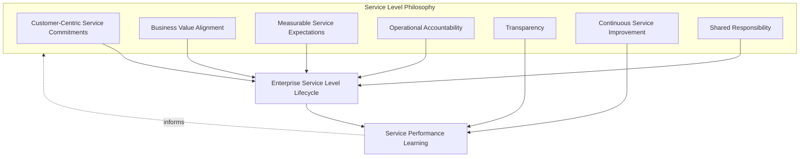
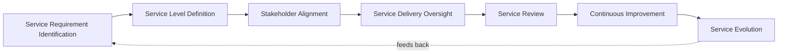
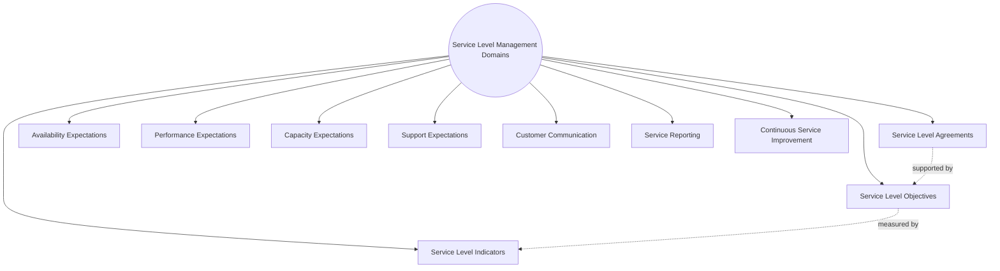
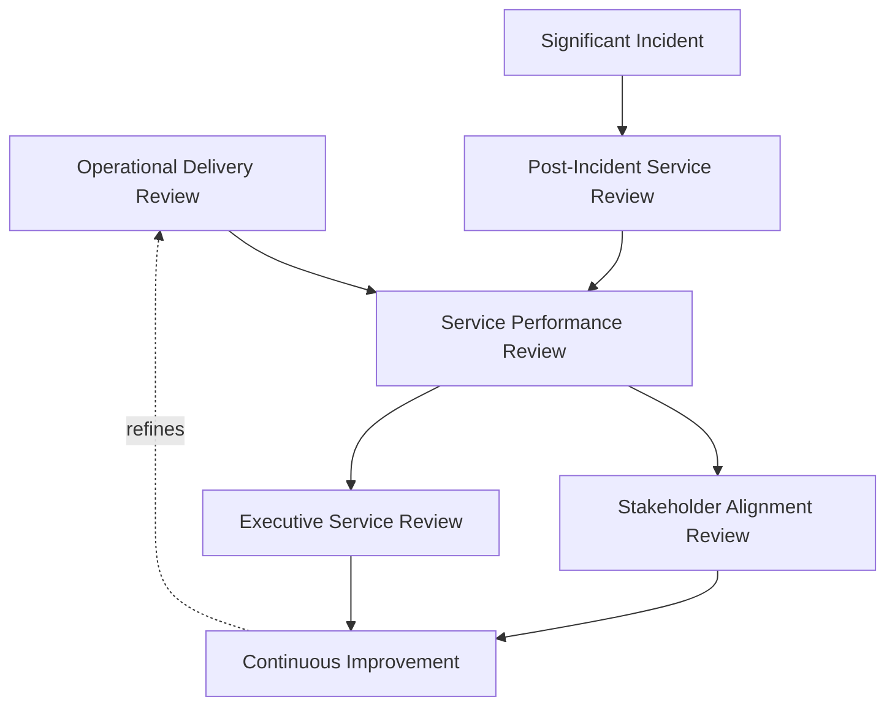
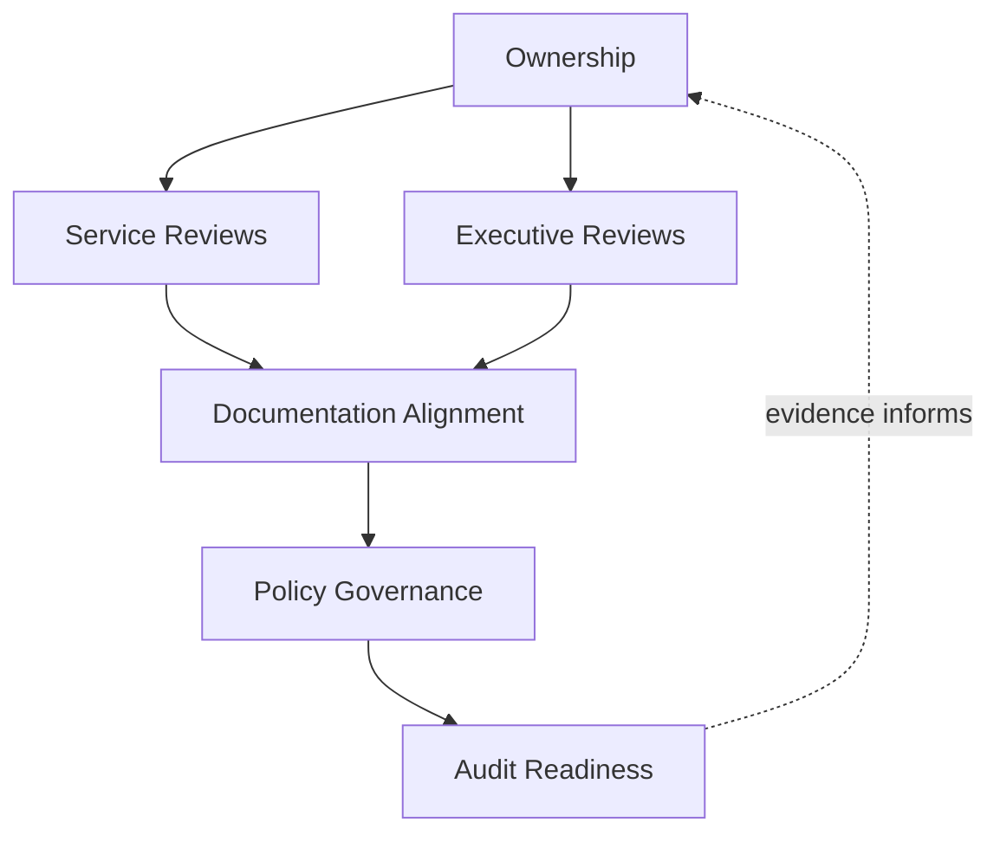
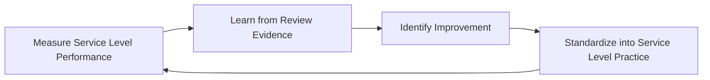
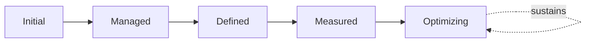

# Enterprise Service Level Management Strategy

## 1. Document Purpose

This document defines the official Enterprise Service Level Management (SLM) Strategy for **StackLeo Tech Store**. It establishes how service expectations are defined, communicated, delivered against, and reviewed — independent of any specific monitoring platform, ITSM tool, or SLA management software.

- **Purpose of Service Level Management** — SLM exists to convert the reliability engineered in `07_DevOps/sre-strategy.md` into explicit, agreed, business-facing commitments that customers and stakeholders can understand and hold the business accountable to, elaborating Service Level Management as introduced in `service-management.md` (Section 4.3).
- **Relationship with Service Management** — this document is the service-level-specific elaboration of `service-management.md`; where that document defines the full service lifecycle and ten management domains, this document defines specifically how expectations for each service are set, tracked, and reviewed.
- **Relationship with Service Catalog** — every service level commitment defined here applies to a specific service entry in `service-catalog.md`; Service Criticality (`service-catalog.md`, Section 4.8) directly informs the rigor with which a service's level commitments are set and reviewed.
- **Relationship with Customer Experience** — service levels exist to make explicit what customers can genuinely expect, consistent with Customer-Centric Service Delivery in `service-management.md` (Section 2.2); a commitment that does not reflect real customer need is not a meaningful service level, however precisely it is measured.
- **Relationship with Reliability Engineering** — this strategy does not re-engineer reliability; it translates the objectives and error budget thinking of `07_DevOps/sre-strategy.md` into business-facing commitments, keeping engineering and business understanding of reliability connected rather than divergent.
- **Relationship with Business Governance** — service level performance is a direct input to business decisions about investment, risk acceptance, and customer commitments; this strategy ensures those decisions are grounded in genuine, agreed expectations rather than informal impression.

This document is implementation-independent and vendor-neutral. It defines service level philosophy, lifecycle, domains, and governance conceptually — not specific monitoring platforms, ITSM tools, SLA management software, SLA/SLO/SLI target values, or infrastructure configuration.

## 2. Service Level Philosophy

Service level management at StackLeo is governed by seven principles. Each exists to produce a specific business outcome — service levels are managed deliberately because of the trust and accountability they create, not as a reporting exercise.

### 2.1 Customer-Centric Service Commitments

Service level commitments are defined around genuine customer expectation and need, consistent with `service-management.md` (Section 2.2), not around what is technically convenient to measure.

- **Business Value** — ensures commitments protect what customers actually care about, rather than optimizing for an internally convenient but customer-irrelevant measure.

### 2.2 Business Value Alignment

Every service level commitment traces to a genuine business rationale — why this level of service matters to customers or the business — consistent with Business Value First in `service-management.md` (Section 2.1).

- **Business Value** — prevents commitments from being set arbitrarily, ensuring the rigor applied to each service is proportionate to its genuine business importance.

### 2.3 Measurable Service Expectations

Service expectations are expressed in terms that can be objectively observed and verified, not left as vague or subjective impressions of "good enough."

- **Business Value** — replaces disputable impression with objective evidence, making service performance discussions productive rather than adversarial.

### 2.4 Operational Accountability

Every service level commitment has a clear, accountable owner responsible for its delivery, consistent with Service Ownership in `service-catalog.md` (Section 2.3).

- **Business Value** — ensures a missed commitment has a specific, responsible party working to address it, not a diffuse, unowned gap.

### 2.5 Transparency

Service level performance is visible to the stakeholders who depend on it, not held privately within the team delivering the service.

- **Business Value** — builds trust with customers and business stakeholders by making performance genuinely knowable, not merely asserted.

### 2.6 Continuous Service Improvement

Service level commitments and performance are reviewed and improved over time, consistent with Continuous Service Improvement in `service-management.md` (Section 4.10).

- **Business Value** — ensures service levels remain aligned with evolving customer expectation and business scale, rather than fixed at a single historical point.

### 2.7 Shared Responsibility

Meeting service level commitments is owned jointly by Engineering, Operations, Product, and Support; no single function alone determines whether a commitment is met.

- **Business Value** — prevents the anti-pattern in Section 10.3, where weak cross-functional alignment leaves commitments unmet despite individual functions each believing they did their part.

*Diagram 1: Service Level Philosophy Overview — the seven principles shape the enterprise service level lifecycle, and service performance learning feeds back into the philosophy itself.*

## 3. Enterprise Service Level Lifecycle

Service level management is governed across seven conceptual stages, spanning from initial requirement identification through continuous evolution.

### 3.1 Service Requirement Identification

- **Purpose** — determine what customers and business stakeholders genuinely need from a service, before any specific level is defined.
- **Business Value** — ensures subsequent commitments are grounded in real need, consistent with Customer-Centric Service Commitments (Section 2.1).
- **Governance Objectives** — require documented requirement identification for every service before Service Level Definition (Section 3.2) begins.

### 3.2 Service Level Definition

- **Purpose** — express identified requirements as specific, measurable service level expectations for a given service.
- **Business Value** — converts general expectation into a concrete commitment that can be delivered against and verified.
- **Governance Objectives** — require every defined service level to trace to an identified requirement (Section 3.1) and a named accountable owner.

### 3.3 Stakeholder Alignment

- **Purpose** — confirm that customers, business stakeholders, and the teams responsible for delivery genuinely agree on and understand the defined service levels.
- **Business Value** — prevents disputes and misaligned expectations from surfacing only after a commitment has already been missed.
- **Governance Objectives** — require explicit sign-off from both delivering and depending stakeholders before a service level is considered active.

### 3.4 Service Delivery Oversight

- **Purpose** — continuously oversee whether a service is being delivered consistent with its defined levels.
- **Business Value** — allows deviation to be noticed and addressed while a commitment is still recoverable, rather than only discovered at a scheduled review.
- **Governance Objectives** — require oversight to be continuous, connected to Monitoring & Observability in `operations-overview.md` (Section 5.2), not confined to periodic checks alone.

### 3.5 Service Review

- **Purpose** — formally evaluate service level performance against defined expectations on a recurring basis.
- **Business Value** — gives stakeholders an honest, evidence-based view of whether commitments are genuinely being met.
- **Governance Objectives** — require review to occur on a predictable, regular cadence, per the Service Review Matrix (Section 5).

### 3.6 Continuous Improvement

- **Purpose** — act on review findings to improve service delivery or refine service level definitions where genuinely warranted.
- **Business Value** — ensures review translates into action rather than remaining a passive reporting exercise.
- **Governance Objectives** — require improvement actions arising from service review to be documented and tracked to completion.

### 3.7 Service Evolution

- **Purpose** — deliberately reconsider service level commitments as business context, customer expectation, or service scope changes materially.
- **Business Value** — keeps commitments genuinely relevant rather than fixed indefinitely at their original definition.
- **Governance Objectives** — require material changes to a service level to proceed through the same Stakeholder Alignment (Section 3.3) as an original definition.

### Enterprise Service Level Lifecycle Matrix

| Stage | Purpose | Business Value | Governance Objective |
|---|---|---|---|
| Service Requirement Identification | Determine genuine customer/business need | Grounds subsequent commitments in real need | Documented before service level definition begins |
| Service Level Definition | Express requirements as measurable expectations | Converts general expectation into a verifiable commitment | Traces to an identified requirement and a named owner |
| Stakeholder Alignment | Confirm shared agreement and understanding | Prevents disputes from surfacing after commitments are missed | Explicit sign-off required from all relevant stakeholders |
| Service Delivery Oversight | Continuously oversee delivery against defined levels | Allows deviation to be caught while still recoverable | Oversight is continuous, not confined to periodic checks |
| Service Review | Formally evaluate performance against expectations | Gives stakeholders an honest, evidence-based view | Occurs on a predictable, regular cadence |
| Continuous Improvement | Act on review findings to improve delivery/definitions | Ensures review translates into action | Improvement actions documented and tracked to completion |
| Service Evolution | Reconsider commitments as context changes materially | Keeps commitments genuinely relevant over time | Material changes proceed through stakeholder alignment again |

*Diagram 2: Enterprise Service Level Lifecycle — a continuous cycle in which improvement and evolution directly inform the next iteration of requirement identification.*

## 4. Service Level Management Domains

Service level management spans ten conceptual domains. Consistent with the requirement to remain implementation-independent, none of these domains prescribe specific target values, thresholds, or metrics — each defines the concept and its governance, leaving concrete figures to be set service-by-service through the lifecycle in Section 3.

### 4.1 Service Level Agreements (SLA)

- **Purpose** — represent the formal, business-facing commitment made to customers or stakeholders regarding a service.
- **Scope** — the outward-facing agreement, typically the least technical and most business-oriented of the three related concepts in this section.
- **Governance Expectations** — an SLA is never defined without a corresponding internal SLO (Section 4.2) that gives the business confidence it can genuinely be met.
- **Business Importance** — is the commitment customers and partners actually rely on when choosing to trust and use StackLeo's services.

### 4.2 Service Level Objectives (SLO)

- **Purpose** — represent the internal, engineering-facing target a team aims to meet in order to satisfy an SLA.
- **Scope** — informed directly by `07_DevOps/sre-strategy.md`; typically more granular and technically specific than the SLA it supports.
- **Governance Expectations** — SLOs are set with deliberate margin relative to the SLA they support, consistent with error budget thinking.
- **Business Importance** — is the mechanism that makes an outward SLA commitment genuinely achievable rather than aspirational.

### 4.3 Service Level Indicators (SLI)

- **Purpose** — represent the specific, observed measurement used to determine whether an SLO is being met.
- **Scope** — the measurable signal itself, distinct from the target (SLO) it is compared against.
- **Governance Expectations** — SLIs are chosen to genuinely reflect customer experience, consistent with Measurable Service Expectations (Section 2.3), not chosen merely for ease of collection.
- **Business Importance** — is the evidentiary foundation every other concept in this section ultimately depends on; a poorly chosen SLI undermines confidence in the SLO and SLA it supports.

### 4.4 Availability Expectations

- **Purpose** — express how consistently a service is expected to be accessible and functional for its consumers.
- **Scope** — informed by the reliability architecture in `03_System_Design/quality-attributes.md` (Section 5) and engineered in `07_DevOps/sre-strategy.md`.
- **Governance Expectations** — availability expectations are set per service, proportionate to its criticality (`service-catalog.md`, Section 4.8), not applied uniformly across the portfolio.
- **Business Importance** — directly underpins customer confidence that the platform will be there when they choose to shop.

### 4.5 Performance Expectations

- **Purpose** — express how responsively a service is expected to behave for its consumers.
- **Scope** — informed by `08_Quality_Assurance/performance-testing.md`, translating engineering-level performance validation into business-facing commitment.
- **Governance Expectations** — performance expectations reflect genuine workload conditions, not idealized or unrepresentative ones.
- **Business Importance** — directly affects conversion and customer trust, both highly sensitive to responsiveness.

### 4.6 Capacity Expectations

- **Purpose** — express the volume of demand a service is expected to sustain without degrading its other commitments.
- **Scope** — informed by Capacity Management in `operations-overview.md` (Section 5.8), covering both technical and operational capacity.
- **Governance Expectations** — capacity expectations are reviewed proactively against genuine growth projections, not only after strain is observed.
- **Business Importance** — ensures the business can serve growing demand without silently eroding other service commitments.

### 4.7 Support Expectations

- **Purpose** — express how promptly and effectively customers and stakeholders can expect assistance when they need it.
- **Scope** — informed by Service Support in `service-management.md` (Section 4.5), covering responsiveness and competence of assistance.
- **Governance Expectations** — support expectations are set with awareness of genuine customer urgency, not uniform regardless of issue severity.
- **Business Importance** — protects customer trust at the exact moments it is most fragile — when something has already gone wrong.

### 4.8 Customer Communication

- **Purpose** — express how and when customers and stakeholders are informed about service status, planned change, and disruption.
- **Scope** — informed by Customer Communication in `service-management.md` (Section 4.7).
- **Governance Expectations** — communication commitments are honored even when the news is unfavorable, consistent with Transparency (Section 2.5).
- **Business Importance** — well-communicated disruption preserves substantially more trust than a technically well-handled but poorly communicated one.

### 4.9 Service Reporting

- **Purpose** — express how and to whom service level performance is regularly communicated.
- **Scope** — informed by Service Reporting in `service-management.md` (Section 4.9) and `08_Quality_Assurance/quality-metrics.md`.
- **Governance Expectations** — reporting reflects genuine underlying performance evidence and is produced on a predictable cadence, per the Service Review Matrix (Section 5).
- **Business Importance** — gives stakeholders an honest basis for decisions about investment, escalation, or risk acceptance.

### 4.10 Continuous Service Improvement

- **Purpose** — express the standing expectation that service levels and delivery against them improve over time.
- **Scope** — cross-cutting; consolidates the improvement expectations from every other domain in this section.
- **Governance Expectations** — improvement is a scheduled, standing discipline, not an occasional initiative undertaken only after a visible failure.
- **Business Importance** — ensures service level management value compounds over time rather than remaining static as the business and platform grow.

### Service Level Management Domain Matrix

| Domain | Purpose | Governance Expectations | Business Importance |
|---|---|---|---|
| Service Level Agreements (SLA) | Represent the formal, business-facing commitment | Never defined without a supporting internal SLO | The commitment customers and partners actually rely on |
| Service Level Objectives (SLO) | Represent the internal engineering-facing target | Set with deliberate margin relative to the SLA | Makes the outward commitment genuinely achievable |
| Service Level Indicators (SLI) | Represent the specific observed measurement | Chosen to genuinely reflect customer experience | Evidentiary foundation every other concept depends on |
| Availability Expectations | Express expected accessibility and functionality | Set per service, proportionate to criticality | Underpins confidence the platform will be there |
| Performance Expectations | Express expected responsiveness | Reflect genuine workload conditions | Directly affects conversion and customer trust |
| Capacity Expectations | Express sustainable demand volume | Reviewed proactively against growth projections | Ensures growth doesn't silently erode other commitments |
| Support Expectations | Express promptness and effectiveness of assistance | Set with awareness of genuine customer urgency | Protects trust at the customer's most fragile moment |
| Customer Communication | Express how/when customers are informed | Honored even when news is unfavorable | Preserves trust through well-communicated disruption |
| Service Reporting | Express how performance is regularly communicated | Reflects genuine evidence, predictable cadence | Honest basis for investment and escalation decisions |
| Continuous Service Improvement | Express the standing expectation of improvement | A scheduled, standing discipline | Ensures value compounds rather than remaining static |

*Diagram 3: Service Commitment Operating Model — ten domains, with the foundational SLA/SLO/SLI relationship highlighted as the structural basis every other commitment builds on.*

## 5. Service Quality Governance

- **Service Ownership** — every service level commitment has a single, named accountable owner, consistent with Operational Accountability (Section 2.4).
- **Stakeholder Expectations** — the expectations of customers, business stakeholders, and delivering teams are explicitly reconciled during Stakeholder Alignment (Section 3.3), not assumed to already agree.
- **Performance Reviews** — service level performance is formally reviewed on a recurring, predictable basis, per the Service Review Matrix below.
- **Service Reporting** — performance is communicated to dependent stakeholders consistently and honestly, consistent with Section 4.9.
- **Risk Awareness** — governance decisions about service levels are made with explicit awareness of the risk a given commitment carries if unmet.
- **Auditability** — service level definitions, alignment sign-offs, and review outcomes are retained in a form that can be independently reviewed after the fact.
- **Continuous Improvement** — service quality governance itself matures over time, informed by what is learned from real service level performance.

### Service Quality Governance Matrix

| Governance Element | Description | Business Value |
|---|---|---|
| Service Ownership | Every commitment has a single, named accountable owner | Ensures a missed commitment has a responsible party addressing it |
| Stakeholder Expectations | Expectations explicitly reconciled, not assumed | Prevents disputes from surfacing only after commitments are missed |
| Performance Reviews | Performance reviewed on a recurring, predictable basis | Gives stakeholders confidence commitments are genuinely tracked |
| Service Reporting | Performance communicated consistently and honestly | Builds trust through genuine, not merely asserted, transparency |
| Risk Awareness | Decisions made with explicit awareness of commitment risk | Enables deliberate, informed risk-taking rather than blind exposure |
| Auditability | Definitions, sign-offs, and outcomes retained for review | Supports accountability and confidence for partners and regulators |
| Continuous Improvement | Governance matures from real performance evidence | Keeps governance aligned with organizational and platform growth |

### Service Review Matrix

| Review Type | Purpose | Typical Audience | Cadence Nature |
|---|---|---|---|
| Operational Delivery Review | Confirm day-to-day delivery against defined service levels | Service Owners, Engineering, Operations | Frequent, tightly coupled to ongoing delivery |
| Service Performance Review | Evaluate aggregate service level performance over a recent period | Service Owners, Product, Support | Regular, predictable cadence |
| Stakeholder Alignment Review | Reconfirm that defined commitments still reflect genuine stakeholder need | Business Stakeholders, Product, Service Owners | Periodic, tied to material business or scope change |
| Executive Service Review | Provide leadership visibility into overall service level health | Executive Leadership, COO / Operations Lead | Regular, less frequent than operational review |
| Post-Incident Service Review | Evaluate service level impact and recovery following a significant incident | Service Owners, Operations, SRE | Triggered by significant incidents, per `07_DevOps/incident-management.md` |

*Diagram 4: Service Review & Improvement Cycle — operational, performance, stakeholder, executive, and post-incident reviews together feed continuous improvement, which refines future operational delivery.*

## 6. Governance

### 6.1 Ownership

Every service level domain (Section 4) has a single accountable owner; overall service level management governance is owned jointly by Operations and Product leadership, consistent with `service-management.md` (Section 6.1).

### 6.2 Service Reviews

Individual services are formally reviewed against their defined service levels per the Service Review Matrix (Section 5), ensuring performance confirmation is a deliberate, recurring governance act.

### 6.3 Executive Reviews

Overall service level health across the portfolio is reviewed with executive stakeholders on a regular cadence, consistent with Executive Reporting in `08_Quality_Assurance/quality-metrics.md` (Section 3.5).

### 6.4 Documentation Alignment

Service level documentation is kept consistent with `service-management.md`, `service-catalog.md`, and `07_DevOps/sre-strategy.md`; a service level claim that contradicts current service catalog or reliability documentation is treated as a governance gap.

### 6.5 Policy Governance

Subordinate, practice-specific service level documents (individual SLA/SLO definitions, review templates) must remain consistent with the philosophy, lifecycle, and domains defined in this strategy.

### 6.6 Audit Readiness

Service level definitions, stakeholder sign-offs, and review outcomes are retained in a form that can be independently reviewed after the fact, supporting internal governance and partner or regulatory review where relevant.

*Diagram 5: Enterprise Service Quality Governance Model — ownership anchors review activity, which feeds documentation alignment, policy governance, and ultimately audit-ready evidence.*

### Governance Responsibility Matrix

| Role | Responsibility |
|---|---|
| COO / Operations Lead | Owns coherence and enforcement of this service level management strategy, in partnership with Product and Engineering leadership. |
| Service Owners | Own individual service level commitments (Section 4) and their delivery. |
| SRE Lead | Ensures SLO/SLI definitions (Sections 4.2–4.3) remain consistent with `07_DevOps/sre-strategy.md`. |
| Product Manager | Ensures service requirements (Section 3.1) reflect genuine customer and business need. |
| Support Lead | Owns Support Expectations (Section 4.7) definition and delivery. |
| Communications Lead | Owns Customer Communication (Section 4.8) practice and standards. |
| Executive Leadership | Consumes Executive Service Reviews (Section 6.3) and makes informed investment decisions. |
| Internal Audit / Review Function | Independently verifies that service level governance records reflect actual practice. |

## 7. Future Readiness

This strategy is designed to remain valid as StackLeo evolves in scale and organizational complexity, without requiring redefinition of its underlying philosophy.

- **Cloud-Native Platforms** — service level domains (Section 4) are defined independently of any specific runtime or deployment model, so they apply unchanged as infrastructure evolves.
- **AI-Enabled Services** — as AI-assisted capability is introduced as a customer-facing service, it receives its own service level definitions (Section 3.2) under the same governance as any other service, without prescribing AI-specific target values here.
- **Marketplace Platform** — the multi-vendor marketplace model extends Availability and Support Expectations (Sections 4.4, 4.7) to cover seller-facing services, applying the same rigor used for StackLeo's own services today.
- **Multi-Tenant Architecture** — where future architecture introduces tenant isolation, Capacity and Availability Expectations (Sections 4.6, 4.4) extend to explicitly account for per-tenant commitments.
- **Mobile Applications** — the future Mobile App channel receives its own service level definitions as a new Customer-Facing Service (`service-catalog.md`, Section 3.2), following the same lifecycle (Section 3) as any other service.
- **Multi-Region Services** — as StackLeo expands from Bangladesh into South Asia and beyond, Availability and Performance Expectations (Sections 4.4–4.5) extend to reflect region-specific conditions.
- **Global Operations** — the service level lifecycle, domains, and governance defined in Sections 3–6 are defined independently of team size or organizational structure, so they remain coherent as operations scale across geographies.
- **Enterprise Scale** — the Service Review Matrix (Section 5) is structured to extend to additional review types and stakeholder groups as the organization grows, without requiring the underlying lifecycle to be redesigned.

## 8. Operational Governance

- **Ownership** — the Operations lead (or equivalent COO-accountable function) owns this strategy and is accountable for its consistent application across the platform, in partnership with SRE and Product leadership.
- **Review Process** — this strategy is formally reviewed whenever a material change occurs in business model (`01_Business/business-model.md`), the service catalog (`service-catalog.md`), or reliability architecture (`07_DevOps/sre-strategy.md`), and on a regular recurring cadence independent of specific change events.
- **Service Level Policies** — subordinate, practice-specific service level documents must remain consistent with the philosophy, lifecycle, and domains defined here.
- **Continuous Evaluation** — service level definitions and performance are continuously evaluated against genuine customer and business need, not fixed indefinitely at their original definition, consistent with Service Evolution (Section 3.7).
- **Audit Readiness** — this strategy and the evidence it requires (Section 6.6) are maintained in a state ready for internal or external audit at any time, without requiring advance preparation.

*Diagram: Continuous Service Level Improvement — performance is measured, learned from, improved upon, and standardized back into practice, on a continuing basis.*

## 9. Service Level Maturity Model

Service level management maturity is described across five conceptual levels, adapted from established process maturity thinking. Progression reflects increasing consistency, measurement, and deliberate improvement — not merely increasing documentation volume.

- **Initial** — service expectations, if they exist at all, are informal and inconsistent; commitments are implied rather than explicit, and performance against them is not systematically tracked.
- **Managed** — basic service level definitions exist for individual services, but consistency and rigor vary across the portfolio.
- **Defined** — service level definitions are standardized, documented, and consistently applied across the portfolio, consistent with the lifecycle and domains defined throughout this document; ownership is clear organization-wide.
- **Measured** — service level performance is measured systematically against defined SLOs and SLIs, and reviews are grounded in genuine performance data rather than qualitative impression alone.
- **Optimizing** — service level management practice is continuously and deliberately improved based on quantitative evidence and organizational learning; improvement itself is a managed, ongoing discipline rather than an occasional initiative.

### Service Level Maturity Model Matrix

| Level | Characteristics | Primary Focus |
|---|---|---|
| Initial | Informal, implied expectations; performance not systematically tracked | Ad hoc service commitment |
| Managed | Basic definitions exist per service; consistency varies across the portfolio | Service-level consistency |
| Defined | Standardized, documented definitions applied across the portfolio | Organization-wide consistency and clear ownership |
| Measured | Performance measured systematically against SLOs and SLIs | Evidence-based service level decisions |
| Optimizing | Practice continuously and deliberately improved from evidence | Sustained, deliberate improvement as a discipline |

*Diagram 6: Service Level Maturity Progression Model — maturity advances from informal, implied commitment toward standardized, measured, and continuously optimized service level management.*

## 10. Anti-Patterns

The following recurring failure patterns are explicitly recognized and avoided, as each one structurally undermines this strategy.

| Anti-Pattern | Why It's Avoided |
|---|---|
| Undefined Service Expectations | Contradicts Measurable Service Expectations (Section 2.3); without explicit definitions, "acceptable service" becomes a subjective, unverifiable impression. |
| Unrealistic Service Commitments | Contradicts Business Value Alignment (Section 2.2); commitments set without genuine engineering confidence (via a supporting SLO) are aspirational, not real, and erode trust when missed. |
| Weak Stakeholder Alignment | Undermines Stakeholder Alignment (Section 3.3); expectations assumed rather than explicitly reconciled surface as disputes only after a commitment is already missed. |
| Poor Service Reporting | Undermines Service Reporting (Section 4.9); without honest, regular reporting, stakeholders cannot make informed decisions about service investment or risk. |
| Reactive Service Reviews | Contradicts Continuous Service Improvement (Section 2.6); reviewing service levels only after a visible failure forfeits the far cheaper option of noticing drift early. |
| Weak Governance | Undermines Section 6; without clear ownership and review, service level commitments drift into inconsistency as the portfolio and organization grow. |
| Poor Documentation | Undermines Documentation Alignment (Section 6.4), leaving service level definitions and evidence unclear or unverifiable after the fact. |
| Missing Continuous Improvement | Contradicts Continuous Service Improvement (Section 2.6, Section 4.10); without deliberate improvement, service level management value stagnates as the business and platform grow in complexity. |

## 11. Document Information

| Property | Value |
|----------|-------|
| Document | service-level-management.md |
| Version | 1.0.0 |
| Status | Active |
| Maintained By | StackLeo |
| Last Updated | 2026-07-24 |

---

© StackLeo. All Rights Reserved.
