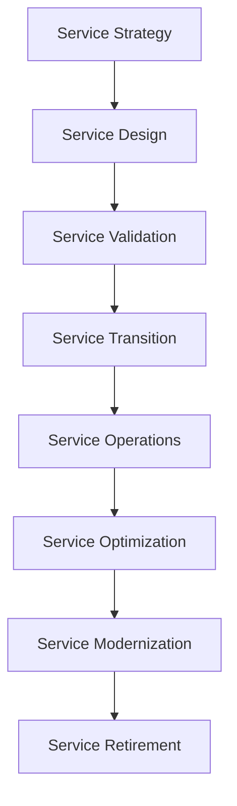
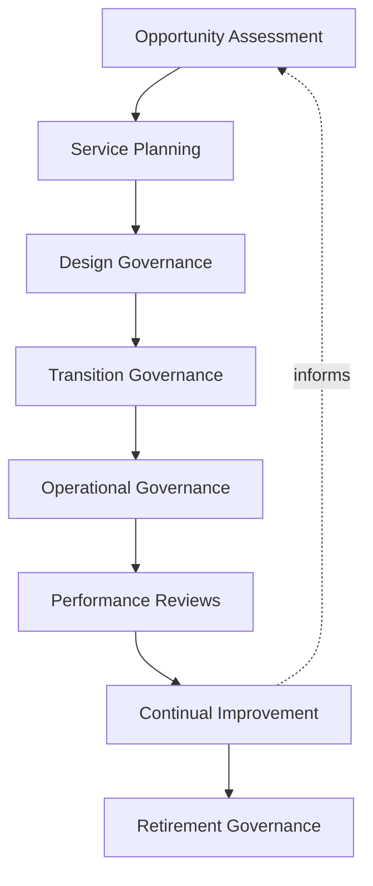
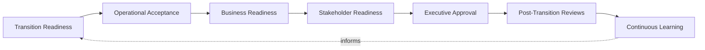
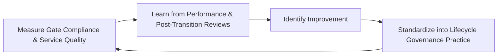
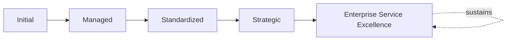

# Enterprise Service Lifecycle Framework

## 1. Executive Summary

**Purpose** — This document defines the official Enterprise Service Lifecycle Framework for **StackLeo Tech Store**. It establishes service lifecycle governance, service design governance, service transition governance, service operations governance, continual service improvement, executive oversight, organizational accountability, and long-term service lifecycle maturity as a deliberate, accountable enterprise discipline. `09_Operations/service-management-framework.md` already governs the broader enterprise service model and touches lifecycle stages briefly in its Section 6. This framework does not restate that treatment. It provides the dedicated, stage-gate-level elaboration of how a service moves deliberately from opportunity through design, transition, operation, optimization, and eventual retirement.

**Scope** — This framework applies to every stage a StackLeo service passes through across its lifecycle — strategy, design, validation, transition, operations, optimization, modernization, and retirement — coordinated with `09_Operations/service-management-framework.md`, `09_Operations/service-level-governance.md`, `09_Operations/incident-management-governance.md`, `09_Operations/problem-management-governance.md`, `09_Operations/operations-governance.md`, and `09_Operations/business-continuity-framework.md`.

**Strategic Objectives** — To ensure a service is never introduced without genuine strategic justification; that a service's design and transition are deliberately validated before it reaches customers; that a service's ongoing operation is genuinely governed, not left to informal habit; and that a service's eventual retirement is as deliberately governed as its introduction.

**Business Value** — A governed service lifecycle framework protects StackLeo from the disproportionate cost of a service launched without genuine readiness, protects the organization from services that quietly persist past their useful value, and gives leadership the confidence to evolve the enterprise service portfolio because its lifecycle governance is demonstrably sound.

**Intended Audience** — The Board of Directors, executive leadership, the Chief Operating Officer, the Chief Technology Officer, the Service Governance Board, operations leadership, engineering leadership, security leadership, customer success leadership, and business stakeholders.

## 2. Enterprise Service Lifecycle Vision

- **Services Throughout Their Entire Lifecycle** — a service is governed across its complete lifecycle, never only at the moment of launch.
- **Customer-Centric Service Evolution** — how a service evolves is governed to remain genuinely centered on customer benefit.
- **Predictable Service Quality** — a service's quality is governed to be genuinely predictable at every lifecycle stage.
- **Operational Stability** — a service's transition into operation is governed to protect genuine operational stability.
- **Sustainable Service Value** — the value a service delivers is governed to remain genuinely sustainable across its life.
- **Organizational Learning** — understanding gained across a service's lifecycle genuinely deepens future service governance.
- **Long-Term Service Excellence** — service lifecycle governance is pursued as a durable discipline supporting genuine, sustained excellence.

### Enterprise Service Lifecycle Vision Matrix

| Vision Element | Focus | Business Value |
|---|---|---|
| Services Throughout Their Entire Lifecycle | Governed across the complete lifecycle, not only at launch | Prevents governance gaps outside the launch moment |
| Customer-Centric Service Evolution | Evolution remaining genuinely centered on customer benefit | Keeps service change connected to genuine customer need |
| Predictable Service Quality | Genuinely predictable quality at every stage | Builds organizational confidence in service delivery |
| Operational Stability | Transition protecting genuine operational stability | Prevents instability introduced at the point of transition |
| Sustainable Service Value | Value remaining genuinely sustainable across the service's life | Protects long-term return on service investment |
| Organizational Learning | Understanding genuinely deepening future governance | Compounds the value of accumulated lifecycle experience |
| Long-Term Service Excellence | A durable discipline supporting sustained excellence | Converts lifecycle governance into lasting advantage |

## 3. Service Lifecycle Principles

Service lifecycle governance at StackLeo rests on nine principles, each producing a specific business outcome.

- **Lifecycle Governance** — every stage of a service's life is genuinely, deliberately governed. *Business Value:* prevents any lifecycle stage from being left informally managed.
- **Customer Value First** — a lifecycle decision is judged by the genuine value it protects or creates for customers. *Business Value:* keeps lifecycle governance connected to genuine customer benefit.
- **Business Alignment** — a service's lifecycle progression remains genuinely connected to business strategy. *Business Value:* ensures lifecycle investment reflects genuine business priority.
- **Quality by Design** — a service's quality is genuinely designed in from the outset, not inspected in afterward. *Business Value:* prevents the disproportionate cost of correcting quality after delivery.
- **Controlled Transition** — a service's move into live operation is genuinely, deliberately controlled. *Business Value:* protects operational stability at the point of highest transition risk.
- **Operational Reliability** — a service in operation is governed to remain genuinely reliable for those who depend on it. *Business Value:* protects the trust every operating service represents.
- **Continuous Improvement** — service lifecycle governance practice matures over time, informed by real outcomes. *Business Value:* keeps governance aligned with the organization's growing scale and complexity.
- **Evidence-Based Decisions** — a lifecycle decision is grounded in genuine, documented evidence, not assumption. *Business Value:* protects the credibility and defensibility of lifecycle decisions.
- **Long-Term Sustainability** — a service's lifecycle is governed in a manner genuinely sustainable for both the business and its customers. *Business Value:* protects against lifecycle decisions that quietly erode long-term viability.

### Service Lifecycle Governance Matrix

| Principle | Description | Business Value |
|---|---|---|
| Lifecycle Governance | Every stage genuinely, deliberately governed | Prevents any stage from being informally managed |
| Customer Value First | Judged by genuine value protected or created for customers | Keeps governance connected to genuine customer benefit |
| Business Alignment | Progression remaining genuinely connected to strategy | Ensures investment reflects genuine business priority |
| Quality by Design | Quality genuinely designed in, not inspected in afterward | Prevents the disproportionate cost of correcting quality later |
| Controlled Transition | Move into live operation genuinely, deliberately controlled | Protects stability at the point of highest transition risk |
| Operational Reliability | Genuinely reliable for those who depend on the service | Protects the trust every operating service represents |
| Continuous Improvement | Practice matures from real outcomes | Keeps governance aligned with growing scale and complexity |
| Evidence-Based Decisions | Grounded in genuine, documented evidence | Protects credibility and defensibility of decisions |
| Long-Term Sustainability | Governed in a manner genuinely sustainable for both parties | Protects against decisions that erode long-term viability |

## 4. Enterprise Service Lifecycle Governance Model

Service lifecycle governance operates across eight conceptual stages, each holding accountability for a distinct phase of the service's life.

### Service Strategy

- **Purpose** — govern how a service's genuine strategic justification is established before design begins.
- **Governance Scope** — coordinated with Gate 0 and Gate 1 (Section 5).
- **Business Value** — protects the organization from designing a service without genuine strategic basis.
- **Executive Expectations** — leadership expects strategic justification to be evidenced, not assumed.

### Service Design

- **Purpose** — govern how a service is designed to genuinely deliver its intended value.
- **Governance Scope** — coordinated with Gate 2 (Section 5).
- **Business Value** — protects against a service reaching transition without genuine design rigor.
- **Executive Expectations** — leadership expects design to be reviewed before transition planning begins.

### Service Validation

- **Purpose** — govern how a designed service is genuinely validated against its intended requirements.
- **Governance Scope** — coordinated with Service Quality Governance (Section 7).
- **Business Value** — protects against design flaws surfacing only after a service reaches customers.
- **Executive Expectations** — leadership expects validation evidence before transition readiness is assessed.

### Service Transition

- **Purpose** — govern how a validated service is genuinely, deliberately moved into live operation.
- **Governance Scope** — coordinated with Gate 3 and Service Transition Governance (Section 8).
- **Business Value** — protects operational stability at the point of highest transition risk.
- **Executive Expectations** — leadership expects transition readiness to be formally confirmed, never assumed.

### Service Operations

- **Purpose** — govern the genuine, ongoing delivery of a service once it is live.
- **Governance Scope** — coordinated with Gate 4 and Gate 5 (Section 5).
- **Business Value** — protects the commitments a live service represents to its customers.
- **Executive Expectations** — leadership expects operational performance to be reviewed on a predictable cadence.

### Service Optimization

- **Purpose** — govern how a live service's genuine performance is deliberately improved over time.
- **Governance Scope** — coordinated with Gate 6 (Section 5).
- **Business Value** — protects the service from quietly stagnating once launched.
- **Executive Expectations** — leadership expects optimization to be evidenced by measured improvement.

### Service Modernization

- **Purpose** — govern how a service with continued genuine value but aging foundation is deliberately modernized.
- **Governance Scope** — coordinated with `03_System_Design/technology-governance.md`.
- **Business Value** — protects continued value delivery without accumulating unmanaged technical risk.
- **Executive Expectations** — leadership expects modernization decisions to be evidenced, not deferred indefinitely.

### Service Retirement

- **Purpose** — govern how a service no longer justifying its place is deliberately, formally retired.
- **Governance Scope** — coordinated with Gate 7 (Section 5).
- **Business Value** — protects against a retired-in-practice service persisting as unmanaged risk.
- **Executive Expectations** — leadership expects retirement to be formally closed out, never left ambiguous.

### Service Lifecycle Governance Matrix

| Domain | Purpose | Business Value | Executive Expectations |
|---|---|---|---|
| Service Strategy | Establish genuine strategic justification before design | Protects against designing without genuine basis | Expects strategic justification evidenced, not assumed |
| Service Design | Design to genuinely deliver intended value | Protects against reaching transition without design rigor | Expects review before transition planning begins |
| Service Validation | Validate a designed service against requirements | Protects against flaws surfacing only after delivery | Expects validation evidence before readiness assessment |
| Service Transition | Deliberately move a validated service into operation | Protects stability at the point of highest transition risk | Expects readiness formally confirmed, never assumed |
| Service Operations | Govern genuine, ongoing delivery once live | Protects the commitments a live service represents | Expects performance reviewed on a predictable cadence |
| Service Optimization | Deliberately improve genuine performance over time | Protects against a service quietly stagnating | Expects optimization evidenced by measured improvement |
| Service Modernization | Deliberately modernize aging-but-valuable services | Protects value delivery without unmanaged technical risk | Expects decisions evidenced, not deferred indefinitely |
| Service Retirement | Formally retire a service no longer justifying its place | Protects against unmanaged risk from a retired-in-practice service | Expects formal closure, never left ambiguous |

*Diagram 1: Enterprise Service Lifecycle Framework — strategy and design resolve into validation and transition, feeding operations and optimization, with modernization extending value ahead of eventual, deliberate retirement.*

## 5. Service Stage-Gate Governance Framework

The service lifecycle is governed through eight formal gates, remaining implementation independent throughout.

### Gate 0 – Service Opportunity

- **Governance Objectives** — confirm a candidate service addresses a genuine business or customer opportunity.
- **Decision Authority** — the Service Governance Board.
- **Required Evidence** — a documented opportunity case.
- **Expected Outcomes** — a genuinely justified basis to proceed to strategy approval.

### Gate 1 – Service Strategy Approval

- **Governance Objectives** — confirm the service's strategic direction and value proposition are genuinely sound.
- **Decision Authority** — the Service Governance Board, coordinated with executive leadership.
- **Required Evidence** — a documented, approved service strategy.
- **Expected Outcomes** — formal authorization to proceed to design.

### Gate 2 – Service Design Approval

- **Governance Objectives** — confirm the service's design genuinely satisfies its strategic intent.
- **Decision Authority** — the Service Governance Board, coordinated with Engineering Leadership.
- **Required Evidence** — a documented, reviewed design.
- **Expected Outcomes** — formal authorization to proceed to transition readiness.

### Gate 3 – Transition Readiness

- **Governance Objectives** — confirm the organization is genuinely ready to transition the service into operation.
- **Decision Authority** — the Service Governance Board, coordinated with Operations Leadership.
- **Required Evidence** — a documented transition readiness assessment.
- **Expected Outcomes** — formal authorization to transition.

### Gate 4 – Operational Readiness

- **Governance Objectives** — confirm the service is genuinely ready to be operated reliably at launch.
- **Decision Authority** — Operations Leadership, coordinated with the Service Governance Board.
- **Required Evidence** — a documented operational readiness assessment.
- **Expected Outcomes** — formal authorization to go live.

### Gate 5 – Service Performance Validation

- **Governance Objectives** — confirm a live service genuinely performs as intended.
- **Decision Authority** — the Service Governance Board.
- **Required Evidence** — documented, evidenced performance results.
- **Expected Outcomes** — confirmed validation of genuine service performance.

### Gate 6 – Service Optimization

- **Governance Objectives** — confirm a validated service's genuine optimization opportunities are identified and pursued.
- **Decision Authority** — the Service Governance Board.
- **Required Evidence** — documented optimization analysis.
- **Expected Outcomes** — a genuinely improving service over time.

### Gate 7 – Service Retirement

- **Governance Objectives** — confirm a service no longer justifying its place is formally, deliberately retired.
- **Decision Authority** — the Service Governance Board, coordinated with executive leadership.
- **Required Evidence** — a documented retirement plan and closure record.
- **Expected Outcomes** — a formally closed, cleanly retired service.

### Service Stage-Gate Matrix

| Gate | Governance Objectives | Decision Authority | Required Evidence | Expected Outcomes |
|---|---|---|---|---|
| Gate 0 – Service Opportunity | Confirm a genuine business or customer opportunity | Service Governance Board | Documented opportunity case | A genuinely justified basis to proceed |
| Gate 1 – Service Strategy Approval | Confirm strategic direction and value proposition | Service Governance Board with executive leadership | Documented, approved service strategy | Formal authorization to proceed to design |
| Gate 2 – Service Design Approval | Confirm design genuinely satisfies strategic intent | Service Governance Board with Engineering Leadership | Documented, reviewed design | Formal authorization to proceed to transition readiness |
| Gate 3 – Transition Readiness | Confirm genuine readiness to transition | Service Governance Board with Operations Leadership | Documented transition readiness assessment | Formal authorization to transition |
| Gate 4 – Operational Readiness | Confirm genuine readiness to operate reliably | Operations Leadership with Service Governance Board | Documented operational readiness assessment | Formal authorization to go live |
| Gate 5 – Service Performance Validation | Confirm the live service genuinely performs as intended | Service Governance Board | Documented, evidenced performance results | Confirmed validation of genuine performance |
| Gate 6 – Service Optimization | Confirm genuine optimization opportunities pursued | Service Governance Board | Documented optimization analysis | A genuinely improving service over time |
| Gate 7 – Service Retirement | Confirm formal, deliberate retirement | Service Governance Board with executive leadership | Documented retirement plan and closure record | A formally closed, cleanly retired service |

```mermaid
flowchart LR
    Gate0[Gate 0: Service Opportunity] --> Gate1[Gate 1: Strategy Approval]
    Gate1 --> Gate2[Gate 2: Design Approval]
    Gate2 --> Gate3[Gate 3: Transition Readiness]
    Gate3 --> Gate4[Gate 4: Operational Readiness]
    Gate4 --> Gate5[Gate 5: Performance Validation]
    Gate5 --> Gate6[Gate 6: Service Optimization]
    Gate6 --> Gate7[Gate 7: Service Retirement]
```

*Diagram 2: Service Stage-Gate Governance Model — a candidate service progresses through eight formally governed gates from initial opportunity to eventual, deliberate retirement.*

## 6. Service Lifecycle Governance

- **Opportunity Assessment** — governs how a candidate service's genuine opportunity is deliberately assessed.
- **Service Planning** — governs how an approved service's genuine delivery plan is deliberately developed.
- **Design Governance** — governs how a service's design is deliberately reviewed against strategic intent.
- **Transition Governance** — governs how a service's move into operation is deliberately controlled.
- **Operational Governance** — governs how a live service's genuine ongoing delivery is deliberately overseen.
- **Performance Reviews** — governs how a service's genuine performance is deliberately, periodically reviewed.
- **Continual Improvement** — governs how a service's genuine improvement opportunities are deliberately pursued.
- **Retirement Governance** — governs how a service's eventual, deliberate retirement is formally managed.

### Service Value Matrix

| Lifecycle Stage | Value Delivered | Governance Safeguard |
|---|---|---|
| Opportunity Assessment | Confirms genuine justification before investment begins | Gate 0 (Section 5) |
| Service Planning | Converts approved strategy into a genuine delivery plan | Gate 1 (Section 5) |
| Design Governance | Protects design quality before transition | Gate 2 (Section 5) |
| Transition Governance | Protects operational stability at point of highest risk | Gate 3 (Section 5) |
| Operational Governance | Protects the commitments a live service represents | Gate 4 (Section 5) |
| Performance Reviews | Confirms genuine, ongoing value delivery | Gate 5 (Section 5) |
| Continual Improvement | Compounds value through deliberate optimization | Gate 6 (Section 5) |
| Retirement Governance | Protects against unmanaged risk from lingering services | Gate 7 (Section 5) |

*Diagram 3: Service Lifecycle Governance Flow — opportunity assessment and planning inform design and transition governance, feeding operational governance and performance reviews, with continual improvement feeding lessons back into future opportunity assessment ahead of eventual retirement governance.*

## 7. Service Quality Governance

- **Service Standards** — governs the genuine, consistent standard a service is designed and operated to.
- **Quality Assurance** — governs how a service's genuine adherence to standards is deliberately confirmed.
- **Customer Experience** — governs how a service's genuine effect on customer experience is deliberately considered, coordinated with `02_Product/customer-value-governance.md`.
- **Performance Validation** — governs how a service's genuine performance is deliberately validated against expectation.
- **Operational Consistency** — governs whether a service remains genuinely consistent in its delivery over time.
- **Executive Reviews** — governs how service quality findings are deliberately brought to executive leadership.
- **Continuous Optimization** — governs how service quality practice deliberately improves from real outcomes.

### Service Quality Governance Matrix

| Governance Area | Focus | Coordination |
|---|---|---|
| Service Standards | Genuine, consistent standard for design and operation | Quality by Design (Section 3) |
| Quality Assurance | Genuine adherence to standards deliberately confirmed | Service Validation (Section 4) |
| Customer Experience | Genuine effect on customer experience considered | `02_Product/customer-value-governance.md` |
| Performance Validation | Genuine performance validated against expectation | Gate 5 (Section 5) |
| Operational Consistency | Genuine consistency in delivery over time | Operational Reliability (Section 3) |
| Executive Reviews | Findings deliberately brought to leadership | Service Quality Reviews (Section 10) |
| Continuous Optimization | Practice deliberately improving from real outcomes | Continuous Improvement (Section 3) |

## 8. Service Transition Governance

- **Transition Readiness** — governs whether a service is genuinely ready to move from design into live operation.
- **Operational Acceptance** — governs whether operations leadership genuinely accepts ownership of a transitioning service.
- **Business Readiness** — governs whether the wider business is genuinely prepared for a transitioning service.
- **Stakeholder Readiness** — governs whether affected stakeholders are genuinely informed and prepared.
- **Executive Approval** — governs the point at which transition genuinely requires executive-level approval.
- **Post-Transition Reviews** — governs how a completed transition's genuine outcome is deliberately reviewed.
- **Continuous Learning** — governs how understanding gained from transition deepens future transition governance.

### Service Transition Matrix

| Governance Area | Focus | Coordination |
|---|---|---|
| Transition Readiness | Genuine readiness to move from design into operation | Gate 3 (Section 5) |
| Operational Acceptance | Operations genuinely accepting ownership | Service Transition (Section 4) |
| Business Readiness | Wider business genuinely prepared | Organizational Governance (Section 9) |
| Stakeholder Readiness | Affected stakeholders genuinely informed and prepared | `00_Project_Overview/stakeholder-engagement-framework.md` |
| Executive Approval | Point requiring genuine executive-level approval | Gate 3 (Section 5) |
| Post-Transition Reviews | Completed transition's genuine outcome reviewed | Executive Oversight (Section 10) |
| Continuous Learning | Understanding deepening future transition governance | Continuous Improvement (Section 3) |

*Diagram 4: Service Transition Framework — transition and operational readiness inform business and stakeholder readiness, feeding executive approval and post-transition review, with continuous learning feeding lessons back into future transition readiness.*

## 9. Organizational Governance

Governance accountability is distributed deliberately across ten organizational roles.

- **Board of Directors** — holds ultimate accountability for whether StackLeo's service lifecycle governance genuinely serves the business's long-term direction.
- **Executive Leadership** — holds accountability for whether lifecycle decisions genuinely align with business strategy, in partnership with the Board.
- **Chief Operating Officer** — owns the coherence and enforcement of this framework across service operations.
- **Chief Technology Officer** — owns coordination of Service Design and Service Modernization (Section 4) with `03_System_Design/technology-governance.md`.
- **Service Governance Board** — owns the operational execution of the Service Stage-Gate Governance Framework (Section 5).
- **Operations Leadership** — own Service Transition and Service Operations (Section 4) within their accountable services.
- **Engineering Leadership** — own Service Design and Service Validation (Section 4).
- **Security Leadership** — own security-related quality requirements within Service Quality Governance (Section 7).
- **Customer Success Leadership** — own Customer Experience quality within Service Quality Governance (Section 7).
- **Business Stakeholders** — own business-context input into Business Readiness (Section 8) for services affecting their domain.

### Organizational Responsibility Matrix

| Role | Governance Objective | Business Value |
|---|---|---|
| Board of Directors | Hold ultimate accountability for lifecycle governance serving direction | Provides the highest point of ultimate accountability |
| Executive Leadership | Hold accountability for decisions aligning with business strategy | Provides a single point of executive-level accountability |
| Chief Operating Officer | Own coherence and enforcement across service operations | Provides a single point of specialist accountability |
| Chief Technology Officer | Own coordination of design and modernization | Ensures the lifecycle connects to architecture governance |
| Service Governance Board | Own operational execution of stage-gate governance | Provides a dedicated, cross-functional governance body |
| Operations Leadership | Own transition and operations within accountable services | Embeds accountability closest to where services are run |
| Engineering Leadership | Own design and validation | Embeds accountability closest to where services are built |
| Security Leadership | Own security-related quality requirements | Ensures the lifecycle meets enterprise security rigor |
| Customer Success Leadership | Own customer experience quality | Ensures the lifecycle reflects genuine customer priority |
| Business Stakeholders | Own business-context input into readiness | Connects lifecycle decisions to genuine business relevance |

## 10. Executive Oversight

- **Service Lifecycle Reviews** — the overall coherence of service lifecycle governance is formally reviewed on a regular cadence.
- **Stage-Gate Reviews** — progression through the eight gates is reviewed directly with executive leadership.
- **Service Quality Reviews** — genuine service quality is reviewed as a distinct, ongoing concern.
- **Customer Experience Reviews** — a service's genuine effect on customer experience is reviewed with executive leadership.
- **Strategic Reviews** — service lifecycle governance's genuine connection to business strategy is reviewed with executive leadership.
- **Continuous Improvement Reviews** — the organization's follow-through on captured lifecycle lessons is reviewed directly with executive leadership.

### Executive Oversight Matrix

| Oversight Mechanism | Purpose | Governance Role |
|---|---|---|
| Service Lifecycle Reviews | Confirm overall lifecycle governance coherence | Regular, predictable cadence for the framework as a whole |
| Stage-Gate Reviews | Review progression through the eight gates | Direct executive-level stage-gate review |
| Service Quality Reviews | Review genuine service quality | Treats quality as ongoing, not assumed |
| Customer Experience Reviews | Review genuine effect on customer experience | Direct executive-level experience review |
| Strategic Reviews | Review genuine connection to business strategy | Direct executive-level strategic alignment review |
| Continuous Improvement Reviews | Review follow-through on captured lessons | Direct executive-level review of improvement completion |

## 11. Future Readiness

This framework is designed to remain valid as StackLeo evolves in scale, geography, and organizational complexity.

- **AI-Assisted Service Lifecycle Governance** — as lifecycle assessment increasingly incorporates AI-assisted methods, coordinated with `04_Database/ai-governance.md`, it remains governed under the Service Stage-Gate Governance Framework (Section 5) at the same rigor as any other method.
- **Predictive Service Evolution** — where the organization develops the capability to anticipate a service's need for optimization or modernization before it fully materializes, that capability is governed as an extension of Service Optimization (Section 4).
- **Adaptive Service Operations** — where operations increasingly adapt to genuinely changing demand, that evolution remains governed under Service Operations (Section 4) at the same rigor as any other method.
- **Intelligent Service Decision Support** — where lifecycle decisions increasingly draw on intelligent analysis, that analysis remains subject to the same Service Stage-Gate Governance Framework (Section 5) as any other method.
- **Digital Service Innovation** — new service delivery approaches are adopted only in a manner consistent with Quality by Design (Section 3), never at its expense.
- **Sustainable Service Excellence** — Gate 0 and Gate 1 (Section 5) are structured to be re-applied as StackLeo expands from Bangladesh into South Asia and global markets.

## 12. Service Lifecycle Maturity Model

Service lifecycle governance maturity is described across five conceptual levels.

- **Initial** — lifecycle governance, where it exists, is informal and inconsistent; services are launched reactively, and gate discipline is not consistently applied.
- **Managed** — basic lifecycle governance exists for individual services, but consistency across the eight stages in Section 4 varies significantly.
- **Standardized** — the governance model, stage-gate framework, and transition governance are standardized, documented, and consistently applied across the organization.
- **Strategic** — lifecycle decisions are genuinely and routinely made in deliberate service of business strategy, not delivery convenience.
- **Enterprise Service Excellence** — service lifecycle governance is continuously and deliberately improved based on quantitative evidence and organizational learning; lifecycle capability functions as a genuine, sustained source of enterprise excellence.

### Service Lifecycle Maturity Matrix

| Level | Characteristics | Primary Focus |
|---|---|---|
| Initial | Informal, inconsistent governance; services launched reactively | Ad hoc, individually-dependent lifecycle practice |
| Managed | Basic governance exists per service; consistency varies | Service-level consistency |
| Standardized | Standardized governance model, stage-gates, and transition governance | Organization-wide consistency and clear gate discipline |
| Strategic | Decisions genuinely and routinely made in service of strategy | Business-strategy-driven lifecycle decision-making |
| Enterprise Service Excellence | Practice continuously improved; lifecycle governance as advantage | Sustained, deliberate, enterprise-wide service excellence |

*Diagram 5: Continual Service Improvement Cycle — gate compliance and service quality are measured, learned from through performance and post-transition reviews, improved upon, and standardized back into governed practice, on a continuing basis.*

*Diagram 6: Service Lifecycle Maturity Progression — maturity advances from informal, reactively-launched service practice toward standardized, genuinely strategy-driven, and continuously excellent enterprise service lifecycle governance.*

## 13. Service Lifecycle Anti-Patterns

- **Services Without Lifecycle Governance** — allowing a service to exist without genuine lifecycle governance produces decisions with no accountable discipline.
- **Weak Service Design** — allowing a service to proceed with genuinely weak design guarantees downstream quality and operational cost.
- **Uncontrolled Service Transition** — allowing a service to transition into operation without genuine control risks operational instability.
- **Reactive Service Operations** — operating a service only reactively, without deliberate governance, wastes the value proactive oversight would provide.
- **Ignoring Customer Experience** — allowing lifecycle decisions to proceed without genuinely weighing customer experience erodes the trust every service should protect.
- **Poor Service Retirement** — allowing a service to linger without formal retirement leaves unmanaged risk in place indefinitely.
- **Organizational Silos** — governing a service's lifecycle within a single function without genuine cross-functional coordination prevents one coherent lifecycle picture.
- **No Continual Improvement** — treating current lifecycle practice as permanently finished guarantees it falls behind the organization's growing scale and complexity.

### Anti-Pattern Summary

| Anti-Pattern | Organizational & Business Impact |
|---|---|
| Services Without Lifecycle Governance | Produces decisions with no accountable discipline |
| Weak Service Design | Guarantees downstream quality and operational cost |
| Uncontrolled Service Transition | Risks operational instability at the point of highest exposure |
| Reactive Service Operations | Wastes the value proactive oversight would have provided |
| Ignoring Customer Experience | Erodes the trust every service should protect |
| Poor Service Retirement | Leaves unmanaged risk in place indefinitely |
| Organizational Silos | Prevents one coherent, organization-wide lifecycle picture |
| No Continual Improvement | Guarantees practice falls behind growing scale and complexity |

## Related Documents

| Document | Relationship |
|---|---|
| `09_Operations/service-management-framework.md` | Establishes the broader enterprise service governance model this framework's stage-gate treatment elaborates in depth. |
| `09_Operations/incident-management-governance.md` | Governs incident response for services once transitioned into Service Operations (Section 4). |
| `09_Operations/problem-management-governance.md` | Governs root-cause resolution for recurring issues surfaced during Service Operations (Section 4). |
| `09_Operations/service-level-governance.md` | Governs the performance commitments validated at Gate 5 (Section 5). |
| `09_Operations/knowledge-management-framework.md` | Governs how lifecycle knowledge is captured and reused. |
| `09_Operations/service-risk-governance.md` | Provides a deeper elaboration of risk across the service lifecycle. |
| `09_Operations/service-maturity-framework.md` | Consolidates the maturity model this framework defines in Section 12 into the enterprise-wide service maturity picture. |
| `09_Operations/operations-governance.md` | Establishes the broader operations governance discipline this framework's service-specific lifecycle specializes. |
| `09_Operations/business-continuity-framework.md` | Establishes the continuity discipline this framework's Service Transition and Service Operations (Section 4) coordinate with. |

## Document Information

| Property | Value |
|----------|-------|
| Document | service-lifecycle-framework.md |
| Version | 1.0.0 |
| Status | Active |
| Maintained By | StackLeo |
| Last Updated | 2026-07-29 |

---

© StackLeo. All Rights Reserved.
