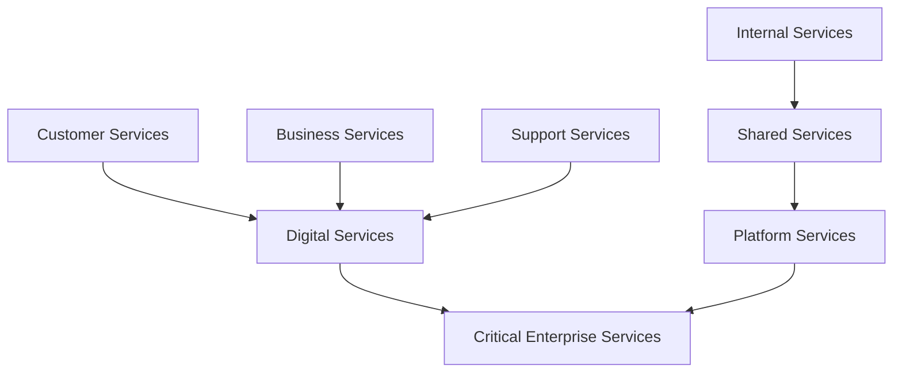
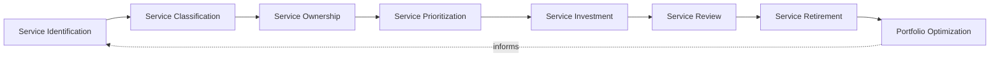
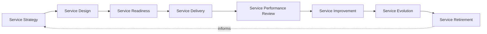
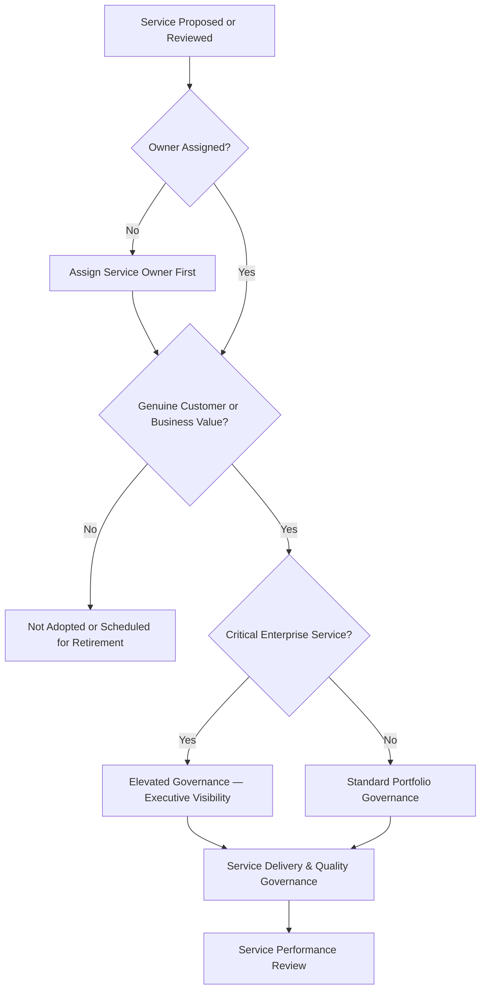
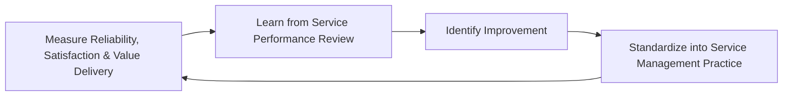
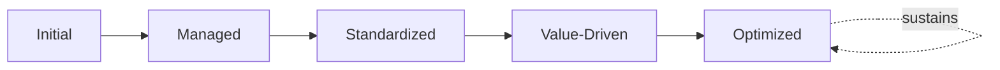

# Enterprise Service Management Framework

## 1. Executive Summary

**Purpose** — This document defines the official Enterprise Service Management Framework for **StackLeo Tech Store**. It establishes service governance, service portfolio management, service ownership, lifecycle governance, service quality, organizational accountability, executive oversight, continuous improvement, and long-term service management maturity as a single, consolidated governance reference. `service-management.md` remains the official Enterprise IT Service Management Strategy elaborating the full service lifecycle in operational depth; `service-catalog.md` defines the services themselves; and `service-level-governance.md` remains the COO/CCO/CIO-owned executive charter specifically for service quality, level commitment, and customer expectation. This framework does not compete with any of them for authority. It is the consolidated governance reference that synthesizes portfolio management, ownership, risk, and executive oversight across every service category into one coherent document.

**Scope** — This framework applies to every category of service at StackLeo — customer, business, digital, internal, shared, platform, support, and critical enterprise services — coordinated with `service-management.md`, `service-catalog.md`, `service-level-governance.md`, and `operations-strategy.md`.

**Strategic Objectives** — To ensure the platform is understood and governed as a defined portfolio of valuable services, never as undifferentiated running infrastructure; that every service traces to a genuinely accountable owner across its full lifecycle; that service investment is prioritized by genuine customer and business value; and that executive leadership has one coherent, consolidated view of the organization's service portfolio and quality posture.

**Business Value** — A consolidated service management framework protects the organization from the risk of portfolio gaps hiding in the seams between separately-maintained service documents, protects customer value delivery by ensuring every service genuinely earns its place in the portfolio, and gives executive leadership confidence that services are genuinely and coherently governed end to end.

**Intended Audience** — The Board of Directors, executive leadership, the Chief Technology Officer, operations leadership, service owners, engineering leadership, customer support leadership, quality leadership, and business stakeholders.

## 2. Enterprise Service Management Vision

- **Services as Business Capabilities** — every service is governed as a genuine business capability delivered to customers and the business, never as incidental running infrastructure.
- **Customer Value Creation** — a service is governed to exist because it genuinely creates value for the customer or business function it serves.
- **Reliable Digital Services** — every service is governed to be genuinely dependable for those who rely on it.
- **Business Continuity** — service management protects the organization's ability to keep delivering value through genuine disruption, coordinated with `business-continuity-governance.md`.
- **Operational Excellence** — service delivery is pursued as a durable discipline of genuine excellence, never merely adequate function.
- **Sustainable Service Delivery** — the service portfolio is governed to evolve deliberately alongside the business, never allowed to accumulate unmanaged sprawl.
- **Organizational Trust** — the service portfolio is the organization's continuous, demonstrable evidence that its commitments to customers are genuinely honored.

### Enterprise Service Management Vision Matrix

| Vision Element | Focus | Business Value |
|---|---|---|
| Services as Business Capabilities | A genuine business capability, not incidental infrastructure | Prevents services from being managed as undifferentiated technical output |
| Customer Value Creation | Existing because it genuinely creates value | Ensures the portfolio is spent on what genuinely matters |
| Reliable Digital Services | Genuinely dependable for those who rely on it | Protects confidence in the platform's daily operation |
| Business Continuity | Protects the ability to keep delivering value through disruption | Protects revenue and commitments tied to continuous service |
| Operational Excellence | A durable discipline of genuine excellence | Distinguishes StackLeo through consistently superior delivery |
| Sustainable Service Delivery | The portfolio evolving deliberately, never accumulating sprawl | Keeps the portfolio genuinely manageable as it grows |
| Organizational Trust | Continuous, demonstrable evidence commitments are honored | Converts service discipline into genuine competitive advantage |

## 3. Service Management Principles

Service management governance at StackLeo rests on nine principles, each producing a specific business outcome.

- **Customer-Centric Services** — a service's design and operation are judged first by genuine customer experience, not internal technical measures alone. *Business Value:* keeps the portfolio connected to what customers actually value.
- **Service Ownership** — every service traces to a specific, named, responsible owner. *Business Value:* ensures no service drifts without someone genuinely responsible for it.
- **Accountability** — every service decision traces to the accountable person who made it. *Business Value:* ensures service decisions can be genuinely defended, not merely assumed reasonable.
- **Business Alignment** — service priority is set by genuine business consequence, coordinated with `01_Business/business-model.md`. *Business Value:* ensures service investment is spent on what genuinely matters to the business.
- **Quality by Design** — service quality is considered from the outset of a service's design, never retrofitted after launch. *Business Value:* prevents the disproportionate cost of remediating quality after a service is already delivering.
- **Continuous Improvement** — service management practice matures over time, informed by real delivery and performance outcomes. *Business Value:* keeps service management aligned with the organization's growing scale and complexity.
- **Transparency** — service status, ownership, and performance are documented and visible to those who genuinely need them. *Business Value:* allows service posture to be scrutinized and defended, not merely trusted on faith.
- **Operational Excellence** — services are delivered to a standard of genuine excellence, not merely functional adequacy. *Business Value:* distinguishes service delivery as a genuine competitive advantage.
- **Value-Driven Decision Making** — every portfolio decision is weighed against the genuine value it delivers, never pursued by default or convenience. *Business Value:* protects the portfolio from accumulating services that no longer justify their cost.

### Service Management Principles Matrix

| Principle | Description | Business Value |
|---|---|---|
| Customer-Centric Services | Judged first by genuine customer experience | Keeps the portfolio connected to what customers actually value |
| Service Ownership | Every service traces to a specific, responsible owner | Ensures no service drifts without genuine responsibility |
| Accountability | Every decision traces to the accountable person | Ensures decisions can be genuinely defended |
| Business Alignment | Priority set by genuine business consequence | Ensures investment is spent on what genuinely matters |
| Quality by Design | Considered from the outset, never retrofitted | Prevents the disproportionate cost of after-launch remediation |
| Continuous Improvement | Practice matures from real delivery and performance outcomes | Keeps management aligned with growing scale and complexity |
| Transparency | Status, ownership, and performance documented and visible | Allows posture to be scrutinized and defended |
| Operational Excellence | Delivered to genuine excellence, not mere adequacy | Distinguishes delivery as a genuine competitive advantage |
| Value-Driven Decision Making | Every decision weighed against genuine value delivered | Protects the portfolio from accumulating unjustified services |

## 4. Enterprise Service Governance Model

Service governance operates across eight conceptual categories, each holding accountability for a distinct service type.

### Customer Services

- **Purpose** — govern services customers directly interact with and depend upon.
- **Governance Scope** — coordinated with `service-catalog.md` and Customer-Centric Services (Section 3).
- **Business Value** — protects the most direct point of customer encounter with StackLeo.
- **Executive Expectations** — leadership expects customer services to be held to elevated rigor given direct customer exposure.

### Business Services

- **Purpose** — govern services directly supporting business operation and revenue.
- **Governance Scope** — coordinated with `01_Business/business-model.md`.
- **Business Value** — protects the services the business's commercial operation directly depends on.
- **Executive Expectations** — leadership expects business service governance to reflect genuine commercial consequence.

### Digital Services

- **Purpose** — govern the digital channels through which StackLeo delivers value — web today, mobile and future channels.
- **Governance Scope** — coordinated with `service-level-governance.md`.
- **Business Value** — protects the platform's evolving digital footprint as a coherent, governed whole.
- **Executive Expectations** — leadership expects digital service governance to remain consistent as new channels emerge.

### Internal Services

- **Purpose** — govern services used internally by StackLeo employees to conduct business.
- **Governance Scope** — coordinated with `identity-access-governance.md` (Workforce Identity).
- **Business Value** — protects employees' ability to genuinely rely on internal capability.
- **Executive Expectations** — leadership expects internal services to be governed to the same standard as customer-facing services.

### Shared Services

- **Purpose** — govern capability shared and consumed across multiple other services.
- **Governance Scope** — coordinated with `07_DevOps/platform-engineering.md`.
- **Business Value** — ensures a shared service failure is never treated as a single team's isolated concern.
- **Executive Expectations** — leadership expects shared services to be governed with awareness of their broad dependency footprint.

### Platform Services

- **Purpose** — govern the underlying platform capability every other service category ultimately depends on.
- **Governance Scope** — coordinated with Platform Operations (`operations-strategy.md`, Section 4).
- **Business Value** — protects the foundation every other service category depends on.
- **Executive Expectations** — leadership expects platform services to be governed with consistent rigor regardless of scale.

### Support Services

- **Purpose** — govern the services through which customer and internal issues are genuinely resolved.
- **Governance Scope** — coordinated with Support Operations (`operations-strategy.md`, Section 4).
- **Business Value** — protects the customer's confidence that a genuine problem will be genuinely resolved.
- **Executive Expectations** — leadership expects support services to be measured by genuine resolution, not only response time.

### Critical Enterprise Services

- **Purpose** — govern the synthesized set of services whose failure would carry the most severe genuine business consequence.
- **Governance Scope** — oversight exclusively accountable for converging every category above into one coherent enterprise-critical view.
- **Business Value** — protects the services the business's continued operation most directly depends on.
- **Executive Expectations** — leadership expects critical enterprise services to be governed with the highest rigor in this model.

### Service Governance Matrix

| Domain | Purpose | Business Value | Executive Expectations |
|---|---|---|---|
| Customer Services | Govern services customers directly interact with | Protects the most direct point of customer encounter | Expects elevated rigor given direct customer exposure |
| Business Services | Govern services supporting operation and revenue | Protects services commercial operation depends on | Expects governance reflecting genuine commercial consequence |
| Digital Services | Govern digital delivery channels | Protects the evolving digital footprint as a coherent whole | Expects consistency as new channels emerge |
| Internal Services | Govern services used by employees | Protects employees' ability to genuinely rely on capability | Expects the same standard as customer-facing services |
| Shared Services | Govern capability shared across multiple services | Ensures failure is never one team's isolated concern | Expects awareness of broad dependency footprint |
| Platform Services | Govern the underlying platform capability | Protects the foundation every other category depends on | Expects consistent rigor regardless of scale |
| Support Services | Govern services resolving customer and internal issues | Protects confidence a genuine problem will be resolved | Expects measurement by genuine resolution |
| Critical Enterprise Services | Synthesize services of the most severe consequence | Protects services operation most directly depends on | Expects the highest rigor in this model |

*Diagram 1: Enterprise Service Management Framework — customer, business, and support services converge into digital services, while internal and shared services feed platform services, with digital and platform services resolving into critical enterprise services requiring the highest governance rigor.*

## 5. Service Portfolio Governance

Service portfolio governance operates across eight conceptual disciplines, remaining implementation independent throughout.

- **Service Identification** — governs how a genuine candidate service is recognized before it is formally added to the portfolio.
- **Service Classification** — governs how an identified service is assigned to the appropriate category in Section 4.
- **Service Ownership** — governs how a classified service is assigned a specific, named, accountable owner.
- **Service Prioritization** — governs how portfolio investment is prioritized by genuine customer and business value.
- **Service Investment** — governs how resources are deliberately allocated to a prioritized service.
- **Service Review** — governs the periodic, formal review of a service's continued genuine justification.
- **Service Retirement** — governs how a service no longer delivering genuine value is deliberately retired.
- **Portfolio Optimization** — governs how the overall portfolio composition is periodically assessed for genuine coherence and value.

### Service Portfolio Matrix

| Discipline | Governance Objective | Business Value |
|---|---|---|
| Service Identification | Recognize a genuine candidate before formal addition | Ensures portfolio growth is deliberately directed |
| Service Classification | Assign to the appropriate category | Ensures consistent treatment across the portfolio |
| Service Ownership | Assign a specific, named, accountable owner | Ensures no service drifts without genuine responsibility |
| Service Prioritization | Prioritize investment by genuine value | Directs limited investment toward what genuinely matters most |
| Service Investment | Deliberately allocate resources to prioritized services | Ensures resourcing reflects genuine portfolio priority |
| Service Review | Periodically review continued genuine justification | Prevents a service outliving the value that justified it |
| Service Retirement | Deliberately retire services no longer delivering value | Prevents accumulation of stale, unjustified services |
| Portfolio Optimization | Periodically assess overall coherence and value | Keeps the portfolio genuinely manageable as it grows |

*Diagram 2: Service Portfolio Governance Model — identification and classification inform ownership and prioritization, feeding investment and periodic review, with retirement and portfolio optimization feeding lessons back into the cycle.*

## 6. Service Lifecycle Governance

Service governance operates across eight conceptual lifecycle stages, coordinated with `service-management.md`.

- **Service Strategy** — govern how a service's genuine purpose and value proposition are defined before it is designed.
- **Service Design** — govern how a service is designed to genuinely deliver its defined value.
- **Service Readiness** — govern the organization's genuine preparedness to deliver a service before it launches.
- **Service Delivery** — govern the genuine, ongoing delivery of a service to its customers.
- **Service Performance Review** — govern the periodic, formal review of a service's performance for genuine insight.
- **Service Improvement** — govern how a genuine service gap is planned for deliberate remediation.
- **Service Evolution** — govern how a service's design evolves alongside genuine customer and business need.
- **Service Retirement** — govern how a service's obligations are formally closed out when it is genuinely retired.

### Service Lifecycle Matrix

| Stage | Governance Objective | Business Value |
|---|---|---|
| Service Strategy | Define genuine purpose and value before design | Ensures a service exists for a genuine, deliberate reason |
| Service Design | Design to genuinely deliver defined value | Prevents a service from launching without genuine value clarity |
| Service Readiness | Confirm genuine preparedness before launch | Prevents readiness gaps from being discovered in production |
| Service Delivery | Genuinely, ongoingly deliver to customers | Protects the commitments a service represents |
| Service Performance Review | Periodically review performance for genuine insight | Confirms delivery investment is genuinely working |
| Service Improvement | Plan deliberate remediation of a genuine gap | Ensures gaps are addressed deliberately, not left to accumulate |
| Service Evolution | Evolve design alongside genuine need | Keeps the service genuinely connected to customer and business intent |
| Service Retirement | Formally close out obligations when genuinely retired | Prevents a retired service from persisting as unmanaged risk |

*Diagram 3: Service Lifecycle Governance — strategy and design inform readiness and delivery, feeding performance review and improvement, with service evolution and retirement feeding lessons back into the cycle.*

## 7. Service Quality Governance

- **Service Reliability** — governs whether a service is genuinely dependable for those who rely on it, coordinated with `service-level-governance.md`.
- **Service Availability** — governs whether a service is genuinely accessible when its customers need it.
- **Customer Satisfaction** — governs whether a service genuinely meets the expectation of the customer it serves.
- **Business Value Delivery** — governs whether a service continues to genuinely deliver the value its strategy defined.
- **Quality Reviews** — governs the periodic, formal review of service quality across every domain in Section 4.
- **Performance Accountability** — governs every service quality outcome's traceability to the accountable owner.
- **Continuous Quality Improvement** — governs how service quality practice is deliberately strengthened based on real outcomes.

### Service Quality Matrix

| Quality Area | Focus | Governance Coordination |
|---|---|---|
| Service Reliability | Genuine dependability for those who rely on it | `service-level-governance.md` |
| Service Availability | Genuine accessibility when customers need it | `09_Operations/availability-management.md` |
| Customer Satisfaction | Genuinely meeting customer expectation | Customer-Centric Services (Section 3) |
| Business Value Delivery | Continuing to genuinely deliver defined value | Service Portfolio Governance (Section 5) |
| Quality Reviews | Periodic, formal review across every domain | Executive Oversight (Section 10) |
| Performance Accountability | Traceability to the accountable owner | Service Ownership (Section 5) |
| Continuous Quality Improvement | Practice strengthened from real outcomes | Continuous Improvement (Section 3) |

## 8. Organizational Governance

Governance accountability is distributed deliberately across nine organizational roles.

- **Board of Directors** — holds ultimate accountability for StackLeo's overall service portfolio posture.
- **Executive Leadership** — holds accountability for whether the service portfolio genuinely serves the business, in partnership with the Board.
- **Chief Technology Officer** — owns the coherence of this framework's synthesis across `service-management.md`, `service-catalog.md`, and `service-level-governance.md`.
- **Operations Leadership** — owns the operational governance defined in `service-management.md` and `operations-strategy.md`.
- **Service Owners** — own their assigned service's genuine value, quality, and continued justification.
- **Engineering Leadership** — own Digital, Shared, and Platform Services (Section 4) within their accountable teams.
- **Customer Support Leadership** — own Support Services (Section 4) and Customer Satisfaction (Section 7).
- **Quality Leadership** — own Service Quality Governance (Section 7) jointly with `08_Quality_Assurance/qa-governance.md`.
- **Business Stakeholders** — own Business Services (Section 4) alignment with genuine business priority.

### Organizational Responsibility Matrix

| Role | Governance Objective | Business Value |
|---|---|---|
| Board of Directors | Hold ultimate accountability for overall portfolio posture | Provides the highest point of ultimate accountability |
| Executive Leadership | Hold accountability for the portfolio serving the business | Provides a single point of executive-level accountability |
| Chief Technology Officer | Own coherence of this framework's synthesis | Connects the consolidated view to authoritative sources |
| Operations Leadership | Own operational governance and its family of strategies | Applies governance to day-to-day service practice |
| Service Owners | Own their assigned service's value, quality, justification | Ensures no service drifts without genuine responsibility |
| Engineering Leadership | Own digital, shared, and platform services | Embeds accountability closest to where services run |
| Customer Support Leadership | Own support services and customer satisfaction | Ensures accountability extends into genuine customer trust |
| Quality Leadership | Own service quality governance jointly with QA governance | Ensures quality and service practice remain coordinated |
| Business Stakeholders | Own business services alignment with priority | Connects services to genuine business relevance |

*Diagram 4: Service Ownership Structure — a service is checked for assigned ownership and genuine customer or business value, escalated to elevated executive-visible governance for critical enterprise services, resolving into ongoing delivery, quality governance, and performance review.*

## 9. Service Risk Governance

Service-related risk is governed across eight conceptual categories.

- **Service Availability Risks** — the risk that a genuinely important service becomes inaccessible to those who depend on it.
- **Customer Experience Risks** — the risk that a service fails to genuinely meet customer expectation.
- **Operational Risks** — the risk that the organization cannot adequately deliver, support, or recover a service.
- **Third-Party Risks** — the risk introduced through a service's dependency on a vendor or integration partner.
- **Business Continuity Risks** — the risk that a service failure escalates into a genuine threat to business continuity.
- **Compliance Risks** — the risk that a service fails to meet a genuine regulatory or contractual obligation.
- **Reputation Risks** — the risk that a service failure damages StackLeo's standing with customers, partners, or the market.
- **Strategic Risks** — the risk that the portfolio either over-invests in services without genuine justification, or under-invests and forfeits genuine competitive advantage.

### Service Risk Matrix

| Risk Category | Focus | Governance Coordination |
|---|---|---|
| Service Availability Risks | A genuinely important service becomes inaccessible | Coordinated with `availability-management.md` |
| Customer Experience Risks | A service failing to meet genuine expectation | Coordinated with Customer Satisfaction (Section 7) |
| Operational Risks | Inadequate ability to deliver, support, or recover | Coordinated with `operations-strategy.md` |
| Third-Party Risks | Risk from a vendor or integration partner | Coordinated with `06_Security/third-party-risk-governance.md` |
| Business Continuity Risks | A service failure escalating into a continuity threat | Coordinated with `business-continuity-governance.md` |
| Compliance Risks | Failure to meet regulatory or contractual obligation | Coordinated with `06_Security/compliance-governance.md` |
| Reputation Risks | Damage to standing with customers, partners, market | Coordinated with Executive Oversight (Section 10) |
| Strategic Risks | Over- or under-investment relative to genuine justification | Coordinated with Portfolio Optimization (Section 5) |

## 10. Executive Oversight

- **Service Portfolio Reviews** — the overall coherence of the service portfolio is formally reviewed on a regular cadence.
- **Service Performance Reviews** — service delivery performance is reviewed directly with executive leadership.
- **Business Value Reviews** — the genuine business value delivered by the portfolio is reviewed as a distinct, ongoing concern.
- **Customer Experience Reviews** — the genuine customer experience of the service portfolio is reviewed with executive leadership.
- **Strategic Service Reviews** — service investment priorities are reviewed directly with executive leadership against genuine business direction.
- **Continuous Improvement Reviews** — the organization's follow-through on captured service management lessons is reviewed directly with executive leadership.

### Executive Oversight Matrix

| Oversight Mechanism | Purpose | Governance Role |
|---|---|---|
| Service Portfolio Reviews | Confirm overall portfolio coherence | Regular, predictable cadence for the framework as a whole |
| Service Performance Reviews | Review service delivery performance | Direct executive-level performance review |
| Business Value Reviews | Review genuine business value delivered | Treats value delivery as ongoing, not assumed |
| Customer Experience Reviews | Review genuine customer experience of the portfolio | Direct executive-level customer experience review |
| Strategic Service Reviews | Review investment priorities against business direction | Direct executive-level strategic alignment review |
| Continuous Improvement Reviews | Review follow-through on captured lessons | Direct executive-level review of improvement completion |

## 11. Future Readiness

This framework is designed to remain valid as StackLeo evolves in scale, geography, and organizational complexity.

- **AI-Assisted Service Management** — as portfolio review and quality assessment increasingly incorporate AI-assisted methods, coordinated with `04_Database/ai-governance.md`, they remain governed under Service Review (Section 5) at the same rigor as any other method.
- **Intelligent Service Optimization** — where portfolio optimization increasingly draws on intelligent pattern analysis, that capability remains governed under Portfolio Optimization (Section 5) at the same rigor as any other method.
- **Predictive Service Governance** — where the organization develops the capability to anticipate a service quality issue before it fully materializes, that capability is governed as an extension of Service Performance Review (Section 6).
- **Autonomous Service Operations (Conceptual)** — where automation increasingly performs steps within service delivery or performance review, that automation remains subject to the same ownership and executive oversight as any human-performed activity.
- **Enterprise Service Scaling** — the governance model, domains, and lifecycle defined throughout this framework are defined independently of the number of services in the portfolio.
- **Digital Service Innovation** — this framework's governance discipline is treated as a direct, durable contributor to the digital trust customers, partners, and regulators extend to StackLeo.

## 12. Service Management Maturity Model

Service management governance maturity is described across five conceptual levels.

- **Initial** — service management, where it exists, is informal and inconsistent; services are delivered reactively, and ownership is unclear.
- **Managed** — basic service governance exists for individual categories, but consistency across the eight domains in Section 4 varies significantly.
- **Standardized** — the governance model, domains, and lifecycle are standardized, documented, and consistently applied across the organization.
- **Value-Driven** — portfolio decisions are genuinely and routinely made from evidenced customer and business value, not assumption.
- **Optimized** — service management governance is continuously and deliberately improved based on quantitative evidence and organizational learning; improvement itself is a managed, ongoing discipline.

### Service Maturity Matrix

| Level | Characteristics | Primary Focus |
|---|---|---|
| Initial | Informal, inconsistent management; services delivered reactively | Ad hoc, individually-dependent service practice |
| Managed | Basic governance exists per category; consistency varies | Category-level consistency |
| Standardized | Standardized governance model, domains, and lifecycle | Organization-wide consistency and clear ownership |
| Value-Driven | Decisions genuinely and routinely made from evidenced value | Evidence-based portfolio decision-making |
| Optimized | Practice continuously and deliberately improved from evidence | Sustained, deliberate improvement as a discipline |

*Diagram 5: Continuous Service Improvement Cycle — reliability, customer satisfaction, and value delivery are measured, learned from, improved upon, and standardized back into governed practice, on a continuing basis.*

*Diagram 6: Service Management Maturity Progression — maturity advances from informal, reactively-delivered service practice toward standardized, genuinely value-driven, and continuously optimized service management governance.*

## 13. Service Management Anti-Patterns

- **Services Without Ownership** — a service with no accountable owner has no one genuinely responsible for its value, quality, or continued justification.
- **Reactive Service Delivery** — addressing service quality only once a customer complaint has already occurred forfeits the chance to prevent it.
- **Poor Customer Focus** — evaluating a service purely by internal technical measures, without genuine customer experience awareness, misjudges its true value.
- **Weak Service Visibility** — leadership and stakeholders unable to genuinely see portfolio status cannot make informed investment decisions.
- **No Service Portfolio Governance** — services introduced without genuine portfolio review accumulate as ungoverned, unjustified sprawl.
- **Ignoring Service Improvement** — treating current service quality as permanently finished guarantees it falls behind genuine customer and business expectation.
- **Fragmented Service Management** — governing services independently by team, without genuine cross-domain coordination, prevents one coherent enterprise picture.
- **Lack of Strategic Alignment** — pursuing services disconnected from genuine business direction wastes portfolio investment on what does not genuinely matter.

### Anti-Pattern Summary

| Anti-Pattern | Organizational & Business Impact |
|---|---|
| Services Without Ownership | Leaves no one genuinely responsible for value, quality, or justification |
| Reactive Service Delivery | Forfeits the chance to prevent a customer complaint before it occurs |
| Poor Customer Focus | Misjudges a service's true value by internal measures alone |
| Weak Service Visibility | Prevents informed investment decisions about the portfolio |
| No Service Portfolio Governance | Accumulates as ungoverned, unjustified service sprawl |
| Ignoring Service Improvement | Guarantees quality falls behind genuine expectation |
| Fragmented Service Management | Prevents one coherent, organization-wide service picture |
| Lack of Strategic Alignment | Wastes portfolio investment on what does not genuinely matter |

## Related Documents

| Document | Relationship |
|---|---|
| `service-management.md` | The official Enterprise IT Service Management Strategy this framework consolidates a governance-level view of, without restating its lifecycle detail. |
| `service-catalog.md` | Defines the services themselves this framework's Service Portfolio Governance (Section 5) governs the accountability structure for. |
| `service-level-governance.md` | The COO/CCO/CIO-owned executive charter for service quality and level commitment this framework's Service Quality Governance (Section 7) coordinates with. |
| `operations-strategy.md` | Provides the enterprise operations context this framework's service categories elaborate as a specific instantiation. |
| `incident-management-framework.md` | Consumes this framework's Service Governance Model (Section 4) to classify Service Incidents by affected service category. |
| `business-continuity-governance.md` | Elaborates the continuity discipline this framework's Business Continuity vision (Section 2) connects to. |
| `business-continuity-framework.md` | Consolidates critical service, resilience, and crisis governance this framework's service portfolio prioritization coordinates with. |
| `disaster-recovery.md` | Elaborates the technical recovery capability this framework's Service Availability Risks (Section 9) depend on. |
| `disaster-recovery-framework.md` | Consolidates recovery prioritization this framework's Service Availability Risks (Section 9) depend on. |
| `monitoring-observability.md` | Elaborates the visibility practice this framework's Service Performance Review (Section 6) depends on. |
| `monitoring-observability-governance.md` | Consolidates monitoring and KPI governance this framework's Service Performance Review (Section 6) depends on. |
| `operational-excellence-framework.md` | Elaborates the excellence discipline this framework's Service Management Maturity Model (Section 12) extends into service-specific practice. |
| `operations-maturity-framework.md` | Consolidates this framework's Service Management Maturity Model (Section 12) into the enterprise-wide operations maturity picture. |
| `security-strategy.md` | Sets the enterprise-wide security strategic direction this framework's service categories coordinate with for protection. |

## Document Information

| Property | Value |
|----------|-------|
| Document | service-management-framework.md |
| Version | 1.0.0 |
| Status | Active |
| Maintained By | StackLeo |
| Last Updated | 2026-07-29 |

---

© StackLeo. All Rights Reserved.
