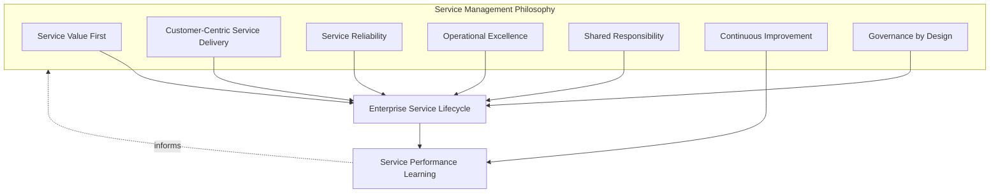
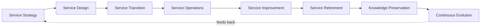
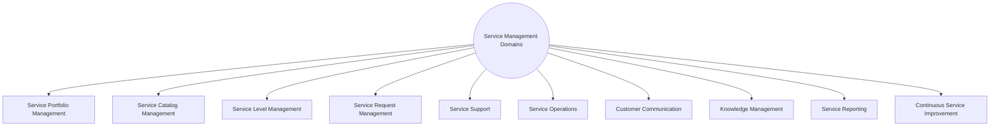
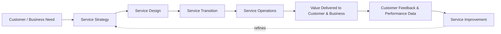
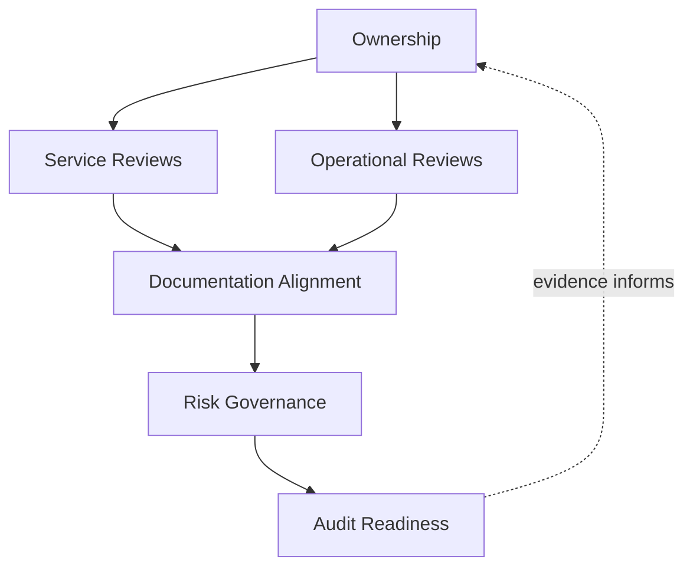
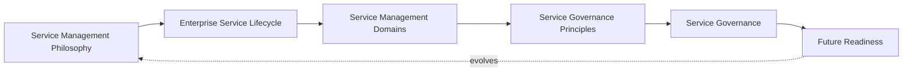
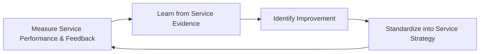
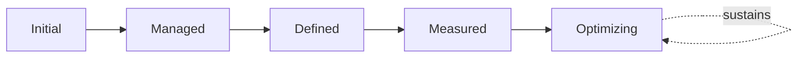

# Enterprise IT Service Management Strategy

## 1. Document Purpose

This document defines the official Enterprise IT Service Management (ITSM) Strategy for **StackLeo Tech Store**. It establishes service management philosophy, the service lifecycle, service management domains, and long-term ITSM maturity that apply across the entire platform — independent of any specific ITSM platform, service desk software, or ticketing system.

- **Purpose of Enterprise Service Management** — service management exists to ensure the platform is understood and operated as a set of defined, valuable services delivered to customers and the business, rather than as undifferentiated running infrastructure, elaborating Service Management as introduced in `operations-overview.md` (Section 5.1).
- **Relationship with Operations** — this document is the service-management-specific elaboration of `operations-overview.md`; where that document establishes the operating model and lifecycle for operations broadly, this document defines specifically how the platform's services are strategized, designed, transitioned, run, and improved.
- **Relationship with DevOps** — this document assumes the delivery and platform architecture of `07_DevOps`; service transition (Section 3.3) is the point at which delivered technical capability, per `07_DevOps/release-management.md`, becomes a service under this strategy's governance.
- **Relationship with Site Reliability Engineering (SRE)** — this strategy operates on top of the reliability objectives engineered in `07_DevOps/sre-strategy.md`; Service Level Management (Section 4.3) translates those engineering objectives into business-facing service commitments.
- **Relationship with Business Operations** — service management is not a separate discipline from business operations; the services defined and governed here are the concrete mechanism by which `01_Business/business-model.md` is delivered to customers and partners daily.
- **Relationship with Customer Experience** — every service defined in this strategy exists because a customer or business stakeholder depends on it; service quality (Section 5.5) is judged by genuine customer experience, not internal technical measures alone.
- **Relationship with Continuous Service Improvement** — this strategy treats improvement as a standing lifecycle stage (Section 3.5), not an occasional initiative, ensuring service management matures deliberately as StackLeo's business model and scale evolve.

This document is implementation-independent and vendor-neutral. It defines service management philosophy, lifecycle, domains, and governance — not specific ITSM platforms, service desk software, ticketing systems, monitoring tools, or infrastructure configuration.

## 2. Service Management Philosophy

Service management at StackLeo is governed by seven principles. Each exists to produce a specific business outcome — services are managed deliberately because of the value and trust they protect, not as administrative overhead.

### 2.1 Service Value First

Every service management decision is evaluated by the value it delivers to customers and the business, consistent with ITIL's value-co-creation thinking, rather than by technical elegance or internal convenience alone.

- **Business Value** — keeps service management effort anchored to genuine business outcome, preventing investment in service capability that does not translate into real customer or business benefit.

### 2.2 Customer-Centric Service Delivery

Services are designed and operated around genuine customer need and experience, consistent with Customer-Centric Operations in `operations-overview.md` (Section 2.3).

- **Business Value** — ensures service management decisions protect what customers actually experience, not only what is convenient to measure internally.

### 2.3 Service Reliability

Services are delivered with consistent, dependable performance, translating the engineered reliability of `07_DevOps/sre-strategy.md` into a lived, business-facing commitment.

- **Business Value** — reliability experienced consistently by customers is what the business is ultimately judged by, more than reliability engineered in principle alone.

### 2.4 Operational Excellence

Services are run with deliberate discipline and consistent practice, consistent with Operational Excellence in `operations-overview.md` (Section 2.1).

- **Business Value** — produces predictable service outcomes at scale, where informal or improvised operation eventually fails to keep pace with growth.

### 2.5 Shared Responsibility

Service management is owned jointly by Product, Engineering, Operations, Support, and Business stakeholders; no single function alone determines whether a service genuinely delivers value.

- **Business Value** — prevents the anti-pattern in Section 10.2, where service ownership is unclear and consequently weak.

### 2.6 Continuous Improvement

Service management practice matures over time, informed by real service performance, customer feedback, and evolving business scale.

- **Business Value** — keeps service management capability aligned with StackLeo's growth from single-market B2C retailer toward marketplace, corporate sales, and regional expansion.

### 2.7 Governance by Design

Service governance structures are established deliberately as services are designed, consistent with `operations-overview.md` (Section 8), not retrofitted once ownership gaps have already emerged.

- **Business Value** — prevents the costly rework of introducing governance after a service is already live and its gaps have already caused customer or business impact.

*Diagram 1: Service Management Philosophy Overview — the seven principles shape the enterprise service lifecycle, and service performance learning feeds back into the philosophy itself.*

## 3. Enterprise Service Lifecycle

The service lifecycle is governed across eight conceptual stages, spanning from initial strategy through retirement and continuous evolution.

### 3.1 Service Strategy

- **Purpose** — determine what services StackLeo should offer, to whom, and why, grounded in genuine business and customer need.
- **Business Value** — ensures service investment is deliberate and value-driven from the outset, consistent with Service Value First (Section 2.1).
- **Governance Objectives** — require every proposed service to state its intended customer, value, and business rationale before design begins.

### 3.2 Service Design

- **Purpose** — shape a service's scope, expected performance, and support model before it is built.
- **Business Value** — makes service quality a structural property considered from inception, not a later addition.
- **Governance Objectives** — require service design to be reviewed against Service Level Management expectations (Section 4.3) before proceeding to transition.

### 3.3 Service Transition

- **Purpose** — move a designed and built service into live operation, consistent with Production Readiness and Operational Readiness in `operations-overview.md` (Sections 4.2–4.3).
- **Business Value** — ensures a service becomes live only once it is genuinely ready to be operated and supported, not merely technically deployable.
- **Governance Objectives** — require confirmed operational readiness before a service is added to the live Service Catalog (Section 4.2).

### 3.4 Service Operations

- **Purpose** — sustain the service's health, availability, and value delivery while it is in active, ongoing use.
- **Business Value** — is the stage where all prior strategy, design, and transition effort actually translates into genuine customer and business outcome.
- **Governance Objectives** — ensure continuous service ownership and monitoring remain active for the service's entire operational life, consistent with `operations-overview.md` (Section 4.4).

### 3.5 Service Improvement

- **Purpose** — act on service performance data and customer feedback to make deliberate improvements to how a service is designed or run.
- **Business Value** — ensures service management translates observation into action, not merely reporting.
- **Governance Objectives** — require improvement actions to be documented and tracked to completion, connected to Continuous Service Improvement (Section 4.10).

### 3.6 Service Retirement

- **Purpose** — deliberately and safely withdraw a service that no longer delivers sufficient value, rather than allowing it to persist indefinitely by default.
- **Business Value** — frees operational and support capacity from sustaining services that no longer justify their cost, redirecting it toward services that do.
- **Governance Objectives** — require an explicit, accountable decision and customer transition plan before a service is retired, never an unannounced discontinuation.

### 3.7 Knowledge Preservation

- **Purpose** — capture and retain what was learned about a service throughout its lifecycle, including at and after retirement.
- **Business Value** — prevents institutional knowledge about how and why a service was built and operated from being lost when the service or its team changes.
- **Governance Objectives** — require documented knowledge capture at each major lifecycle transition, not only at initial design.

### 3.8 Continuous Evolution

- **Purpose** — sustain a standing discipline of evolving the overall service portfolio as business needs and market conditions change.
- **Business Value** — ensures the service portfolio as a whole remains aligned with genuine business strategy, not merely the accumulated sum of historical decisions.
- **Governance Objectives** — ensure the service portfolio is reviewed periodically against current business strategy, per Service Portfolio Management (Section 4.1).

### Enterprise Service Lifecycle Matrix

| Stage | Purpose | Business Value | Governance Objective |
|---|---|---|---|
| Service Strategy | Determine what services to offer, to whom, and why | Ensures investment is deliberate and value-driven | Every service states intended customer, value, and rationale |
| Service Design | Shape scope, performance, and support model pre-build | Makes quality a structural property from inception | Design reviewed against service level expectations |
| Service Transition | Move a designed service into live operation | Ensures a service goes live only when genuinely ready | Confirmed operational readiness required before catalog entry |
| Service Operations | Sustain health, availability, and value delivery live | Where prior effort translates into genuine outcome | Continuous ownership and monitoring sustained throughout |
| Service Improvement | Act on performance data and feedback to improve | Translates observation into deliberate action | Improvement actions documented and tracked to completion |
| Service Retirement | Deliberately and safely withdraw low-value services | Frees capacity for services that justify their cost | Explicit decision and transition plan required, never silent |
| Knowledge Preservation | Capture and retain lifecycle learning | Prevents institutional knowledge loss over time | Documented capture required at each major transition |
| Continuous Evolution | Evolve the overall service portfolio deliberately | Keeps the portfolio aligned with genuine business strategy | Portfolio reviewed periodically against current strategy |

*Diagram 2: Enterprise Service Lifecycle — a continuous cycle in which knowledge preservation and portfolio evolution directly inform the next iteration of service strategy.*

## 4. Service Management Domains

Service management spans ten conceptual domains, each corresponding to a distinct discipline within enterprise IT service management.

### 4.1 Service Portfolio Management

- **Purpose** — govern the complete set of services StackLeo offers or plans to offer, across their full lifecycle.
- **Scope** — all services regardless of lifecycle stage — strategized, live, or retired — consistent with Continuous Evolution (Section 3.8).
- **Governance Expectations** — the portfolio is reviewed periodically against business strategy, not allowed to grow by accumulation alone.
- **Business Importance** — ensures StackLeo's collective service investment remains a deliberate reflection of business priority.

### 4.2 Service Catalog Management

- **Purpose** — maintain a clear, current record of the services currently available to customers and the business.
- **Scope** — live services only, distinct from the full portfolio in Section 4.1, consistent with the Service Catalog introduced in `operations-overview.md` (Section 5.1).
- **Governance Expectations** — the catalog is kept current with actual live service reality, not allowed to drift into inaccuracy.
- **Business Importance** — gives operations, support, and customers a shared, accurate understanding of what is actually available.

### 4.3 Service Level Management

- **Purpose** — set, track, and report business-facing service level expectations for each service.
- **Scope** — availability, responsiveness, and support expectations, translating the engineering-level objectives in `07_DevOps/sre-strategy.md` into commitments the business and customers can understand.
- **Governance Expectations** — service levels are reviewed periodically against actual performance, with deviations addressed deliberately.
- **Business Importance** — gives the business a concrete, measurable basis for the reliability promise made to customers.

### 4.4 Service Request Management

- **Purpose** — govern how customers and internal stakeholders request standard, predefined service actions.
- **Scope** — routine, well-understood requests distinct from incidents (unplanned disruption) or problems (recurring root causes).
- **Governance Expectations** — request handling is consistent and predictable, not dependent on which individual happens to receive it.
- **Business Importance** — protects customer experience for the majority of everyday interactions, which are typically requests rather than incidents.

### 4.5 Service Support

- **Purpose** — provide timely, competent assistance to customers and stakeholders when they need help using or understanding a service.
- **Scope** — support interactions across all live services in the catalog, consistent with Support Operations in `operations-overview.md` (Section 3.6).
- **Governance Expectations** — support has sufficient visibility into service health and history to assist accurately, not merely sympathetically.
- **Business Importance** — protects customer trust at the exact moments it is most fragile — when something has gone wrong for that specific customer.

### 4.6 Service Operations

- **Purpose** — sustain each service's day-to-day health, availability, and correctness.
- **Scope** — the operational execution of Section 3.4, consistent with Live Operations in `operations-overview.md` (Section 4.4).
- **Governance Expectations** — every service has continuous, active operational ownership, never left unattended by default.
- **Business Importance** — is where the service's actual, lived reliability is determined day to day.

### 4.7 Customer Communication

- **Purpose** — keep customers and business stakeholders informed about service status, planned change, and disruption.
- **Scope** — proactive and reactive communication regarding service health and change, consistent with Operational Transparency (Section 5.3).
- **Governance Expectations** — communication is timely and honest, never delayed or minimized to avoid short-term discomfort.
- **Business Importance** — a well-communicated disruption preserves far more customer trust than a technically well-handled but poorly communicated one.

### 4.8 Knowledge Management

- **Purpose** — capture, organize, and make accessible the knowledge needed to design, operate, and support services effectively.
- **Scope** — service definitions, known issues, resolution history, and operational procedure knowledge across the service lifecycle.
- **Governance Expectations** — knowledge is actively maintained and accessible, not scattered across individual memory or informal channels.
- **Business Importance** — reduces dependence on any single individual's tenure or availability for effective service operation.

### 4.9 Service Reporting

- **Purpose** — communicate service performance and health to the stakeholders who depend on that information for decisions.
- **Scope** — service-level performance data, aligned with the measurement discipline in `08_Quality_Assurance/quality-metrics.md`.
- **Governance Expectations** — reporting reflects genuine underlying evidence and is produced on a predictable, regular cadence.
- **Business Importance** — gives leadership and business stakeholders an honest basis for informed decision-making about service investment.

### 4.10 Continuous Service Improvement

- **Purpose** — systematically identify and act on opportunities to improve service value, quality, and efficiency.
- **Scope** — cross-cutting; consolidates the improvement expectations from every other domain in this section.
- **Governance Expectations** — improvement is a standing, scheduled discipline, not an occasional initiative undertaken only after a visible failure.
- **Business Importance** — ensures service management value compounds over time rather than remaining static as the business and platform grow.

### Service Management Domain Matrix

| Domain | Purpose | Governance Expectations | Business Importance |
|---|---|---|---|
| Service Portfolio Management | Govern the complete set of services across their lifecycle | Reviewed periodically against business strategy | Ensures service investment reflects deliberate business priority |
| Service Catalog Management | Maintain a clear, current record of live services | Kept current with actual live service reality | Shared, accurate understanding of what is available |
| Service Level Management | Set, track, and report business-facing service levels | Reviewed periodically against actual performance | Concrete, measurable basis for the reliability promise |
| Service Request Management | Govern standard, predefined service actions | Handling is consistent and predictable | Protects experience for the majority of everyday interactions |
| Service Support | Provide timely, competent assistance | Sufficient visibility to assist accurately | Protects trust at the customer's most fragile moment |
| Service Operations | Sustain day-to-day service health and correctness | Continuous, active ownership, never unattended | Determines actual, lived reliability day to day |
| Customer Communication | Keep stakeholders informed of status and change | Timely and honest, never delayed or minimized | Preserves trust through well-communicated disruption |
| Knowledge Management | Capture and organize service-related knowledge | Actively maintained and accessible | Reduces dependence on individual memory or tenure |
| Service Reporting | Communicate performance to dependent stakeholders | Reflects genuine evidence, regular cadence | Honest basis for service investment decisions |
| Continuous Service Improvement | Systematically identify and act on improvement | A standing, scheduled discipline | Ensures service value compounds over time |

*Diagram 3 (Part A): Service Management Domain Map — ten domains, each governing a distinct discipline, together forming complete service management coverage.*

*Diagram 3 (Part B): Service Value Delivery Model — value flows from genuine need through strategy, design, transition, and operation to the customer, with feedback continuously refining future strategy.*

## 5. Service Governance Principles

- **Service Ownership** — every service in the portfolio (Section 4.1) has a single, named accountable owner, never left to diffuse, shared-by-default responsibility.
- **Value Delivery** — governance exists to confirm services genuinely deliver value, consistent with Service Value First (Section 2.1), not merely that they technically function.
- **Operational Transparency** — service posture, performance, and significant decisions are visible to stakeholders who depend on them, not held privately within any single function.
- **Accountability** — every service governance decision traces to a specific, named accountable role, never left ambiguous.
- **Service Quality** — service quality is judged by genuine customer experience and business outcome, consistent with `08_Quality_Assurance/quality-strategy.md`, not solely by internal technical measures.
- **Evidence-Based Decisions** — service governance decisions are grounded in observed service performance data, consistent with `08_Quality_Assurance/quality-metrics.md`, rather than assumption or anecdote.
- **Auditability** — service governance decisions and their outcomes can be reviewed after the fact, supporting accountability and continuous improvement.
- **Continuous Improvement** — service governance itself matures over time, informed by what is learned from real service performance and organizational experience.

### Service Governance Principle Matrix

| Principle | Description | Business Value |
|---|---|---|
| Service Ownership | Every service has a single, named accountable owner | Prevents diffuse responsibility from becoming no responsibility |
| Value Delivery | Confirm services genuinely deliver value, not just function | Keeps governance anchored to genuine business outcome |
| Operational Transparency | Keep posture and decisions visible to dependent stakeholders | Builds cross-functional confidence and informed decisions |
| Accountability | Trace every governance decision to a named accountable role | Prevents gaps from persisting due to unclear responsibility |
| Service Quality | Judge quality by genuine customer experience and outcome | Keeps quality effort anchored to real customer value |
| Evidence-Based Decisions | Ground decisions in observed service performance data | Improves accuracy and defensibility of governance decisions |
| Auditability | Ensure decisions and outcomes are reviewable after the fact | Supports accountability and confidence for partners and regulators |
| Continuous Improvement | Mature governance from real service performance experience | Keeps governance aligned with organizational and platform growth |

## 6. Service Governance

### 6.1 Ownership

Every service management domain (Section 4) has a single accountable owner; overall service management governance is owned jointly by Operations and Product leadership, consistent with Shared Responsibility (Section 2.5).

### 6.2 Service Reviews

Individual services are formally reviewed against their service level expectations (Section 4.3) on a recurring basis, ensuring service quality confirmation is a deliberate governance act, not an informal assumption.

### 6.3 Operational Reviews

Service operations performance is reviewed jointly with Operational Review in `operations-overview.md` (Section 4.6), ensuring service-level and platform-level review remain connected rather than conducted in isolation.

### 6.4 Documentation Alignment

Service management documentation is kept consistent with `operations-overview.md`, `07_DevOps/sre-strategy.md`, and `08_Quality_Assurance/quality-strategy.md`; a service claim that contradicts current operational or quality documentation is treated as a governance gap.

### 6.5 Risk Governance

Service-related risk — unclear ownership, deteriorating service levels, unmanaged knowledge gaps — is tracked, prioritized, and escalated consistently, ensuring accepted risk is always a deliberate, accountable decision.

### 6.6 Audit Readiness

Service definitions, service level performance, and governance review outcomes are retained in a form that can be independently reviewed after the fact, supporting internal governance and partner or regulatory review where relevant.

### Service Governance Matrix

| Governance Area | Objective |
|---|---|
| Ownership | Every service management domain has one accountable owner |
| Service Reviews | Service quality confirmation is a deliberate, recurring governance act |
| Operational Reviews | Service-level and platform-level review remain connected |
| Documentation Alignment | Service documentation stays consistent with operations and quality strategy |
| Risk Governance | Accepted service risk is always a deliberate, accountable decision |
| Audit Readiness | Service definitions and performance retained for independent review |

*Diagram 4 (Part A): Service Management Governance Framework — ownership anchors review activity, which feeds documentation alignment, risk governance, and ultimately audit-ready evidence.*

*Diagram 4 (Part B): Enterprise Service Operating Model — how philosophy, lifecycle, domains, governance principles, and governance operate together as a single, self-reinforcing system that continues to evolve as the platform grows.*

## 7. Future Readiness

This strategy is designed to remain valid as StackLeo evolves in scale and organizational complexity, without requiring redefinition of its underlying philosophy.

- **Cloud-Native Platforms** — service management domains (Section 4) are defined independently of any specific runtime or deployment model, so they apply unchanged as infrastructure evolves.
- **AI-Enabled Services** — as AI-assisted capability is introduced as a customer-facing service (e.g., recommendations, conversational assistance), it is governed under the same Service Portfolio and Service Level Management disciplines (Sections 4.1, 4.3) as any other service.
- **Marketplace Platform** — the multi-vendor marketplace model extends Service Catalog and Service Level Management (Sections 4.2–4.3) to cover seller-facing services, applying the same governance rigor used for StackLeo's own services today.
- **Multi-Tenant Architecture** — where future architecture introduces tenant isolation, Service Level Management and Service Support (Sections 4.3, 4.5) extend to explicitly cover per-tenant service commitments.
- **Continuous Delivery** — as delivery cadence accelerates per `07_DevOps/ci-cd-strategy.md`, Service Transition (Section 3.3) becomes lighter-weight and more frequent per change, without reducing readiness rigor.
- **Global Service Operations** — as StackLeo expands from Bangladesh into South Asia and beyond, the service lifecycle and domains (Sections 3–4) extend to coordinate services across geographies without requiring a new governance model.
- **Multi-Region Services** — Service Catalog and Service Level Management (Sections 4.2–4.3) extend to cover region-specific service definitions and commitments as infrastructure becomes multi-region.
- **Enterprise Scale** — the service lifecycle, domains, and governance defined in Sections 3–6 are defined independently of team size or organizational structure, so they remain coherent as service management scales well beyond its current footprint.

## 8. Governance

- **Ownership** — the Operations lead (or equivalent COO-accountable function) owns this strategy and is accountable for its consistent application across the platform, in partnership with Product and Engineering leadership, consistent with `operations-overview.md` (Section 8).
- **Review Process** — this strategy is formally reviewed whenever a material change occurs in business model (`01_Business/business-model.md`), the service portfolio (Section 4.1), or delivery practice (`07_DevOps`), and on a regular recurring cadence independent of specific change events.
- **Service Management Policies** — subordinate, practice-specific service documents (service catalog entries, service level definitions, and further documents within `09_Operations`) must remain consistent with the philosophy, lifecycle, and domains defined here.
- **Audit Readiness** — this strategy and the evidence it requires (Section 6.6) are maintained in a state ready for internal or external audit at any time, without requiring advance preparation.
- **Continuous Improvement** — this strategy itself is subject to Continuous Improvement (Section 2.6, Section 3.5); its effectiveness is periodically assessed and revised based on genuine service performance and organizational evidence.

### Governance Responsibility Matrix

| Role | Responsibility |
|---|---|
| COO / Operations Lead | Owns coherence and enforcement of this service management strategy, in partnership with Product and Engineering leadership. |
| Service Owners | Own individual services within the portfolio and catalog (Sections 4.1–4.2) and their defined service levels. |
| SRE Lead | Ensures Service Level Management (Section 4.3) remains consistent with `07_DevOps/sre-strategy.md`. |
| Support Lead | Owns Service Support and Service Request Management (Sections 4.4–4.5). |
| Product Manager | Owns Service Strategy input (Section 3.1), ensuring services reflect genuine business and customer need. |
| Communications Lead | Owns Customer Communication (Section 4.7) practice and standards. |
| QA Leadership | Ensures Service Quality (Section 5.5) reflects `08_Quality_Assurance/quality-strategy.md`. |
| Internal Audit / Review Function | Independently verifies that service governance records reflect actual practice. |

*Diagram 5: Continuous Service Improvement Cycle — service performance is measured, learned from, improved upon, and standardized back into this strategy, on a continuing basis.*

## 9. ITSM Maturity Model

ITSM maturity is described across five conceptual levels, adapted from established process maturity thinking. Progression reflects increasing consistency, measurement, and deliberate improvement — not merely increasing activity volume.

- **Initial** — services are operated informally, dependent on individual effort; service definitions, if they exist, are inconsistent, and outcomes vary unpredictably across services.
- **Managed** — basic service management practice exists and is followed for individual services, but consistency across the full portfolio has not yet been achieved.
- **Defined** — service management processes are standardized, documented, and consistently applied across the entire portfolio, consistent with the lifecycle and domains defined throughout this document; service ownership is clear organization-wide.
- **Measured** — service performance is measured systematically against defined service levels, and decisions are grounded in genuine performance data rather than qualitative impression alone.
- **Optimizing** — service management practice is continuously and deliberately improved based on quantitative evidence and organizational learning; improvement itself is a managed, ongoing discipline rather than an occasional initiative.

### ITSM Maturity Model Matrix

| Level | Characteristics | Primary Focus |
|---|---|---|
| Initial | Informal operation dependent on individual effort; inconsistent definitions | Ad hoc service delivery |
| Managed | Basic practice exists and is followed per individual service | Service-level consistency |
| Defined | Standardized, documented processes applied across the portfolio | Organization-wide consistency and clear ownership |
| Measured | Performance measured systematically against defined service levels | Evidence-based service decisions |
| Optimizing | Practice continuously and deliberately improved from evidence | Sustained, deliberate improvement as a discipline |

*Diagram 6: ITSM Maturity Progression Model — maturity advances from individually-dependent service delivery toward standardized, measured, and continuously optimized service management practice.*

## 10. Anti-Patterns

The following recurring failure patterns are explicitly recognized and avoided, as each one structurally undermines this strategy.

| Anti-Pattern | Why It's Avoided |
|---|---|
| Technology Before Service Value | Contradicts Service Value First (Section 2.1); building technical capability before confirming genuine service value risks investment that does not translate into real customer or business benefit. |
| Unclear Service Ownership | Contradicts Service Ownership (Section 5.1); without a named accountable owner, a service's quality and evolution become nobody's specific priority. |
| Weak Customer Communication | Undermines Customer Communication (Section 4.7); poorly communicated disruption erodes far more trust than the disruption itself. |
| Reactive Service Operations | Contradicts Operational Excellence (Section 2.4); waiting for problems to surface before acting concentrates cost and risk instead of distributing it through proactive practice. |
| Poor Knowledge Management | Undermines Knowledge Management (Section 4.8); without actively maintained knowledge, service operation depends fragilely on individual memory and tenure. |
| Weak Governance | Undermines Section 6; without clear ownership and review, service management drifts into inconsistency as the portfolio and organization grow. |
| Poor Documentation | Undermines Documentation Alignment (Section 6.4), leaving service definitions and evidence unclear or unverifiable after the fact. |
| Missing Continuous Improvement | Contradicts Continuous Improvement (Section 2.6) and Continuous Service Improvement (Section 4.10); without deliberate improvement, service management value stagnates as the business and platform grow in complexity. |

## 11. Document Information

| Property | Value |
|----------|-------|
| Document | service-management.md |
| Version | 1.0.0 |
| Status | Active |
| Maintained By | StackLeo |
| Last Updated | 2026-07-24 |

---

© StackLeo. All Rights Reserved.
