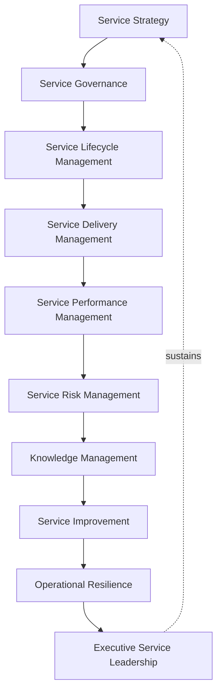
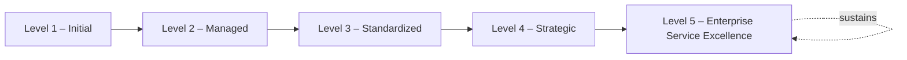
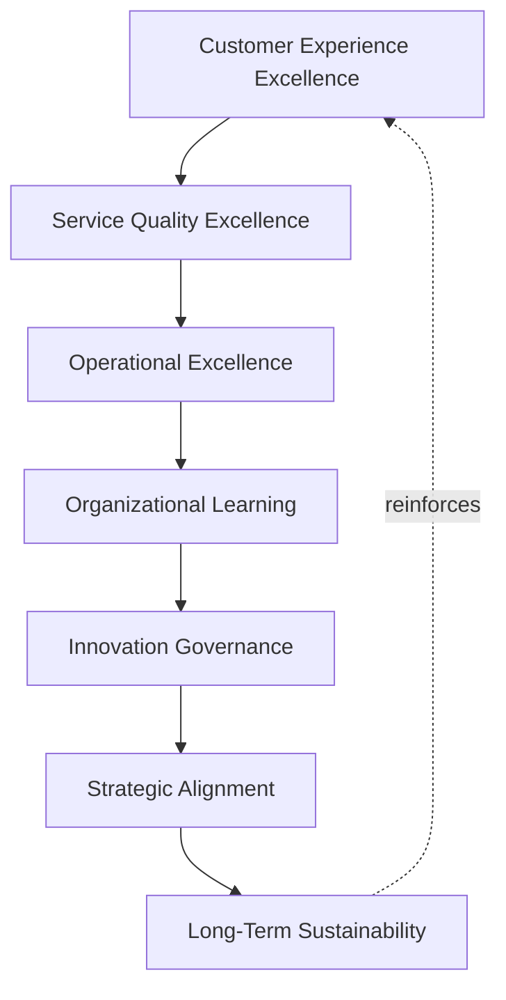

# Enterprise Service Management Maturity Framework

## 1. Executive Summary

**Purpose** — This document defines the official Enterprise Service Management Maturity Framework for **StackLeo Tech Store**. It establishes service management capability evolution, governance maturity, service delivery excellence, operational resilience, executive oversight, continual improvement, and long-term service management sustainability as a deliberate, accountable enterprise discipline. `09_Operations/service-lifecycle-framework.md`, `09_Operations/incident-problem-governance.md`, and `09_Operations/service-risk-governance.md` each anticipated this framework directly as the dedicated, consolidated maturity treatment of their respective domains. This framework does not restate any of them. It is the capstone of the service governance family — the single, enterprise-wide picture of how genuinely mature StackLeo's overall service management capability is, synthesized from every domain those frameworks each govern individually.

**Scope** — This framework applies to the full breadth of StackLeo's service management capability — strategy, governance, lifecycle management, delivery management, performance management, risk management, knowledge management, service improvement, operational resilience, and executive service leadership — coordinated with every document in the `09_Operations` service governance family and with `00_Project_Overview/project-maturity-framework.md` as its organizational-project-level counterpart.

**Strategic Objectives** — To ensure StackLeo genuinely understands how mature its service management capability is, never assumed from confidence alone; that maturity is measured consistently across every capability domain, never assessed unevenly; that the path from current maturity to genuine service excellence is deliberately planned, never left to chance; and that executive leadership has one coherent, honest picture of overall service management maturity.

**Business Value** — A governed service maturity framework protects StackLeo from the disproportionate cost of service management capability that quietly stagnates, protects the organization from assessing its own capability inconsistently across domains, and gives leadership the confidence to make ambitious service investment decisions because the organization's underlying capability is demonstrably understood.

**Intended Audience** — The Board of Directors, executive leadership, the Chief Operating Officer, the Chief Technology Officer, the Service Governance Board, operations leadership, engineering leadership, security leadership, customer success leadership, and business stakeholders.

## 2. Enterprise Service Management Maturity Vision

- **Service Management as Strategic Capability** — service management is governed as a genuine, strategic organizational capability, never merely an operational function.
- **Predictable Service Excellence** — service excellence is pursued as a genuinely predictable outcome of disciplined governance, never a matter of chance.
- **Customer-Centric Operations** — the organization's operational capability is governed to remain genuinely centered on customer benefit.
- **Operational Resilience** — how StackLeo withstands and recovers from disruption is governed to be genuinely, deliberately mature.
- **Business Value Realization** — service management maturity is governed to genuinely realize the business value service investment is intended to produce.
- **Executive Decision Confidence** — a mature service management capability gives executive leadership genuine confidence in the decisions built upon it.
- **Continuous Organizational Learning** — service management maturity is governed to continuously deepen through genuine organizational learning.

### Enterprise Service Management Maturity Vision Matrix

| Vision Element | Focus | Business Value |
|---|---|---|
| Service Management as Strategic Capability | A genuine strategic capability, not an operational function | Elevates service management to genuine enterprise priority |
| Predictable Service Excellence | A genuinely predictable outcome of disciplined governance | Builds organizational confidence in service delivery |
| Customer-Centric Operations | Operational capability remaining genuinely customer-centered | Keeps operations connected to genuine customer benefit |
| Operational Resilience | Genuinely, deliberately mature withstanding and recovery | Protects continuity of value even when disruption occurs |
| Business Value Realization | Genuinely realizing the value investment is intended to produce | Directs maturity investment toward what genuinely matters |
| Executive Decision Confidence | Genuine confidence in decisions built upon capability | Protects the credibility of service-related executive decisions |
| Continuous Organizational Learning | Maturity continuously deepening through genuine learning | Keeps capability aligned with growing scale and complexity |

## 3. Service Management Maturity Principles

Service management maturity at StackLeo rests on nine principles, each producing a specific business outcome.

- **Customer Value First** — maturity is ultimately judged by the genuine customer value the organization's service capability produces. *Business Value:* keeps maturity assessment connected to genuine customer benefit, not internal process alone.
- **Governance First** — genuine governance discipline is treated as a prerequisite for service management maturity, not an afterthought. *Business Value:* protects the credibility of every capability built upon it.
- **Strategic Alignment** — service management maturity remains genuinely connected to business strategy. *Business Value:* ensures maturity investment reflects genuine business priority.
- **Operational Excellence** — mature service management genuinely sustains excellent, dependable operation, never treats it as incidental. *Business Value:* protects the trust every operating service represents.
- **Accountability** — maturity ownership is genuinely clear across every capability domain. *Business Value:* prevents maturity gaps from being deprioritized for lack of an owner.
- **Risk-Aware Decisions** — a service management decision at any maturity level genuinely accounts for known risk. *Business Value:* protects against decisions made in avoidable ignorance of exposure.
- **Continuous Improvement** — service management maturity practice matures over time, informed by real outcomes. *Business Value:* keeps capability aligned with the organization's growing scale and complexity.
- **Cross-Functional Collaboration** — genuine service management maturity depends on collaboration across functions, never one function alone. *Business Value:* prevents maturity gaps hidden by siloed success in a single function.
- **Organizational Learning** — understanding gained from service management practice genuinely deepens future capability. *Business Value:* compounds the value of the organization's accumulated operational experience.

### Enterprise Service Capability Matrix

| Principle | Description | Business Value |
|---|---|---|
| Customer Value First | Maturity judged by genuine customer value produced | Keeps assessment connected to genuine customer benefit |
| Governance First | Genuine governance treated as a maturity prerequisite | Protects the credibility of capability built upon it |
| Strategic Alignment | Maturity remaining genuinely connected to business strategy | Ensures investment reflects genuine business priority |
| Operational Excellence | Genuinely sustaining excellent, dependable operation | Protects the trust every operating service represents |
| Accountability | Maturity ownership genuinely clear across domains | Prevents gaps deprioritized for lack of an owner |
| Risk-Aware Decisions | Decisions genuinely accounting for known risk | Protects against decisions made in avoidable ignorance |
| Continuous Improvement | Practice matures from real outcomes | Keeps capability aligned with growing scale and complexity |
| Cross-Functional Collaboration | Depends on collaboration across functions | Prevents gaps hidden by siloed single-function success |
| Organizational Learning | Understanding genuinely deepening future capability | Compounds the value of accumulated operational experience |

## 4. Enterprise Service Management Capability Domains

Service management maturity is governed across ten conceptual capability domains, each synthesizing maturity from its corresponding sibling framework.

### Service Strategy

- **Purpose** — govern the maturity of how deliberately StackLeo's overall service strategy is set and sustained.
- **Maturity Expectations** — coordinated with Service Strategy (`09_Operations/service-lifecycle-framework.md`, Section 4).
- **Business Value** — protects the coherence of every downstream service decision.
- **Executive Expectations** — leadership expects service strategy maturity to be reviewed at the same rigor as business strategy.

### Service Governance

- **Purpose** — govern the maturity of the organization's overall service governance model.
- **Maturity Expectations** — coordinated with `09_Operations/service-management-framework.md`.
- **Business Value** — protects the coherence of accountability across every service domain.
- **Executive Expectations** — leadership expects governance maturity to be assessed as a distinct, foundational concern.

### Service Lifecycle Management

- **Purpose** — govern the maturity of how consistently the stage-gate discipline is applied.
- **Maturity Expectations** — coordinated with `09_Operations/service-lifecycle-framework.md`.
- **Business Value** — protects the discipline every service's evolution ultimately depends on.
- **Executive Expectations** — leadership expects lifecycle maturity to be evidenced by gate compliance, not assumed.

### Service Delivery Management

- **Purpose** — govern the maturity of how genuinely, reliably services are delivered day to day.
- **Maturity Expectations** — coordinated with Service Operations (`09_Operations/service-lifecycle-framework.md`, Section 4).
- **Business Value** — protects the commitments every live service represents to its customers.
- **Executive Expectations** — leadership expects delivery maturity to be evidenced by consistent performance.

### Service Performance Management

- **Purpose** — govern the maturity of how genuinely service performance is measured and reviewed.
- **Maturity Expectations** — coordinated with `09_Operations/service-level-governance.md`.
- **Business Value** — protects the credibility of the commitments StackLeo makes to its customers.
- **Executive Expectations** — leadership expects performance maturity to be evidenced by genuine outcome data.

### Service Risk Management

- **Purpose** — govern the maturity of how deliberately service-related risk is identified and owned.
- **Maturity Expectations** — coordinated with `09_Operations/service-risk-governance.md`.
- **Business Value** — protects the organization from risk maturity gaps going unnoticed.
- **Executive Expectations** — leadership expects risk management maturity to be reviewed with elevated scrutiny.

### Knowledge Management

- **Purpose** — govern the maturity of how genuinely service-related knowledge is captured, retained, and reused.
- **Maturity Expectations** — coordinated with `09_Operations/knowledge-management-framework.md`.
- **Business Value** — protects the organization's accumulated operational understanding.
- **Executive Expectations** — leadership expects knowledge maturity to be evidenced by genuine reuse, not just capture.

### Service Improvement

- **Purpose** — govern the maturity of how deliberately service capability is continually improved.
- **Maturity Expectations** — coordinated with Continual Service Improvement Lifecycle (Section 7).
- **Business Value** — protects the organization's services from quietly stagnating over time.
- **Executive Expectations** — leadership expects improvement maturity to be evidenced by measured outcomes.

### Operational Resilience

- **Purpose** — govern the maturity of how genuinely the organization withstands and recovers from disruption, coordinated with `09_Operations/incident-problem-governance.md` and `09_Operations/business-continuity-framework.md`.
- **Maturity Expectations** — oversight ensuring resilience maturity meets the rigor those frameworks require.
- **Business Value** — protects continuity of value even when disruption occurs.
- **Executive Expectations** — leadership expects resilience maturity to be evidenced, not assumed from confidence.

### Executive Service Leadership

- **Purpose** — govern the maturity of how deliberately executive leadership engages with service management as a discipline.
- **Maturity Expectations** — coordinated with Executive Oversight (Section 10).
- **Business Value** — protects the organization's overall service management maturity from the top down.
- **Executive Expectations** — leadership expects its own engagement to be held to the same maturity standard it expects of the organization.

### Service Management Domain Maturity Matrix

| Domain | Purpose | Business Value | Executive Expectations |
|---|---|---|---|
| Service Strategy | Govern maturity of how strategy is set and sustained | Protects the coherence of every downstream decision | Expects review at the rigor of business strategy |
| Service Governance | Govern maturity of the overall governance model | Protects coherence of accountability across domains | Expects assessment as a distinct, foundational concern |
| Service Lifecycle Management | Govern maturity of stage-gate discipline consistency | Protects the discipline evolution depends on | Expects maturity evidenced by gate compliance |
| Service Delivery Management | Govern maturity of reliable, day-to-day delivery | Protects the commitments live services represent | Expects delivery maturity evidenced by consistent performance |
| Service Performance Management | Govern maturity of performance measurement and review | Protects the credibility of customer commitments | Expects maturity evidenced by genuine outcome data |
| Service Risk Management | Govern maturity of deliberate risk identification | Protects against risk maturity gaps going unnoticed | Expects review with elevated scrutiny |
| Knowledge Management | Govern maturity of knowledge capture and reuse | Protects accumulated operational understanding | Expects maturity evidenced by genuine reuse |
| Service Improvement | Govern maturity of continual capability improvement | Protects services from quietly stagnating | Expects improvement maturity evidenced by measured outcomes |
| Operational Resilience | Govern maturity of withstanding and recovering from disruption | Protects continuity of value through disruption | Expects resilience maturity evidenced, not assumed |
| Executive Service Leadership | Govern maturity of executive engagement with service | Protects overall maturity from the top down | Expects its own engagement held to the same standard |

*Diagram 1: Enterprise Service Management Maturity Framework — the ten capability domains connect from service strategy and governance through lifecycle, delivery, and performance management, into risk, knowledge, improvement, and resilience, sustained by executive service leadership feeding back into strategy.*

## 5. Enterprise Service Management Maturity Model

### Level 1 – Initial

Service management capability, where it exists, is informal and inconsistent. Services are delivered reactively rather than through deliberate governance. Ownership across the ten domains in Section 4 is unclear, and outcomes depend heavily on individual initiative rather than organizational discipline.

### Level 2 – Managed

Basic service management practice exists for individual domains, but consistency across the ten domains in Section 4 varies significantly. Some governance exists, but it is not yet standardized or consistently applied across the organization.

### Level 3 – Standardized

The governance model, capability domains, and assessment framework are standardized, documented, and consistently applied across the organization. Service decisions follow a genuinely repeatable, evidenced discipline regardless of which team or individual is involved.

### Level 4 – Strategic

Service management decisions are genuinely and routinely made in deliberate service of business strategy, not delivery convenience or individual preference. Maturity across domains is actively monitored, and gaps are deliberately closed rather than tolerated.

### Level 5 – Enterprise Service Excellence

Service management maturity is continuously and deliberately improved based on quantitative evidence and organizational learning. Service management capability functions as a genuine, sustained source of enterprise competitive advantage, and the organization's service commitments are trusted precisely because the discipline behind them is demonstrably mature.

### Service Management Maturity Matrix

| Level | Characteristics | Primary Focus |
|---|---|---|
| Level 1 – Initial | Informal, inconsistent; services delivered reactively | Ad hoc, individually-dependent service practice |
| Level 2 – Managed | Basic practice exists per domain; consistency varies | Domain-level consistency |
| Level 3 – Standardized | Standardized governance model, domains, and assessment | Organization-wide consistency and repeatable discipline |
| Level 4 – Strategic | Decisions genuinely and routinely made in service of strategy | Business-strategy-driven service decision-making |
| Level 5 – Enterprise Service Excellence | Practice continuously improved; capability as competitive advantage | Sustained, deliberate, enterprise-wide service excellence |

*Diagram 6: Service Management Maturity Progression — maturity advances from informal, individually-dependent service practice toward standardized, genuinely strategy-driven, and continuously excellent enterprise service management.*

## 6. Service Capability Assessment Framework

- **Service Strategy Assessment** — governs how genuinely the organization's service strategy maturity is assessed.
- **Governance Assessment** — governs how genuinely the organization's service governance maturity is assessed.
- **Service Lifecycle Assessment** — governs how genuinely stage-gate discipline consistency is assessed.
- **Service Performance Assessment** — governs how genuinely service performance maturity is assessed.
- **Risk Assessment** — governs how genuinely service risk management maturity is assessed.
- **Knowledge Assessment** — governs how genuinely knowledge management maturity is assessed.
- **Executive Review** — governs how assessment findings are deliberately brought to executive leadership.
- **Improvement Planning** — governs how assessment findings are deliberately converted into a genuine improvement plan.

### Service Capability Assessment Matrix

| Governance Area | Focus | Coordination |
|---|---|---|
| Service Strategy Assessment | Genuine assessment of strategy maturity | Service Strategy (Section 4) |
| Governance Assessment | Genuine assessment of governance maturity | Service Governance (Section 4) |
| Service Lifecycle Assessment | Genuine assessment of stage-gate consistency | Service Lifecycle Management (Section 4) |
| Service Performance Assessment | Genuine assessment of performance maturity | Service Performance Management (Section 4) |
| Risk Assessment | Genuine assessment of risk management maturity | Service Risk Management (Section 4) |
| Knowledge Assessment | Genuine assessment of knowledge management maturity | Knowledge Management (Section 4) |
| Executive Review | Findings deliberately brought to leadership | Executive Oversight (Section 10) |
| Improvement Planning | Findings converted into a genuine improvement plan | Continual Service Improvement Lifecycle (Section 7) |

## 7. Continual Service Improvement Lifecycle

- **Current State Assessment** — governs how the organization's genuine, current service management maturity is established as a baseline.
- **Gap Analysis** — governs how the genuine distance between current and desired maturity is identified.
- **Improvement Planning** — governs how a deliberate plan to close identified gaps is developed.
- **Capability Enhancement** — governs how planned improvement is deliberately carried out.
- **Organizational Adoption** — governs how enhanced capability is genuinely adopted across the organization, not left isolated to a single team.
- **Performance Validation** — governs how genuinely the enhanced capability's effect is validated.
- **Executive Governance Review** — governs how improvement outcomes are deliberately reviewed with executive leadership.
- **Continuous Evolution** — governs how the improvement lifecycle itself deliberately repeats and matures.

### Continual Service Improvement Matrix

| Stage | Focus | Coordination |
|---|---|---|
| Current State Assessment | Genuine, current maturity established as baseline | Service Capability Assessment Framework (Section 6) |
| Gap Analysis | Genuine distance between current and desired maturity | Enterprise Service Management Maturity Model (Section 5) |
| Improvement Planning | Deliberate plan to close identified gaps | Improvement Planning (Section 6) |
| Capability Enhancement | Planned improvement deliberately carried out | Service Excellence Framework (Section 8) |
| Organizational Adoption | Enhanced capability genuinely adopted organization-wide | Cross-Functional Collaboration (Section 3) |
| Performance Validation | Genuine validation of enhancement effect | Service Performance Management (Section 4) |
| Executive Governance Review | Improvement outcomes reviewed with leadership | Continual Improvement Reviews (Section 10) |
| Continuous Evolution | Improvement lifecycle deliberately repeats and matures | Organizational Learning (Section 3) |

*Diagram 3: Continual Service Improvement Lifecycle — current state assessment and gap analysis inform improvement planning and capability enhancement, resolving through organizational adoption and performance validation into executive review, with continuous evolution repeating the cycle.*

## 8. Service Excellence Framework

- **Customer Experience Excellence** — governs whether the organization's customer-facing service delivery genuinely reaches an excellent standard, coordinated with `02_Product/customer-value-governance.md`.
- **Service Quality Excellence** — governs whether the genuine quality of StackLeo's services reaches an excellent standard.
- **Operational Excellence** — governs whether the organization's day-to-day operation genuinely reaches an excellent standard.
- **Organizational Learning** — governs how understanding gained from pursuing excellence deepens future capability.
- **Innovation Governance** — governs how genuine innovation in service delivery is deliberately pursued and evaluated.
- **Strategic Alignment** — governs whether service excellence remains genuinely connected to business strategy.
- **Long-Term Sustainability** — governs whether service excellence is pursued in a manner genuinely sustainable over time.

### Service Excellence Matrix

| Excellence Area | Focus | Coordination |
|---|---|---|
| Customer Experience Excellence | Customer-facing delivery reaching an excellent standard | `02_Product/customer-value-governance.md` |
| Service Quality Excellence | Genuine service quality reaching an excellent standard | Service Lifecycle Management (Section 4) |
| Operational Excellence | Day-to-day operation reaching an excellent standard | Operational Excellence (Section 3) |
| Organizational Learning | Understanding deepening future capability | Continual Service Improvement Lifecycle (Section 7) |
| Innovation Governance | Genuine innovation deliberately pursued and evaluated | Service Improvement (Section 4) |
| Strategic Alignment | Excellence remaining genuinely connected to strategy | Service Strategy (Section 4) |
| Long-Term Sustainability | Excellence pursued in a genuinely sustainable manner | Predictable Service Excellence (Section 2) |

*Diagram 5: Service Excellence Cycle — customer experience, service quality, and operational excellence resolve through organizational learning and innovation governance into strategic alignment and long-term sustainability, reinforcing customer experience excellence in turn.*

## 9. Organizational Governance

Governance accountability is distributed deliberately across ten organizational roles.

- **Board of Directors** — holds ultimate accountability for whether StackLeo's service management maturity genuinely serves the business's long-term direction.
- **Executive Leadership** — holds accountability for whether service maturity investment genuinely aligns with business strategy, in partnership with the Board.
- **Chief Operating Officer** — owns the coherence and enforcement of this framework across every capability domain.
- **Chief Technology Officer** — owns coordination of Service Lifecycle Management and Operational Resilience (Section 4) with `03_System_Design/technology-governance.md`.
- **Service Governance Board** — owns the operational execution of the Service Capability Assessment Framework (Section 6) and Continual Service Improvement Lifecycle (Section 7).
- **Operations Leadership** — own maturity within Service Delivery Management and Operational Resilience (Section 4).
- **Engineering Leadership** — own the technical capability underlying Service Lifecycle Management and Service Performance Management (Section 4).
- **Security Leadership** — own the security dimension of Service Risk Management (Section 4).
- **Customer Success Leadership** — own the experiential capability underlying Customer Experience Excellence (Section 8).
- **Business Stakeholders** — own business-context input into maturity assessment for their domain.

### Organizational Responsibility Matrix

| Role | Governance Objective | Business Value |
|---|---|---|
| Board of Directors | Hold ultimate accountability for maturity serving direction | Provides the highest point of ultimate accountability |
| Executive Leadership | Hold accountability for investment aligning with strategy | Provides a single point of executive-level accountability |
| Chief Operating Officer | Own coherence and enforcement across every capability domain | Provides a single point of specialist accountability |
| Chief Technology Officer | Own coordination of lifecycle and resilience maturity | Ensures maturity connects to architecture governance |
| Service Governance Board | Own operational execution of assessment and improvement | Provides a dedicated, cross-functional governance body |
| Operations Leadership | Own delivery and resilience maturity | Embeds accountability closest to where services are run |
| Engineering Leadership | Own technical capability underlying lifecycle and performance | Embeds accountability closest to where services are built |
| Security Leadership | Own the security dimension of risk maturity | Ensures maturity reflects genuine security rigor |
| Customer Success Leadership | Own experiential capability underlying customer excellence | Ensures maturity reflects genuine customer experience quality |
| Business Stakeholders | Own business-context input into assessment | Connects maturity assessment to genuine business relevance |

## 10. Executive Oversight

- **Service Maturity Reviews** — the overall coherence of service management maturity is formally reviewed on a regular cadence.
- **Operational Excellence Reviews** — operational resilience and delivery maturity are reviewed directly with executive leadership.
- **Customer Experience Reviews** — customer experience excellence maturity is reviewed as a distinct, ongoing concern.
- **Service Performance Reviews** — genuine progress in service performance maturity is reviewed with executive leadership.
- **Strategic Alignment Reviews** — service management maturity's genuine connection to business strategy is reviewed with executive leadership.
- **Continual Improvement Reviews** — the organization's follow-through on captured maturity improvement plans is reviewed directly with executive leadership.

### Executive Oversight Matrix

| Oversight Mechanism | Purpose | Governance Role |
|---|---|---|
| Service Maturity Reviews | Confirm overall service management maturity coherence | Regular, predictable cadence for the framework as a whole |
| Operational Excellence Reviews | Review operational resilience and delivery maturity | Direct executive-level operational maturity review |
| Customer Experience Reviews | Review customer experience excellence maturity | Treats customer experience maturity as ongoing, not assumed |
| Service Performance Reviews | Review genuine progress in performance maturity | Direct executive-level performance maturity review |
| Strategic Alignment Reviews | Review genuine connection to business strategy | Direct executive-level strategic alignment review |
| Continual Improvement Reviews | Review follow-through on captured improvement plans | Direct executive-level review of improvement completion |

## 11. Future Readiness

This framework is designed to remain valid as StackLeo evolves in scale, geography, and organizational complexity.

- **AI-Assisted Service Governance** — as service governance activity increasingly incorporates AI-assisted methods, coordinated with `04_Database/ai-governance.md`, it remains governed under Service Governance (Section 4) at the same rigor as any other method.
- **Intelligent Service Operations** — where service delivery increasingly draws on intelligent pattern analysis, that analysis remains subject to the same Service Delivery Management domain (Section 4) as any other method.
- **Predictive Service Performance** — where the organization develops the capability to anticipate service performance shifts before they fully materialize, that capability is governed as an extension of Service Performance Management (Section 4).
- **Adaptive Service Organizations** — where the service organization increasingly adapts its structure to genuinely changing operational conditions, that evolution remains governed under Continuous Improvement (Section 3) at the same rigor as any other method.
- **Autonomous Governance Support (Conceptual)** — where governance activity is conceptually assisted by autonomous methods in the future, such assistance remains subject to the same executive oversight and accountability structures this framework defines, never a substitute for them.
- **Sustainable Enterprise Service Evolution** — Current State Assessment and Gap Analysis (Section 7) are structured to be re-applied as StackLeo expands from Bangladesh into South Asia and global markets.

## 12. Service Management Anti-Patterns

- **Services Without Governance** — allowing a service to exist without genuine governance produces decisions with no accountable owner.
- **Reactive Service Culture** — operating without deliberate service management maturity wastes the value proactive discipline would provide.
- **Weak Accountability** — allowing no genuine end-to-end owner for service maturity produces disjointed, inconsistent progress.
- **Poor Customer Focus** — allowing maturity investment to proceed without genuine customer understanding wastes effort on capability customers do not value.
- **Siloed Operations** — allowing service decisions to be made within a single function without genuine cross-functional collaboration prevents one coherent service picture.
- **Ignoring Lessons Learned** — capturing lessons without genuinely acting on them wastes the value of the learning itself.
- **Governance Without Business Value** — pursuing governance for its own sake, disconnected from genuine business value, undermines the credibility of the discipline.
- **No Continual Improvement** — treating current service management maturity as permanently finished guarantees it falls behind the organization's growing scale and complexity.

### Anti-Pattern Summary

| Anti-Pattern | Organizational & Business Impact |
|---|---|
| Services Without Governance | Produces decisions with no accountable owner |
| Reactive Service Culture | Wastes the value proactive discipline would have provided |
| Weak Accountability | Produces disjointed, inconsistent maturity progress |
| Poor Customer Focus | Wastes effort on capability customers do not value |
| Siloed Operations | Prevents one coherent, organization-wide service picture |
| Ignoring Lessons Learned | Wastes the value of the learning itself |
| Governance Without Business Value | Undermines the credibility of the discipline |
| No Continual Improvement | Guarantees maturity falls behind growing scale and complexity |

## Enterprise Service Evolution Roadmap Matrix

| Maturity Transition | Primary Enabler | Executive Signal |
|---|---|---|
| Level 1 → Level 2 | Basic governance established per domain | Individual domains begin showing consistent ownership |
| Level 2 → Level 3 | Governance model and domains standardized organization-wide | Service decisions follow a repeatable, evidenced discipline |
| Level 3 → Level 4 | Maturity actively monitored and connected to strategy | Service decisions routinely and visibly serve business strategy |
| Level 4 → Level 5 | Continuous, evidence-based improvement institutionalized | Service management functions as a demonstrated competitive advantage |

## Related Documents

| Document | Relationship |
|---|---|
| `09_Operations/service-management-framework.md` | Sets the individual service governance model this framework's Service Governance domain (Section 4) consolidates. |
| `09_Operations/service-lifecycle-framework.md` | Anticipated this framework by name; supplies the maturity model this framework's Service Lifecycle Management domain (Section 4) consolidates. |
| `09_Operations/incident-problem-governance.md` | Anticipated this framework by name; supplies the maturity model this framework's Operational Resilience domain (Section 4) consolidates. |
| `09_Operations/service-level-governance.md` | Supplies the performance discipline this framework's Service Performance Management domain (Section 4) consolidates. |
| `09_Operations/knowledge-management-framework.md` | Supplies the maturity model this framework's Knowledge Management domain (Section 4) consolidates. |
| `09_Operations/service-risk-governance.md` | Anticipated this framework by name; supplies the maturity model this framework's Service Risk Management domain (Section 4) consolidates. |
| `09_Operations/operations-maturity-framework.md` | The analogous broader operations maturity capstone this framework's service-specific maturity parallels. |
| `00_Project_Overview/project-maturity-framework.md` | The analogous organizational-project-level maturity capstone this framework's service-specific maturity parallels. |

## Document Information

| Property | Value |
|----------|-------|
| Document | service-maturity-framework.md |
| Version | 1.0.0 |
| Status | Active |
| Maintained By | StackLeo |
| Last Updated | 2026-07-29 |

---

© StackLeo. All Rights Reserved.
