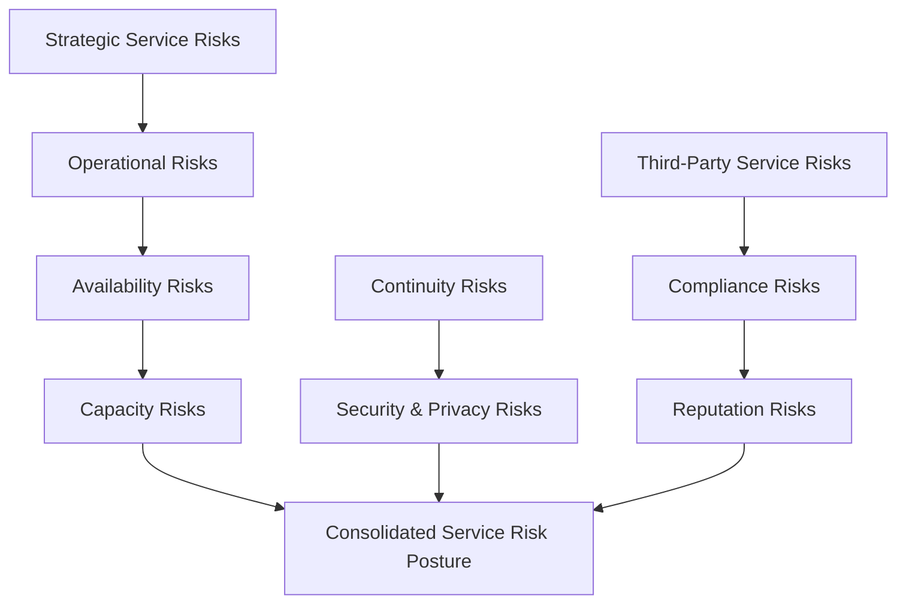
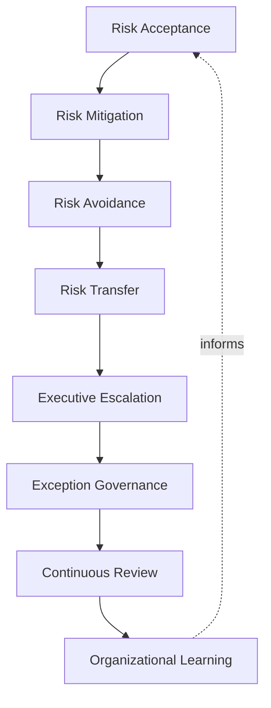
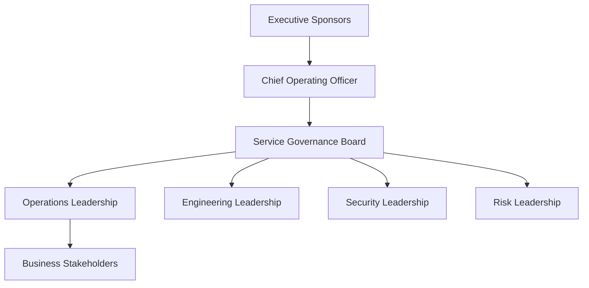
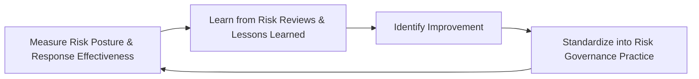
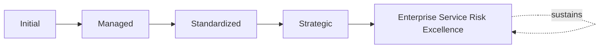

# Enterprise Service Risk Governance Framework

## 1. Executive Summary

**Purpose** — This document defines the official Enterprise Service Risk Governance Framework for **StackLeo Tech Store**. It establishes service risk governance, operational and strategic service risks, the service risk lifecycle, risk ownership, executive oversight, organizational accountability, operational resilience, continuous improvement, and long-term service risk maturity as a deliberate, accountable enterprise discipline. `09_Operations/service-lifecycle-framework.md` and `09_Operations/incident-problem-governance.md` each anticipated this framework directly as the dedicated elaboration of service-related risk. This framework does not restate either, nor does it restate `06_Security/enterprise-risk-management-strategy.md` or `09_Operations/business-continuity-framework.md`. It governs the risk dimension specific to how a service is designed, operated, and evolved — distinct from enterprise-wide security or continuity risk, and distinct from the incident and problem governance that responds to risk once it has already materialized.

**Scope** — This framework applies to every category of service-related risk at StackLeo — strategic, operational, availability, capacity, continuity, security and privacy, third-party, compliance, and reputation risk — coordinated with `09_Operations/service-lifecycle-framework.md`, `09_Operations/incident-problem-governance.md`, `09_Operations/service-level-governance.md`, `09_Operations/knowledge-management-framework.md`, `06_Security/enterprise-risk-management-strategy.md`, and `09_Operations/business-continuity-framework.md`.

**Strategic Objectives** — To ensure service-related risk is identified and owned deliberately, never discovered only after disruption has occurred; that every consequential service decision genuinely accounts for its risk before being made; that risk ownership is genuinely clear at every stage, never left ambiguous; and that executive leadership has continuous, honest visibility into the organization's service risk posture.

**Business Value** — A governed service risk framework protects StackLeo from the disproportionate cost of a service decision made without genuine risk awareness, protects the organization's customer trust from being eroded by an unmanaged service risk, and gives leadership the confidence to evolve the enterprise service portfolio because its risk governance is demonstrably sound.

**Intended Audience** — The Board of Directors, executive leadership, the Chief Operating Officer, the Chief Technology Officer, the Service Governance Board, operations leadership, engineering leadership, security leadership, risk leadership, and business stakeholders.

## 2. Enterprise Service Risk Vision

- **Risk-Aware Service Organization** — every part of the service organization is governed to genuinely understand the risk its decisions carry.
- **Operational Resilience** — service risk governance exists to protect the organization's genuine capacity to withstand and recover from disruption.
- **Service Reliability** — service risk is governed so that reliability remains genuinely dependable for those who rely on it.
- **Customer Trust Protection** — service risk governance exists foremost to protect the genuine trust customers place in StackLeo.
- **Business Continuity** — service-related risk is governed to protect StackLeo's continued ability to operate, coordinated with `09_Operations/business-continuity-framework.md`.
- **Sustainable Service Excellence** — service risk is governed so that excellence remains genuinely sustainable, never pursued at unmanaged risk.
- **Long-Term Enterprise Stability** — service risk governance is pursued as a durable discipline supporting genuine, sustained enterprise stability.

### Enterprise Service Risk Vision Matrix

| Vision Element | Focus | Business Value |
|---|---|---|
| Risk-Aware Service Organization | Genuine understanding of the risk decisions carry | Embeds risk awareness throughout the service organization |
| Operational Resilience | Protecting genuine capacity to withstand disruption | Protects continuity of value even when risk materializes |
| Service Reliability | Reliability remaining genuinely dependable | Protects the trust every operating service represents |
| Customer Trust Protection | Governance existing foremost to protect customer trust | Anchors risk governance to its most important stakeholder |
| Business Continuity | Protecting StackLeo's continued ability to operate | Connects service risk to enterprise continuity |
| Sustainable Service Excellence | Excellence remaining genuinely sustainable | Protects against excellence pursued at unmanaged risk |
| Long-Term Enterprise Stability | A durable discipline supporting sustained stability | Converts service risk governance into lasting advantage |

## 3. Service Risk Governance Principles

Service risk governance at StackLeo rests on nine principles, each producing a specific business outcome.

- **Customer Impact First** — every risk decision genuinely weighs its effect on customers as a primary consideration. *Business Value:* prevents risk decisions that quietly deprioritize customer interest.
- **Proactive Risk Management** — risk is genuinely identified and addressed before it materializes, not after. *Business Value:* protects against the disproportionate cost of reactive risk response.
- **Shared Accountability** — risk ownership is genuinely distributed and clear, never left to a single overloaded function. *Business Value:* prevents risk from being deprioritized because no one genuinely owns it.
- **Evidence-Based Decisions** — a risk decision is grounded in genuine, documented evidence, not assumption. *Business Value:* protects the credibility and defensibility of risk decisions.
- **Transparency** — service risk and its governance are documented and visible to those who genuinely need them. *Business Value:* allows risk posture to be scrutinized and defended, not merely trusted on faith.
- **Strategic Alignment** — risk governance decisions remain genuinely connected to business strategy. *Business Value:* ensures risk tolerance reflects genuine business priority, not arbitrary caution.
- **Continuous Monitoring** — service risk is genuinely and continuously monitored, never assessed only at a single point in time. *Business Value:* keeps risk understanding current as services and demand evolve.
- **Executive Visibility** — the organization's most consequential service risks are genuinely visible at the executive level. *Business Value:* ensures the organization's most significant exposures receive commensurate attention.
- **Continuous Improvement** — service risk governance practice matures over time, informed by real outcomes. *Business Value:* keeps governance aligned with the organization's growing scale and complexity.

### Service Risk Governance Matrix

| Principle | Description | Business Value |
|---|---|---|
| Customer Impact First | Every decision genuinely weighs effect on customers | Prevents decisions that quietly deprioritize customer interest |
| Proactive Risk Management | Risk genuinely identified and addressed before it materializes | Protects against the disproportionate cost of reactive response |
| Shared Accountability | Ownership genuinely distributed and clear | Prevents risk being deprioritized for lack of an owner |
| Evidence-Based Decisions | Grounded in genuine, documented evidence | Protects credibility and defensibility of decisions |
| Transparency | Risk and governance documented and visible | Allows posture to be scrutinized and defended |
| Strategic Alignment | Decisions remaining genuinely connected to strategy | Ensures risk tolerance reflects genuine business priority |
| Continuous Monitoring | Risk genuinely and continuously monitored | Keeps understanding current as services and demand evolve |
| Executive Visibility | Most consequential risks genuinely visible at the top | Ensures significant exposures receive commensurate attention |
| Continuous Improvement | Practice matures from real outcomes | Keeps governance aligned with growing scale and complexity |

## 4. Enterprise Service Risk Governance Model

Service risk governance operates across nine conceptual categories, each holding accountability for a distinct source of exposure.

### Strategic Service Risks

- **Purpose** — govern the risk that a service's overall strategic direction proves genuinely misaligned with the business.
- **Governance Scope** — coordinated with Service Strategy (`09_Operations/service-lifecycle-framework.md`, Section 4).
- **Business Value** — protects the organization from investing heavily in a strategically unsound service direction.
- **Executive Expectations** — leadership expects strategic service risk to be reviewed at the same rigor as any major business decision.

### Operational Risks

- **Purpose** — govern the risk that a service genuinely cannot be operated reliably once delivered.
- **Governance Scope** — coordinated with `09_Operations/incident-problem-governance.md`.
- **Business Value** — protects the organization's ability to sustain what it delivers.
- **Executive Expectations** — leadership expects operational risk to be assessed before, not after, launch.

### Availability Risks

- **Purpose** — govern the risk that a service genuinely fails to remain accessible when customers need it.
- **Governance Scope** — coordinated with `09_Operations/service-level-governance.md`.
- **Business Value** — protects the commitments a service's availability represents.
- **Executive Expectations** — leadership expects availability risk to be continuously, not periodically, monitored.

### Capacity Risks

- **Purpose** — govern the risk that a service genuinely cannot meet demand placed upon it.
- **Governance Scope** — coordinated with Service Optimization (`09_Operations/service-lifecycle-framework.md`, Section 4).
- **Business Value** — protects the organization from service degradation under genuine demand growth.
- **Executive Expectations** — leadership expects capacity risk to be evidenced by forward-looking analysis, not assumed sufficient.

### Continuity Risks

- **Purpose** — govern the risk that a service genuinely cannot recover from a significant disruption, coordinated with, and never superseding, `09_Operations/business-continuity-framework.md`.
- **Governance Scope** — oversight ensuring service decisions meet the rigor that framework requires.
- **Business Value** — protects the organization's ability to continue operating through disruption.
- **Executive Expectations** — leadership expects continuity risk to be assessed jointly with continuity governance.

### Security & Privacy Risks

- **Purpose** — govern the risk that a service genuinely compromises security or customer privacy, coordinated with, and never superseding, `06_Security/security-strategy.md` and `06_Security/data-privacy-framework.md`.
- **Governance Scope** — oversight ensuring service decisions meet the rigor those frameworks require.
- **Business Value** — protects StackLeo's core trust differentiator from service-level compromise.
- **Executive Expectations** — leadership expects security and privacy risk to receive elevated, deliberate scrutiny.

### Third-Party Service Risks

- **Purpose** — govern the risk introduced by a service's genuine dependency on third-party capability, coordinated with `06_Security/third-party-risk-governance.md`.
- **Governance Scope** — oversight ensuring service decisions meet the rigor that framework requires.
- **Business Value** — protects the organization from exposure it does not directly control.
- **Executive Expectations** — leadership expects third-party dependency risk to be explicitly identified, not assumed benign.

### Compliance Risks

- **Purpose** — govern the risk that a service genuinely fails to meet applicable regulatory or compliance obligation, coordinated with `06_Security/compliance-governance.md`.
- **Governance Scope** — oversight ensuring service decisions meet the rigor that framework requires.
- **Business Value** — protects the organization from the disproportionate cost of regulatory non-compliance.
- **Executive Expectations** — leadership expects compliance risk to be assessed before a service reaches customers.

### Reputation Risks

- **Purpose** — govern the risk that a service decision genuinely damages StackLeo's public standing or brand.
- **Governance Scope** — coordinated with Customer Impact Reporting (Section 7).
- **Business Value** — protects the organization's hardest-to-rebuild asset.
- **Executive Expectations** — leadership expects reputation risk to be considered explicitly, not as an afterthought.

### Service Risk Governance Matrix

| Domain | Purpose | Business Value | Executive Expectations |
|---|---|---|---|
| Strategic Service Risks | Govern risk of misaligned strategic direction | Protects against heavy investment in unsound direction | Expects review at the rigor of any major business decision |
| Operational Risks | Govern risk of unreliable operation once delivered | Protects the ability to sustain what is delivered | Expects assessment before, not after, launch |
| Availability Risks | Govern risk of failing to remain accessible | Protects the commitments availability represents | Expects continuous, not periodic, monitoring |
| Capacity Risks | Govern risk of failing to meet demand | Protects against degradation under genuine demand growth | Expects forward-looking analysis, not assumed sufficiency |
| Continuity Risks | Govern risk of failing to recover from disruption | Protects the ability to continue operating through disruption | Expects joint assessment with continuity governance |
| Security & Privacy Risks | Govern risk of compromised security or privacy | Protects StackLeo's core trust differentiator | Expects elevated, deliberate scrutiny |
| Third-Party Service Risks | Govern risk from third-party dependency | Protects against exposure not directly controlled | Expects explicit identification, never assumed benign |
| Compliance Risks | Govern risk of failing regulatory obligation | Protects against the cost of non-compliance | Expects assessment before reaching customers |
| Reputation Risks | Govern risk of damaged public standing or brand | Protects the organization's hardest-to-rebuild asset | Expects explicit consideration, not an afterthought |

*Diagram 1: Enterprise Service Risk Governance Framework — strategic and operational risks feed availability and capacity risk, continuity, security, and third-party risks connect through compliance into reputation risk, all resolving into one consolidated service risk posture.*

## 5. Service Risk Lifecycle Framework

The service risk lifecycle is governed across ten conceptual stages, remaining implementation independent throughout.

### Risk Identification

- **Governance Objectives** — confirm a service risk is genuinely surfaced as early as possible.
- **Decision Authority** — Operations Leadership, coordinated with the Service Governance Board.
- **Expected Outcomes** — a genuinely early, complete inventory of known risk.
- **Review Requirements** — periodic review of identification completeness.

### Risk Classification

- **Governance Objectives** — confirm an identified risk is genuinely categorized against the domains in Section 4.
- **Decision Authority** — the Service Governance Board.
- **Expected Outcomes** — risk genuinely routed to the correct governance domain.
- **Review Requirements** — review of classification accuracy.

### Risk Assessment

- **Governance Objectives** — confirm a classified risk's genuine likelihood and impact are evaluated.
- **Decision Authority** — the Service Governance Board, coordinated with domain specialists per Section 4.
- **Expected Outcomes** — a genuinely evidenced understanding of risk severity.
- **Review Requirements** — review of assessment rigor and evidence quality.

### Risk Ownership

- **Governance Objectives** — confirm every assessed risk has a genuine, accountable owner.
- **Decision Authority** — the Service Governance Board, per the Risk Ownership Framework (Section 8).
- **Expected Outcomes** — no risk left genuinely unowned.
- **Review Requirements** — periodic ownership audit.

### Response Planning

- **Governance Objectives** — confirm an owned risk has a genuine, deliberate response plan.
- **Decision Authority** — the risk owner, coordinated with the Service Governance Board.
- **Expected Outcomes** — a documented, actionable response plan.
- **Review Requirements** — review of response plan adequacy.

### Executive Escalation

- **Governance Objectives** — confirm a risk genuinely exceeding defined tolerance reaches executive attention.
- **Decision Authority** — the Chief Operating Officer, escalating to executive leadership.
- **Expected Outcomes** — no significant risk withheld from executive visibility.
- **Review Requirements** — review of escalation timeliness.

### Continuous Monitoring

- **Governance Objectives** — confirm an owned risk's genuine status is continuously tracked.
- **Decision Authority** — the risk owner.
- **Expected Outcomes** — current, accurate risk status at all times.
- **Review Requirements** — ongoing monitoring cadence review.

### Risk Validation

- **Governance Objectives** — confirm a risk's response is genuinely validated as effective.
- **Decision Authority** — the Service Governance Board.
- **Expected Outcomes** — evidenced confirmation of response effectiveness.
- **Review Requirements** — review of validation evidence.

### Risk Closure

- **Governance Objectives** — confirm a validated, resolved risk is genuinely and formally closed.
- **Decision Authority** — the Service Governance Board.
- **Expected Outcomes** — a clean, accurate record of resolved risk.
- **Review Requirements** — review of closure completeness.

### Organizational Learning

- **Governance Objectives** — confirm understanding gained from a closed risk genuinely informs future governance.
- **Decision Authority** — the Service Governance Board.
- **Expected Outcomes** — deepened organizational risk understanding.
- **Review Requirements** — periodic review of lessons-learned application.

### Service Risk Lifecycle Matrix

| Stage | Governance Objectives | Decision Authority | Expected Outcomes | Review Requirements |
|---|---|---|---|---|
| Risk Identification | Confirm risk genuinely surfaced early | Operations Leadership with Service Governance Board | A genuinely early, complete risk inventory | Identification completeness review |
| Risk Classification | Confirm risk genuinely categorized correctly | Service Governance Board | Risk genuinely routed to correct domain | Classification accuracy review |
| Risk Assessment | Confirm genuine likelihood and impact evaluated | Service Governance Board with domain specialists | Genuinely evidenced severity understanding | Assessment rigor and evidence review |
| Risk Ownership | Confirm every risk has a genuine, accountable owner | Service Governance Board | No risk left genuinely unowned | Periodic ownership audit |
| Response Planning | Confirm owned risk has a genuine response plan | Risk owner with Service Governance Board | A documented, actionable response plan | Response plan adequacy review |
| Executive Escalation | Confirm risk exceeding tolerance reaches executives | Chief Operating Officer, executive leadership | No significant risk withheld from visibility | Escalation timeliness review |
| Continuous Monitoring | Confirm genuine status continuously tracked | Risk owner | Current, accurate risk status at all times | Ongoing monitoring cadence review |
| Risk Validation | Confirm response genuinely validated as effective | Service Governance Board | Evidenced confirmation of effectiveness | Validation evidence review |
| Risk Closure | Confirm resolved risk genuinely, formally closed | Service Governance Board | A clean, accurate record of resolved risk | Closure completeness review |
| Organizational Learning | Confirm understanding genuinely informs future governance | Service Governance Board | Deepened organizational risk understanding | Lessons-learned application review |

```mermaid
flowchart LR
    Identification3[Risk Identification] --> Classification3[Risk Classification]
    Classification3 --> Assessment3[Risk Assessment]
    Assessment3 --> Ownership3[Risk Ownership]
    Ownership3 --> ResponsePlan2[Response Planning]
    ResponsePlan2 --> Escalation3[Executive Escalation]
    Escalation3 --> Monitoring3[Continuous Monitoring]
    Monitoring3 --> Validation4[Risk Validation]
    Validation4 --> Closure3[Risk Closure]
    Closure3 --> OrgLearning6[Organizational Learning]
    OrgLearning6 -.informs.-> Identification3
```

*Diagram 2: Service Risk Lifecycle — identification and classification lead into assessment and ownership, resolving through response planning, executive escalation, and continuous monitoring, into validation, closure, and organizational learning feeding back into identification.*

## 6. Service Risk Decision Governance

- **Risk Acceptance** — governs how a genuine decision to accept a known risk is deliberately made and recorded.
- **Risk Mitigation** — governs how a genuine decision to reduce a known risk's likelihood or impact is deliberately made.
- **Risk Avoidance** — governs how a genuine decision to avoid a risk entirely is deliberately made.
- **Risk Transfer** — governs how a genuine decision to transfer risk exposure is deliberately made.
- **Executive Escalation** — governs the point at which a risk decision genuinely requires executive-level involvement.
- **Exception Governance** — governs how a deliberate exception to normal risk tolerance is formally reviewed and approved.
- **Continuous Review** — governs how service risk decision practice deliberately matures from real outcomes.
- **Organizational Learning** — governs how understanding gained from risk decisions deepens future governance.

### Service Risk Decision Matrix

| Governance Area | Focus | Coordination |
|---|---|---|
| Risk Acceptance | Genuine decision to accept known risk, deliberately recorded | Evidence-Based Decisions (Section 3) |
| Risk Mitigation | Genuine decision to reduce likelihood or impact | Response Planning (Section 5) |
| Risk Avoidance | Genuine decision to avoid a risk entirely | Strategic Service Risks (Section 4) |
| Risk Transfer | Genuine decision to transfer risk exposure | Third-Party Service Risks (Section 4) |
| Executive Escalation | Point requiring genuine executive-level involvement | Executive Escalation (Section 5) |
| Exception Governance | Deliberate exceptions formally reviewed and approved | Continuous Monitoring (Section 5) |
| Continuous Review | Practice deliberately maturing from real outcomes | Continuous Improvement (Section 3) |
| Organizational Learning | Understanding deepening future governance | Organizational Learning (Section 5) |

*Diagram 3: Service Risk Decision Governance Model — acceptance, mitigation, avoidance, and transfer decisions feed executive escalation and exception governance, with continuous review and organizational learning feeding lessons back into future risk decisions.*

## 7. Service Risk Reporting Framework

- **Executive Risk Reporting** — governs how consolidated service risk posture is deliberately reported to executive leadership.
- **Service Portfolio Risk Visibility** — governs how risk across the entire service portfolio is deliberately made visible, coordinated with `09_Operations/service-management-framework.md`.
- **Operational Risk Reporting** — governs how genuine operational risk is deliberately reported to relevant leadership.
- **Customer Impact Reporting** — governs how genuine customer-affecting risk is deliberately, transparently reported.
- **Strategic Risk Communication** — governs how the organization's most consequential service risks are deliberately communicated across leadership.
- **Governance Reviews** — governs how the reporting framework itself is deliberately, periodically reviewed.
- **Continuous Improvement** — governs how understanding gained from reporting deepens future risk governance.

### Service Risk Reporting Matrix

| Governance Area | Focus | Coordination |
|---|---|---|
| Executive Risk Reporting | Consolidated posture deliberately reported to leadership | Executive Visibility (Section 3) |
| Service Portfolio Risk Visibility | Risk across the portfolio deliberately made visible | `09_Operations/service-management-framework.md` |
| Operational Risk Reporting | Genuine operational risk deliberately reported | Operational Risks (Section 4) |
| Customer Impact Reporting | Customer-affecting risk deliberately, transparently reported | Customer Impact First (Section 3) |
| Strategic Risk Communication | Most consequential risks deliberately communicated | Strategic Risk Reviews (Section 10) |
| Governance Reviews | Reporting framework itself deliberately reviewed | Continuous Improvement (Section 3) |
| Continuous Improvement | Understanding deepening future risk governance | Organizational Learning (Section 5) |

## 8. Risk Ownership Framework

- **Executive Sponsors** — accountable for ensuring the most significant service risks receive genuine executive attention; hold ultimate decision authority for escalated risk; are responsible for escalation to the Board where warranted; are expected to review consolidated risk posture regularly.
- **Chief Operating Officer** — accountable for the coherence and enforcement of service risk governance overall; holds decision authority for cross-portfolio risk tolerance; is responsible for escalating significant risk to Executive Sponsors; is expected to review risk posture on a regular cadence.
- **Service Governance Board** — accountable for the operational execution of the Service Risk Lifecycle Framework (Section 5); holds decision authority for risk classification, assessment, and closure; is responsible for escalating risk exceeding tolerance; is expected to review the full risk register regularly.
- **Operations Leadership** — accountable for genuine risk identification within their accountable services; hold decision authority for day-to-day risk response within delegated tolerance; are responsible for escalating risk beyond their authority; are expected to review their service's risk status continuously.
- **Engineering Leadership** — accountable for genuine technical risk assessment; hold decision authority for technical risk mitigation approach; are responsible for escalating technical risk beyond their authority; are expected to review technical risk regularly.
- **Security Leadership** — accountable for genuine security and privacy risk assessment, coordinated with `06_Security/security-strategy.md`; hold decision authority for security risk mitigation approach; are responsible for escalating security risk beyond their authority; are expected to review security risk regularly.
- **Risk Leadership** — accountable for the coherence of risk methodology across every domain in Section 4; hold decision authority for risk assessment standards; are responsible for escalating methodology gaps to the Chief Operating Officer; are expected to review risk methodology regularly.
- **Business Stakeholders** — accountable for surfacing genuine business-context risk affecting their domain; hold input authority, not decision authority, over service risk tolerance; are responsible for raising concerns to Operations Leadership or the Service Governance Board; are expected to participate in relevant risk reviews.

### Risk Ownership Matrix

| Role | Accountability | Decision Authority | Escalation Responsibility | Review Expectations |
|---|---|---|---|---|
| Executive Sponsors | Ensure significant risks receive executive attention | Ultimate authority for escalated risk | Escalate to the Board where warranted | Regular review of consolidated posture |
| Chief Operating Officer | Coherence and enforcement of governance overall | Cross-portfolio risk tolerance | Escalate significant risk to Executive Sponsors | Regular cadence review of risk posture |
| Service Governance Board | Operational execution of the risk lifecycle | Classification, assessment, and closure | Escalate risk exceeding tolerance | Regular review of the full risk register |
| Operations Leadership | Genuine risk identification within their services | Day-to-day response within delegated tolerance | Escalate risk beyond their authority | Continuous review of service risk status |
| Engineering Leadership | Genuine technical risk assessment | Technical mitigation approach | Escalate technical risk beyond authority | Regular review of technical risk |
| Security Leadership | Genuine security and privacy risk assessment | Security mitigation approach | Escalate security risk beyond authority | Regular review of security risk |
| Risk Leadership | Coherence of risk methodology across domains | Risk assessment standards | Escalate methodology gaps to the Chief Operating Officer | Regular review of risk methodology |
| Business Stakeholders | Surfacing genuine business-context risk | Input authority, not decision authority | Raise concerns to Operations Leadership or the Board | Participation in relevant risk reviews |

*Diagram 4: Service Risk Ownership Structure — executive sponsors and the Chief Operating Officer hold ultimate accountability, the Service Governance Board coordinates specialist leadership, and operations leadership connects ownership to business stakeholder input.*

## 9. Organizational Governance

Governance accountability is distributed deliberately across ten organizational roles.

- **Board of Directors** — holds ultimate accountability for whether StackLeo's service risk posture genuinely protects the business's long-term direction.
- **Executive Leadership** — holds accountability for whether service risk decisions genuinely align with business strategy, in partnership with the Board.
- **Chief Operating Officer** — owns the coherence and enforcement of this framework across every service risk domain.
- **Chief Technology Officer** — owns coordination of Operational Risks and Capacity Risks (Section 4) with `03_System_Design/technology-governance.md`.
- **Service Governance Board** — owns the operational execution of the Service Risk Lifecycle Framework (Section 5) and Service Risk Decision Governance (Section 6).
- **Operations Leadership** — own Operational Risks and Availability Risks (Section 4) within their accountable services.
- **Engineering Leadership** — own Capacity Risks and Continuity Risks (Section 4) within their accountable systems.
- **Security Leadership** — own Security & Privacy Risks (Section 4) in coordination with `06_Security/security-strategy.md`.
- **Risk Leadership** — own the coherence of risk methodology across every domain in Section 4.
- **Business Stakeholders** — own surfacing business-context risk affecting their domain.

### Organizational Responsibility Matrix

| Role | Governance Objective | Business Value |
|---|---|---|
| Board of Directors | Hold ultimate accountability for risk posture protecting direction | Provides the highest point of ultimate accountability |
| Executive Leadership | Hold accountability for decisions aligning with business strategy | Provides a single point of executive-level accountability |
| Chief Operating Officer | Own coherence and enforcement across every risk domain | Provides a single point of specialist accountability |
| Chief Technology Officer | Own coordination of operational and capacity risk | Ensures service risk connects to architecture governance |
| Service Governance Board | Own operational execution of lifecycle and decision governance | Provides a dedicated, cross-functional governance body |
| Operations Leadership | Own operational and availability risks | Embeds accountability closest to where services are run |
| Engineering Leadership | Own capacity and continuity risks | Embeds accountability closest to where services are built |
| Security Leadership | Own security and privacy risks | Ensures service risk meets enterprise security rigor |
| Risk Leadership | Own coherence of risk methodology | Ensures consistent, defensible risk assessment enterprise-wide |
| Business Stakeholders | Own surfacing business-context risk | Connects risk governance to genuine business relevance |

## 10. Executive Oversight

- **Service Risk Reviews** — the overall coherence of service risk governance is formally reviewed on a regular cadence.
- **Service Portfolio Risk Reviews** — risk across the entire service portfolio is reviewed directly with executive leadership.
- **Operational Risk Reviews** — genuine operational risk is reviewed as a distinct, ongoing concern.
- **Business Continuity Reviews** — the organization's service-related continuity posture is reviewed directly with executive leadership.
- **Strategic Risk Reviews** — the organization's most consequential service risks are reviewed directly with executive leadership.
- **Continuous Improvement Reviews** — the organization's follow-through on captured service risk lessons is reviewed directly with executive leadership.

### Executive Oversight Matrix

| Oversight Mechanism | Purpose | Governance Role |
|---|---|---|
| Service Risk Reviews | Confirm overall service risk governance coherence | Regular, predictable cadence for the framework as a whole |
| Service Portfolio Risk Reviews | Review risk across the entire service portfolio | Direct executive-level portfolio risk review |
| Operational Risk Reviews | Review genuine operational risk | Treats operational risk as ongoing, not assumed |
| Business Continuity Reviews | Review service-related continuity posture | Direct executive-level continuity risk review |
| Strategic Risk Reviews | Review the organization's most consequential risks | Direct executive-level strategic risk review |
| Continuous Improvement Reviews | Review follow-through on captured lessons | Direct executive-level review of improvement completion |

## 11. Future Readiness

This framework is designed to remain valid as StackLeo evolves in scale, geography, and organizational complexity.

- **AI-Assisted Service Risk Intelligence** — as risk identification and classification increasingly incorporate AI-assisted methods, coordinated with `04_Database/ai-governance.md`, they remain governed under Risk Identification and Risk Classification (Section 5) at the same rigor as any other method.
- **Predictive Operational Risk Analytics** — where the organization develops the capability to anticipate an operational risk before it fully materializes, that capability is governed as an extension of Continuous Monitoring (Section 5).
- **Adaptive Risk Governance** — where risk tolerance increasingly adapts to genuinely changing business conditions, that evolution remains governed under Continuous Improvement (Section 3) at the same rigor as any other method.
- **Intelligent Service Decision Support** — where service decisions increasingly draw on intelligent risk analysis, that analysis remains subject to the same Service Risk Decision Governance (Section 6) as any other method.
- **Digital Risk Visibility** — new risk visibility approaches are adopted only in a manner consistent with Transparency (Section 3), never at its expense.
- **Sustainable Service Evolution** — Risk Identification and Risk Assessment (Section 5) are structured to be re-applied as StackLeo expands from Bangladesh into South Asia and global markets.

## 12. Service Risk Maturity Model

Service risk governance maturity is described across five conceptual levels.

- **Initial** — service risk governance, where it exists, is informal and inconsistent; risk is identified reactively, and ownership is unclear.
- **Managed** — basic risk governance exists for individual domains, but consistency across the nine domains in Section 4 varies significantly.
- **Standardized** — the governance model, lifecycle, and ownership framework are standardized, documented, and consistently applied across the organization.
- **Strategic** — service risk decisions are genuinely and routinely made in deliberate service of business strategy, not convenience.
- **Enterprise Service Risk Excellence** — service risk governance is continuously and deliberately improved based on quantitative evidence and organizational learning; risk capability functions as a genuine, sustained source of enterprise excellence.

### Service Risk Maturity Matrix

| Level | Characteristics | Primary Focus |
|---|---|---|
| Initial | Informal, inconsistent governance; risk identified reactively | Ad hoc, individually-dependent risk practice |
| Managed | Basic governance exists per domain; consistency varies | Domain-level consistency |
| Standardized | Standardized governance model, lifecycle, and ownership | Organization-wide consistency and clear ownership |
| Strategic | Decisions genuinely and routinely made in service of strategy | Business-strategy-driven risk decision-making |
| Enterprise Service Risk Excellence | Practice continuously improved; risk governance as advantage | Sustained, deliberate, enterprise-wide risk excellence |

*Diagram 5: Continuous Service Risk Improvement Cycle — risk posture and response effectiveness are measured, learned from through reviews and lessons learned, improved upon, and standardized back into governed practice, on a continuing basis.*

*Diagram 6: Service Risk Maturity Progression — maturity advances from informal, reactively-identified risk practice toward standardized, genuinely strategy-driven, and continuously excellent enterprise service risk governance.*

## 13. Service Risk Governance Anti-Patterns

- **Risks Without Ownership** — allowing an identified risk to have no genuine owner guarantees it is neither monitored nor resolved.
- **Reactive Operations** — operating without deliberate risk governance wastes the value proactive oversight would provide.
- **Weak Executive Visibility** — allowing significant risk to go unseen by executive leadership prevents genuinely informed strategic decisions.
- **Ignoring Early Warning Signals** — allowing early indicators of risk to go unaddressed wastes the organization's clearest opportunity for proactive response.
- **Siloed Risk Decisions** — managing risk within a single function without genuine cross-functional coordination prevents one coherent risk picture.
- **Governance Without Accountability** — treating risk governance as a formality without genuine ownership undermines the credibility of every decision built on it.
- **No Continuous Learning** — treating current risk governance practice as permanently finished guarantees it falls behind the organization's growing scale and complexity.
- **Service Risk Blind Spots** — allowing a service risk domain to go unmonitored guarantees exposure the organization cannot see coming.

### Anti-Pattern Summary

| Anti-Pattern | Organizational & Business Impact |
|---|---|
| Risks Without Ownership | Guarantees risk is neither monitored nor resolved |
| Reactive Operations | Wastes the value proactive oversight would have provided |
| Weak Executive Visibility | Prevents genuinely informed strategic decisions |
| Ignoring Early Warning Signals | Wastes the clearest opportunity for proactive response |
| Siloed Risk Decisions | Prevents one coherent, organization-wide risk picture |
| Governance Without Accountability | Undermines the credibility of decisions built on it |
| No Continuous Learning | Guarantees practice falls behind growing scale and complexity |
| Service Risk Blind Spots | Guarantees exposure the organization cannot see coming |

## Related Documents

| Document | Relationship |
|---|---|
| `09_Operations/service-management-framework.md` | Establishes the broader enterprise service governance model this framework's risk domains connect to. |
| `09_Operations/service-lifecycle-framework.md` | Anticipated this framework by name; consumes this framework's Strategic Service Risks (Section 4) as an input to stage-gate governance. |
| `09_Operations/incident-problem-governance.md` | Anticipated this framework by name; consumes this framework's Service Risk Reporting Framework (Section 7) as an input to Enterprise Operational Risks. |
| `09_Operations/service-level-governance.md` | Establishes the performance commitments this framework's Availability Risks and Capacity Risks (Section 4) protect. |
| `09_Operations/knowledge-management-framework.md` | Governs how understanding gained from this framework's Organizational Learning (Section 5) is captured and reused. |
| `09_Operations/service-maturity-framework.md` | Consolidates the maturity model this framework defines in Section 12 into the enterprise-wide service maturity picture. |
| `06_Security/enterprise-risk-management-strategy.md` | Establishes the enterprise-wide risk management discipline this framework's service-specific risk governance specializes. |
| `09_Operations/business-continuity-framework.md` | Establishes the business continuity discipline this framework's Continuity Risks (Section 4) coordinate with. |

## Document Information

| Property | Value |
|----------|-------|
| Document | service-risk-governance.md |
| Version | 1.0.0 |
| Status | Active |
| Maintained By | StackLeo |
| Last Updated | 2026-07-29 |

---

© StackLeo. All Rights Reserved.
