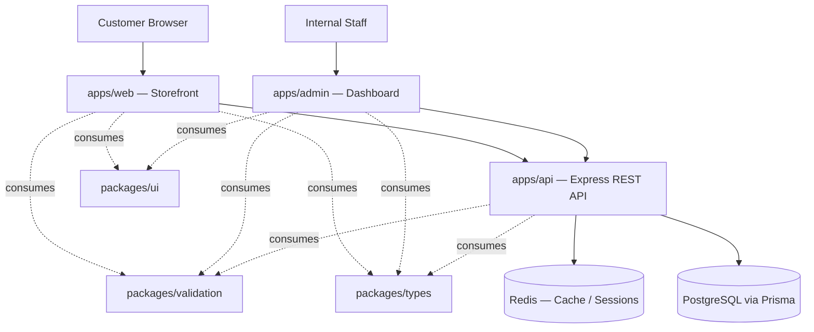

# Architecture Overview

High-level system and monorepo architecture for **StackLeo Tech Store**. For the folder-by-folder breakdown, see [`repository-overview.md`](./repository-overview.md).

## System Architecture

- **`apps/web`** and **`apps/admin`** are independent Next.js applications. Neither imports from the other directly — anything they share is promoted to `packages/`.
- **`apps/api`** is the single backend service both frontend apps depend on. Neither frontend app talks to PostgreSQL or Redis directly.
- **`packages/*`** are internal, non-deployable libraries consumed via workspace references (`@stackleo/*`), not published externally at this stage.

## Monorepo Architecture Principles

1. **Apps are deployable units; packages are not.** If a folder under `packages/` ever needs its own deployment pipeline, it has stopped being a package and should become an app.
2. **One-directional dependency flow.** `apps/*` may depend on `packages/*`. `packages/*` may depend on other `packages/*`. Nothing under `packages/*` depends on anything under `apps/*`. This keeps shared code genuinely reusable and prevents circular dependencies.
3. **No direct app-to-app imports.** `apps/web` and `apps/admin` never import from each other's `src/`. Shared logic between them is promoted to a package.
4. **The API is the only data-access boundary.** `packages/*` never talk to PostgreSQL or Redis directly; only `apps/api` holds that responsibility, via `@prisma/client` inside its `services` layer.
5. **Shared configuration is centralized.** `packages/config` is the single source of truth for lint, TypeScript, and Tailwind rules — individual workspaces extend it rather than redefining rules.

## Why This Structure Scales

### Scalability Considerations

- **Independent deployability** — `apps/web`, `apps/admin`, and `apps/api` each build and deploy independently. A change to the admin dashboard does not require redeploying the storefront or the API.
- **Clear ownership boundaries** — because each app and package is self-contained with its own `package.json`, `tsconfig.json`, and `README.md`, different engineering teams can own different workspaces with minimal cross-team coordination overhead.
- **Shared code without duplication** — `packages/types` and `packages/validation` guarantee the API's contracts and the frontend's expectations never silently drift apart, which is a common failure mode as a platform and its team count grow.
- **Horizontal scaling of the API tier** — `apps/api` is a stateless Express service (session/cache state lives in Redis), so it can be horizontally scaled behind a load balancer as traffic grows toward millions of users without architectural change.
- **Database and cache separation** — PostgreSQL (durable data) and Redis (cache/session) are architecturally distinct from day one, avoiding a costly later migration to introduce caching.
- **Consistent tooling at scale** — `packages/config` ensures that as the number of workspaces grows from a handful to dozens, lint/type/style rules do not fragment per team.

### Future Expansion Strategy

- **New apps** (e.g. a mobile BFF, a seller portal, a partner API) are added as new folders under `apps/`, each with its own `package.json`, following the same shape as `apps/web`, `apps/admin`, or `apps/api`. They immediately gain access to every existing `packages/*`.
- **New shared packages** (e.g. `packages/analytics`, `packages/email-templates`) are added under `packages/` the moment logic is needed by two or more apps — never before, to avoid premature abstraction.
- **Service decomposition** — if `apps/api` grows large enough to warrant splitting into multiple backend services (e.g. a dedicated search service, a dedicated payments service), each becomes its own `apps/*` entry with its own Dockerfile, while continuing to share `packages/types` and `packages/validation` for contract consistency.
- **Multi-region / multi-team growth** — because apps are independently deployable and packages are strictly one-directional dependencies, additional engineering teams can be onboarded to own individual apps or packages without restructuring the repository.
- **Design system evolution** — `packages/ui` is positioned to grow into a fully versioned internal design system as the number of consuming apps increases, without any change to how apps consume it (`@stackleo/ui`).

## Related Documents

- [`repository-overview.md`](./repository-overview.md) — complete folder tree and file purposes.
- [`developer-guide.md`](./developer-guide.md) — conventions for working within this architecture day to day.
